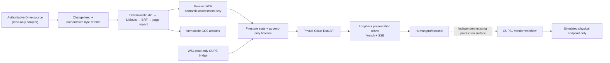

# Braille Errata Relay

Braille Errata Relay is a report-first overlay for late corrections in an
existing Braille production workflow. It detects an authoritative source
revision, deterministically regenerates a candidate BRF with pinned Liblouis,
computes page impact, obtains a bounded Gemini semantic assessment, correlates
fresh read-only production evidence, and prepares evidence for human
professionals. It is intentionally **not** a Braille publishing platform, work
order system of record, or production-device control surface.

## Contents

- [The production problem](#the-production-problem)
- [Why it is agentic](#why-it-is-agentic)
- [Stories 1–5](#stories-15)
- [What is real and what is simulated](#what-is-real-and-what-is-simulated)
- [Architecture](#architecture)
- [Human authority and safety boundary](#human-authority-and-safety-boundary)
- [Repository map](#repository-map)
- [Five-minute quick start](#five-minute-quick-start)
- [Production-style setup](#production-style-setup)
- [Local-only demo](#local-only-demo)
- [Configuration](#configuration)
- [Authentication and authorization](#authentication-and-authorization)
- [Testing and evidence](#testing-and-evidence)
- [Live demo](#live-demo)
- [Limitations](#limitations-and-unclaimed-behavior)
- [Troubleshooting](#troubleshooting)

## The production problem

Late editorial corrections are expensive in Braille production. A correction
can shift pages, invalidate an approved master, or arrive while a job is
already queued or physically progressing. A browser dashboard alone cannot
truthfully resolve those facts. Relay therefore maintains immutable lineage and
produces a review packet rather than pretending it owns the production floor.

## Why it is agentic

The workflow combines bounded autonomous reasoning with deterministic,
auditable work. Gemini/ADK performs a constrained semantic assessment over
explicit evidence spans. Deterministic code owns source normalization,
translation, pagination, BRF bytes, hashes, page impact, recommendations,
state transitions, and verification. The agent proposes and explains; humans
retain the authority to decide, contain, prove, resubmit, and close.

## Stories 1–5

| Story | Delivered boundary |
| --- | --- |
| 1. Baseline and source | Immutable baseline, source revision, and profile lineage. |
| 2. Deterministic impact | Real Liblouis translation, deterministic BRF, source maps, manifests, and page impact. |
| 3. Semantic report | Gemini semantic assessment is bounded to persisted source-diff evidence. |
| 4. Containment and proof | Separate human disposition, operator attestation, containment confirmation, and exact-candidate proof gates. |
| 5. Replacement observation | A machine operator may associate a fresh read-only observation of an independently submitted replacement job. The workflow stops at `REPLACEMENT_OBSERVED`. |

## What is real and what is simulated

| Component | Status |
| --- | --- |
| Liblouis translation, BRF serialization, pagination, hashing | Real, pinned and reproducible. |
| Google Drive change/reconcile adapter | Real read-only MVP adapter. |
| Gemini semantic assessment | Real semantic-only boundary when configured. |
| Firestore/GCS workflow and artifact lineage | Real cloud adapters. |
| CUPS scheduler and read-only bridge | Real in the WSL Gate 0 harness. |
| Physical embossing endpoint | Simulated only. |
| Device controls, cancellation, submission, endpoint completion, closure | Never implemented by Relay. |

## Architecture



Google Cloud hosts the private API, Firestore ledger, GCS artifacts, scheduled
outbox drain, and adapter identities. Drive and CUPS are MVP adapters—not
assumptions about every facility. The Windows browser/operator surfaces and
WSL2 CUPS bridge/simulator are deliberately separate in the single-PC demo.

## Human authority and safety boundary

Relay, its cloud service, local presentation server, and read-only bridge must
never submit, hold, release, cancel, restart, pause, or otherwise mutate CUPS,
an embosser, or another production device. A candidate BRF is not an approved
production master. Cancellation, device stop, physical-output isolation, proof
approval, replacement submission, endpoint completion, and final verification
are separate facts with human authority.

The live watch floor at `/watch` is read-only. Its local acknowledgement and
optional sound controls do not post a professional disposition, mutate cloud
workflow, or operate equipment.

## Repository map

| Path | Purpose |
| --- | --- |
| `src/braille_errata_relay/braille/` | Deterministic normalization, Liblouis boundary, pagination, BRF, and impact code. |
| `src/braille_errata_relay/application/` | Idempotent workflows and fail-closed gates. |
| `src/braille_errata_relay/adapters/` | Drive, Firestore, GCS, and Gemini/ADK adapters. |
| `src/braille_errata_relay/api/` | Private Cloud Run evidence and human-record API. |
| `src/braille_errata_relay/presentation/` | Loopback review dashboard, watch SSE, and sanitized fixture. |
| `local_bridge/` | Read-only CUPS observer and transactional observation journal. |
| `simulator/cups_backend/` | Physical-endpoint simulator only. |
| `infra/` | Explicit human-run setup, GCP, WSL, and demo tools. |
| `demo/` | Fixtures, expected BRF, screenshots, and sanitized evidence. |
| `docs/` | Portable setup, security, testing, and demo chapters. |

## Five-minute quick start

This path is local and non-destructive. It does not authenticate, deploy, edit
Drive, or touch CUPS.

**PowerShell**

```powershell
$RepoRoot = (git rev-parse --show-toplevel).Trim()
Set-Location -LiteralPath $RepoRoot
uv sync --frozen
uv run --frozen pytest -q -p no:cacheprovider tests/unit/test_watch_floor.py
uv run --frozen python -m braille_errata_relay.presentation.screenshot_fixture --port 8877
```

Open `http://127.0.0.1:8877/watch` in the same machine. This is visibly marked
**SANITIZED DEMO FIXTURE** and never contacts Cloud Run, Drive, CUPS, or a
device.

**WSL/Linux**

```bash
repo_root="$(git rev-parse --show-toplevel)"
cd "$repo_root"
uv sync --frozen
uv run --frozen pytest -q -p no:cacheprovider tests/unit/test_watch_floor.py
```

See [docs/quickstart.md](docs/quickstart.md) for the full startup sequence.

## Production-style setup

The setup path writes only a gitignored local `.env`; it neither provisions
Google Cloud nor accepts a password or service-account key.

```text
braille-relay init-local-config --interactive
braille-relay doctor --config .env
```

Use browser-based `gcloud auth login` and `gcloud auth application-default
login` when the doctor asks for ordinary user ADC. Use the exact scoped commands
in [docs/google-cloud-setup.md](docs/google-cloud-setup.md); never put a Gmail
password, OAuth token, or service-account JSON key in `.env`.

## Local-only demo

The safe Windows launcher starts the loopback presentation shell, checks that
it is reachable, and opens `/watch` once because the user launched it. It does
not grant IAM, run a scheduler, register a baseline, post a disposition, edit
Drive, or mutate CUPS.

```powershell
$RepoRoot = (git rev-parse --show-toplevel).Trim()
Set-Location -LiteralPath $RepoRoot
powershell.exe -NoProfile -ExecutionPolicy Bypass -File .\infra\demo\start_demo.ps1
```

For a live private service, first create `.env` and complete the human-owned
authentication prerequisites. For screenshots or a disconnected presentation,
use the sanitized fixture above.

## Configuration

The generated `.env` contains non-secret identifiers only: cloud project,
region, Drive file ID, source MIME type, site/queue/bridge IDs, optional
service-account principal names, and private Relay URL origins. It is ignored
by Git and refuses overwrite unless `--force` is explicit. See
[docs/configuration.md](docs/configuration.md).

## Authentication and authorization

- The browser never receives a Google credential, access token, service-account
  material, Drive ID, or private Cloud Run URL.
- The loopback server uses ordinary local user ADC to mint short-lived,
  audience-bound tokens only when a separately authorized human has granted
  narrow, temporary impersonation authority.
- The service remains private. No public invoker is required.
- The CUPS observer has read-only authorization. The separate operator identity
  belongs to a human using an independent production surface.

See [docs/security-and-authority.md](docs/security-and-authority.md).

## Testing and evidence

Run checks independently so one pass cannot conceal another result:

```text
uv lock --check
uv run --frozen pytest -q -p no:cacheprovider
uv run --frozen ruff check src tests infra/scripts
uv run --frozen ruff format --check src tests infra/scripts
uv run --frozen mypy src/braille_errata_relay
docker build --tag braille-errata-relay:final-demo-readiness .
docker run --rm --network none --read-only --cap-drop ALL --entrypoint python braille-errata-relay:final-demo-readiness -m braille_errata_relay.container_smoke
```

The repository preserves three honest platform skips: unavailable upstream
Liblouis on the Windows host and two POSIX-only capture permission checks.
Never turn those into passing mocks. See
[docs/testing-and-evidence.md](docs/testing-and-evidence.md) and the sanitized
release evidence under `demo/evidence/`.

## Live demo

Use [docs/live-demo-runbook.md](docs/live-demo-runbook.md) for the 3–4 minute
storyboard and fallback plan. The detailed human-action sequence is maintained
in [docs/active-professional-review-demo.md](docs/active-professional-review-demo.md)
rather than duplicated here.

## Limitations and unclaimed behavior

- No Chrome extension, desktop daemon, email/Gmail integration, or notification
  delivery service exists.
- No production-device control, replacement submission, endpoint-completion
  claim, final verification, or incident closure exists.
- A `REPLACEMENT_OBSERVED` state is scheduler observation evidence only.
- Page-range replacement is deferred; the hero path is full-volume candidate
  replacement.
- An incompatible external baseline profile fails closed as
  `INCOMPATIBLE_BASELINE_PROFILE` rather than being compared with a Relay
  candidate.
- Historical blocked incidents remain valid fail-closed evidence; they are not
  authorization to act.

## Troubleshooting

Start with [docs/troubleshooting.md](docs/troubleshooting.md). It covers
missing ADC, an unavailable private service, unavailable Liblouis, local
watch-floor reconnection, and WSL/CUPS Gate 0 blockers without instructing the
user to expose credentials or weaken authority boundaries.

## Governing documents and evidence

The implementation contract is [architecture.md](architecture.md); the product
and hackathon context is [instruction.md](instruction.md). Their content and
lineage are preserved. Release evidence is sanitized and schema-validated,
including [the final Story 5 evidence](demo/evidence/final-story5-dashboard.json).
