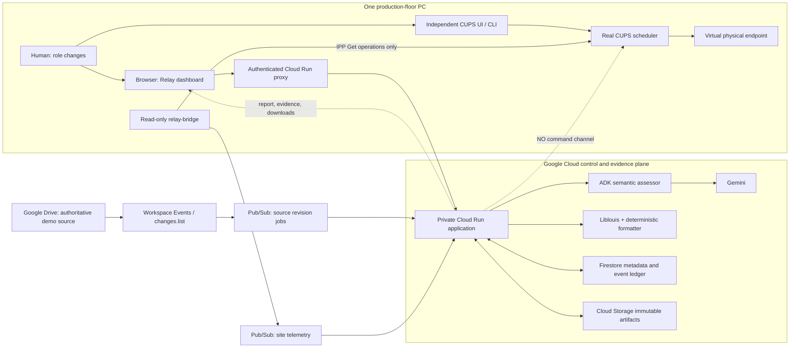
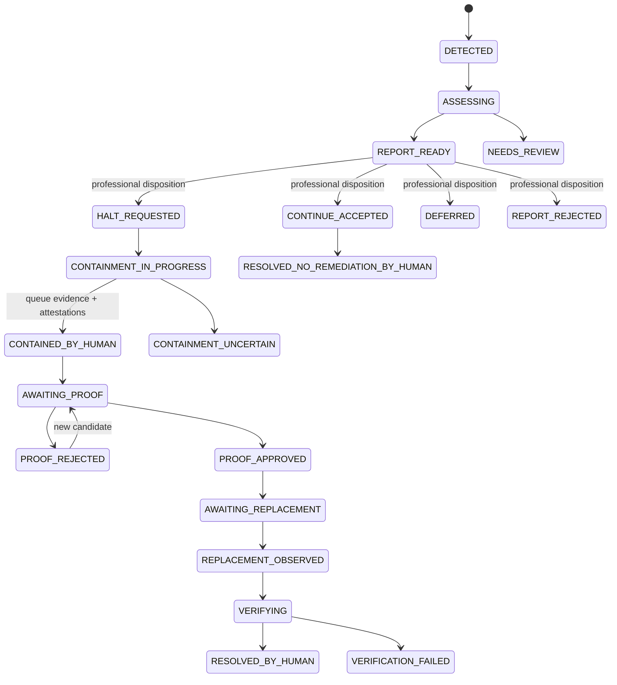

# Braille Errata Relay - Single-PC Architecture

Status: implementation contract for the hackathon MVP  
Last grounded: 2026-08-28  
Companion product context: `instruction.md`

> **Implementation status — 2026-08-31:** This document preserves the original
> research and target architecture. The shipped autonomous source trigger is
> **Cloud Scheduler → private Cloud Run `/internal/automation-cycle` → Drive
> `changes.list` → authoritative metadata-and-byte refetch → durable outbox**.
> Workspace Events and Pub/Sub source-event diagrams below are researched target
> alternatives, not deployed release claims. Use the README and
> `docs/fresh-project-deployment.md` for the implemented setup and release
> evidence.

## 0. Build contract

Braille Errata Relay is a report-first overlay on an existing Braille-production workflow. It observes a changed authoritative source, investigates semantic and deterministic Braille impact, prepares a traceable candidate BRF, reports to the responsible professional, and verifies the recovery that authorized humans perform through their existing controls.

The relay never holds, cancels, submits, releases, restarts, pauses, or physically stops production. The demo uses real Liblouis translation, real BRF bytes, real CUPS scheduling and human queue operations, and a read-only queue observer. Only the physical embossing endpoint is simulated.

This document narrows `instruction.md` into one buildable topology and exactly five end-to-end stories. If the documents appear to conflict, preserve these invariants:

1. Human production authority is never transferred to the relay.
2. A candidate BRF is not an approved master.
3. Queue cancellation, device stop, physical isolation, proof approval, and replacement submission are separate facts.
4. Google Drive and CUPS are MVP adapters, not claims about the universal Braille industry.
5. The project is not a publishing platform, work-order system, or system of record.

## 1. What the evidence supports

### 1.1 Directly documented workflow

The public evidence supports a stable organizational sequence even though facilities use different software and hardware:

1. A source arrives digitally or is scanned from hard copy.
2. A trained transcriber uses specialist software and professional judgment.
3. A draft electronic Braille file, commonly BRF, is proofread against the print source.
4. Corrections return to the transcriber and the material is proofed again.
5. A finished report or work order authorizes production.
6. An electronic Braille file reaches an embosser, a plate-embossing device, or another production machine.
7. Operators and proofreaders inspect produced material; high-volume work can continue through pressing, collation, binding, and distribution.

[American Printing House for the Blind](https://www.aph.org/blog/aph-behind-the-scenes-a-look-at-the-people-and-processes-that-bring-you-braille/) documents electronic Word, Corel, BRF, PDF, and EPUB intake; trained transcription with BrailleBlaster, Braille 2000, or Duxbury; a proof copy; corrections; a second proof; a finished report/work order; and a separate production floor. [National Braille Press](https://www.nbp.org/ic/nbp/about/aboutus/tour.html) documents hard-copy scanning or digital intake, Duxbury transcription, BRF proofing with refreshable Braille, corrections, plate embossing, a second physical proof, pressing, and finishing. [APH facility guidance](https://sites.aph.org/files/pbf/guidelines.pdf) describes a computer at each transcription workstation and at least one computer connected to an embosser.

### 1.2 What is an architecture inference

Public production records do not publish a complete network diagram, host inventory, or one universal late-erratum procedure. Braille Errata Relay's five-story incident flow is a reasoned approximation assembled from the documented stages above, source/version lineage practices, CUPS job semantics, and embosser buffering behavior.

The following labels are mandatory in the UI, demo, and documentation:

| Claim | Truth label |
|---|---|
| Electronic/digital intake, specialist transcription, BRF, repeated proofing, work orders, production machines, and physical quality control exist | Directly evidenced |
| APH or NBP uses Google Drive | Not evidenced |
| APH or NBP uses CUPS | Not evidenced |
| One person normally performs intake, coordination, operation, and independent proofing | Not evidenced; large producers document separated roles |
| A small room may use a computer connected to an embosser and combine responsibilities | Reasonable approximation supported by APH facility guidance |
| Drive as source transport, CUPS as scheduler, Gemini impact analysis, one presenter changing roles, and a virtual embosser | Deliberate hackathon approximations |
| Human authority over disposition, proof, containment, and resubmission | Consistent with documented professional roles and CUPS authorization semantics |

### 1.3 Single-PC assumption

"Single PC" means one physical production-floor workstation used by the presenter. It does not mean the cloud is removed or that all responsibilities become one unsegmented process.

```text
Windows 11 laptop
|- Chrome
|  |- Google Drive source
|  |- Relay report/proof dashboard
|  `- independent CUPS operator page at http://localhost:631
|- optional terminal for explicit human operator commands
`- WSL2 Ubuntu with systemd
   |- CUPS scheduler and Braille-Embosser-Sim queue
   |- relay-bridge under a read-only Linux identity
   |- SQLite observation journal
   `- relay-capture backend and simulated endpoint evidence

Google Cloud
|- Cloud Scheduler automatic Drive reconciliation (private OIDC)
|- Drive changes.list + authoritative byte refetch
|- site-telemetry topic/adapter where configured
|- one Cloud Run FastAPI/ADK application
|- Vertex AI Gemini
|- Firestore lineage/evidence ledger
`- Cloud Storage immutable artifacts
```

The presenter may enact several roles, but the dashboard must require a visible role choice and create a separate attributable record for each role transition. The demo proof record is labeled `DEMO_FIXTURE_REVIEW`; it is not represented as independent certified tactile proofing.

Windows can reach WSL services through `localhost`, but systemd services do not by themselves keep the WSL VM alive. The demo therefore needs a startup preflight that starts the distribution and verifies CUPS, the bridge, and the backend. See [Microsoft WSL networking](https://learn.microsoft.com/windows/wsl/networking) and [systemd support](https://learn.microsoft.com/windows/wsl/systemd).

## 2. The five stories and where they live

| # | Story | Human surface on the one PC | Local background home | Cloud home | Terminal record |
|---:|---|---|---|---|---|
| 1 | Register a traceable live run | Drive, Relay dashboard, independent CUPS surface | CUPS, observer, simulator | baseline API, Liblouis pipeline, Firestore, Storage | `ProductionBaseline` / `BASELINE_REGISTERED` |
| 2 | Detect and investigate an erratum | Drive revision; incident appears without an Analyze button | latest read-only queue snapshot | Workspace/Drive adapter, Pub/Sub, Cloud Run, ADK/Gemini, Liblouis, deterministic diff | `ProductionIncidentReport` / `REPORT_READY` |
| 3 | Decide and contain | Relay dashboard, then independent CUPS surface after a visible role change | human CUPS action, observer, simulator | decision API and telemetry ingestion | `ProfessionalDisposition`, `QueueObservation`, `OperatorAttestation` |
| 4 | Proof the exact candidate | Relay proof view; optional BRF viewer or refreshable display | no production action | artifact/proof API, Firestore, Storage | `ProofApproval` or `ProofRejection` |
| 5 | Return to production and verify | artifact download, independent CUPS surface, final dashboard | human submission/release, observer, simulator | verification workflow and lineage store | `VerificationReport` / `RESOLVED_BY_HUMAN` |

The five stories are not five applications or five computers. They are five controlled moments across three trust zones: the human browser/operator surface, the read-only WSL production observer, and the cloud control plane.

## 3. Story specifications

### Story 1 - Register a traceable live production run

> As the production transcriber/operator, I want the approved source, BRF, production profile, external work-order reference, and actual queue job linked so a later correction can be traced to the exact material already in production.

#### Real-workflow analogue

APH documents electronic-file intake, specialist transcription, repeated proofing, and creation of a finished report/work order before production. NBP documents a reviewed electronic BRF before physical production. The relay begins after that professional gate; it does not replace it.

#### Single-PC sequence

1. In Chrome, the presenter opens source V1 in Drive.
2. In the Relay dashboard, the presenter registers the existing external reference `WO-DEMO-001` using the Drive file ID and `demo-ueb-40x25-v1` profile. Relay does not create that work order.
3. Because this is a synthetic fixture, Cloud Run records `artifact_origin=DEMO_GENERATED_FIXTURE`, fetches and normalizes the source, renders V1 with the pinned Relay profile, and writes immutable source, BRF, and manifests. A real external approval would be imported, not regenerated.
4. The dashboard labels the baseline approval `DEMO_FIXTURE_APPROVED`, exposes the BRF download, and shows its SHA-256.
5. The presenter visibly changes to `machine_operator` and uses the independent CUPS surface to submit V1. The job title is `BER|WO-DEMO-001|<artifact-sha12>|BASELINE`.
6. The bridge observes the CUPS job ID and publishes the observation. The operator records the job ID in the dashboard if automatic title correlation is ambiguous.

#### Interactions

| Actor/component | Software/API/device | Allowed operation | Output |
|---|---|---|---|
| Human | Google Drive UI | Select/view the authoritative source | file ID and visible V1 |
| Cloud source adapter | Drive API `files.get` plus `files.get?alt=media` or configured `files.export` | Read metadata and bytes only | `SourceSnapshot` |
| Cloud workflow | `POST /api/v1/baselines` | Register a fixture/external approval and build lineage | `ProductionBaseline` |
| Braille pipeline | Liblouis Python binding or an allowlisted non-shell CLI adapter | Translate constrained UEB text | exact BRF and source map |
| Persistence | Cloud Storage and Firestore | Immutable artifact put and baseline transaction | hashes, manifest, baseline record |
| Human operator | CUPS web UI or exact `lp` command | Real `Print-Job` | scheduler job ID |
| `relay-bridge` | IPP `Get-Jobs`, `Get-Job-Attributes`, `Get-Printer-Attributes` | Observe only | `QueueObservation` |
| CUPS | `relay-capture` backend | Send scheduled bytes to endpoint simulator | simulated page/capture evidence |

#### Acceptance and failure rules

- The idempotency key is `sha256(work_order_id + source_sha256 + artifact_sha256 + profile_sha256)`.
- The baseline records source revision/hash, artifact hash, table hashes, renderer version, layout profile, queue, observed job ID, and approval label.
- A repeated registration returns the existing baseline.
- Missing work-order ID, mismatched artifact hash, multiple plausible jobs, or stale queue telemetry leaves registration unresolved; code never guesses.
- The relay never calls `Print-Job` while establishing or correlating the baseline.
- The demo baseline and every candidate use the identical pinned Relay renderer/profile.
- An external BRF with unknown or mismatched renderer/table/layout provenance can be registered for lineage but yields `NEEDS_REVIEW` with `blocking_reason=INCOMPATIBLE_BASELINE_PROFILE`; Relay never silently regenerates or diffs it as if it were compatible.

### Story 2 - Detect, regenerate, and prepare the incident report

> As the production coordinator, when the authoritative source changes, I want the relay to explain the meaning and calculate the exact BRF impact before anyone changes production.

#### Real-workflow analogue

Real producers receive corrections through professional transcription and proof cycles. Public evidence does not identify one universal in-flight correction procedure. This story applies version detection and impact lineage to that documented correction boundary.

#### Single-PC sequence

1. The presenter updates the same Drive file to V2. For the deterministic demo fixture, `scripts/publish_demo_revision.py` uploads V2 to the existing file ID; Drive remains the real transport and version source.
2. The preferred source-event adapter receives `google.workspace.drive.file.v3.contentChanged` through Pub/Sub. An event is a signal, never the source of truth.
3. Cloud Run refetches file metadata and bytes, computes the content hash, and creates or finds the incident idempotently.
4. Deterministic code normalizes and diffs V1/V2.
5. One ADK `LlmAgent` receives a bounded evidence packet and returns a schema-validated `SemanticAssessment`. It receives no production-control tool.
6. The deterministic pipeline regenerates the complete constrained volume with the same Liblouis/table/layout profile and computes page hashes, prefix/suffix resynchronization, and affected ranges.
7. Policy code combines semantic assessment, deterministic impact, baseline lineage, and the latest read-only queue observation into `ProductionIncidentReport`.
8. The incident reaches `REPORT_READY`; only then may the professional respond.

#### Drive event decision

Current official Drive/Workspace documentation has carried inconsistent preview/GA signals across release-note views. Therefore the source interface is mandatory:

```python
class SourceEventAdapter(Protocol):
    async def receive_signal(self, raw_event: bytes) -> SourceChangeSignal: ...

class SourceProvider(Protocol):
    async def metadata(self, file_id: str) -> SourceMetadata: ...
    async def fetch(self, file_id: str) -> bytes: ...
```

Use an exact-file Workspace Events subscription after a setup spike, with `include_resource=false`, target `//drive.googleapis.com/files/{FILE_ID}`, event type `google.workspace.drive.file.v3.contentChanged`, and a Pub/Sub topic. Always call Drive after the event. Keep a runnable reconciliation adapter using `changes.getStartPageToken` and `changes.list`; persist `newStartPageToken` only after every page has been durably processed. See [Drive events](https://developers.google.com/workspace/events/guides/events-drive), [subscription creation](https://developers.google.com/workspace/events/guides/create-subscription), [Workspace Events release notes](https://developers.google.com/workspace/events/release-notes), and [Drive change retrieval](https://developers.google.com/workspace/drive/api/guides/manage-changes).

#### Interactions

| Component | Software/API/service | Allowed operation | Output |
|---|---|---|---|
| Source publisher | Drive UI/API | Update the configured file | new Drive revision |
| Workspace adapter | Workspace Events API -> Pub/Sub | Signal exact-file content change | `SourceChangeSignal` |
| Reconciliation fallback | Drive `changes.list` | Read ordered change feed | missing/duplicate signal recovery |
| Cloud Run ingress | authenticated Pub/Sub push | Validate OIDC audience/email, decode envelope, dedupe message | accepted work item |
| Drive provider | Drive API | Fetch metadata and source bytes | immutable V2 snapshot |
| Deterministic core | normalizer and block diff | Compare canonical source blocks | `SourceDiff` |
| ADK/Gemini | Vertex AI structured generation | Semantic classification and concise rationale only | `SemanticAssessment` |
| Braille core | Liblouis, paginator, BRF serializer, page diff | Full deterministic regeneration | candidate, manifests, `BrailleImpact` |
| Policy/reporting | application code | Choose an allowlisted recommendation from verified inputs | `ProductionIncidentReport` |
| Persistence | Firestore/Storage | Transactional ledger plus immutable artifacts | incident and evidence |

#### Acceptance and failure rules

- Replaying the same Drive event/version produces one incident and one current report.
- The incident key is derived from baseline ID, new source content hash, and translation/layout profile hash; Pub/Sub message ID alone is insufficient.
- Gemini never supplies source hashes, Braille cells, page numbers, queue state, job ID, or human facts.
- Invalid model JSON, unsupported structure, graphics/math, missing lineage, or stale production telemetry yields aggregate state `NEEDS_REVIEW` with a specific `blocking_reason`; model confidence alone never authorizes or blocks a production action.
- A deterministic no-output-change result still reaches `REPORT_READY` with that fact and no stop recommendation; only the professional's `CONTINUE_ACCEPTED` can close it as `RESOLVED_NO_REMEDIATION_BY_HUMAN`.
- Report creation cannot invoke or enqueue a CUPS/vendor mutation.

### Story 3 - Professional decision followed by manual containment

> As the responsible professional, I want to review the report and decide the response; as the machine operator, I want to use the existing production control and have the relay observe what I did.

#### Real-workflow analogue

APH and NBP separate transcription, proofreading, and physical production responsibilities. CUPS likewise separates read operations from job-owner/administrator actions and printer-operator actions. A modern Index embosser exposes its own browser queue, showing that the human control surface can be vendor-native rather than CUPS. Braillo documentation shows that a transferred file can remain in the device buffer, so scheduler state cannot establish physical stop.

#### Single-PC sequence

1. The presenter selects `production_coordinator` in the dashboard and reviews the source evidence, semantic classification, deterministic page impact, queue observation age, and uncertainties.
2. The coordinator records one disposition from the canonical enum: `CONTINUE_ACCEPTED`, `HALT_REQUESTED`, `DEFERRED`, or `REPORT_REJECTED`.
3. The dashboard records the decision and displays the required operator step. It contains no queue-control button or embedded CUPS action.
4. The presenter visibly changes to `machine_operator` and switches to the independent CUPS page or terminal.
5. The operator manually holds a pending job or cancels a processing job using the operator identity.
6. The backend receives the real scheduler signal; the observer independently sees the later CUPS state and simulator evidence.
7. The operator records what the scheduler cannot prove, such as `DEVICE_STOP_CONFIRMED` or `PHYSICAL_OUTPUT_ISOLATED`. In the hackathon this record is visibly labeled a simulated-endpoint fixture attestation.

#### Interactions

| Actor/component | Software/API/device | Allowed operation | Output |
|---|---|---|---|
| Coordinator | `POST /api/v1/incidents/{id}/professional-dispositions` | Record professional decision | append-only `ProfessionalDisposition` |
| Dashboard | Firestore query/API | Display report and later observations | human review surface only |
| Human operator | CUPS UI, `cancel`, or exact `lp -i ... -H hold` | Real owner/operator mutation | actual scheduler transition |
| CUPS | scheduler and backend | Apply human request; signal backend | job state and partial capture |
| `relay-bridge` | IPP Get operations | Poll queue/job/printer | `QueueObservation` |
| Endpoint reader | fixed simulator evidence directory | Read capture manifest only | `SimulatorObservation` |
| Operator | `POST /api/v1/incidents/{id}/operator-attestations` | Record a physical/device fact unavailable to software | `OperatorAttestation` |

#### Acceptance and failure rules

- `report_ready_at` precedes any action attributed to the incident.
- Dashboard acknowledgement or disposition alone changes nothing in CUPS.
- The relay and bridge identities receive authorization failure for `Print-Job`, `Create-Job`, `Send-Document`, `Hold-Job`, `Release-Job`, `Cancel-Job`, printer administration, and document retrieval.
- `QUEUE_CANCEL_OBSERVED`, `DEVICE_STOP_CONFIRMED`, and `PHYSICAL_OUTPUT_ISOLATED` remain different event types.
- If the job is already completed, the UI recommends inspection/errata handling rather than impossible cancellation.
- If the observer is stale, the incident stays `SITE_OBSERVATION_STALE`; no future command is queued.
- If a device may have buffered the file, a canceled CUPS state is not enough to close containment.

Grounding: [CUPS operation policies](https://openprinting.github.io/cups/doc/policies.html), [CUPS IPP operations](https://openprinting.github.io/cups/doc/spec-ipp.html), [Index web queue](https://indexbraille.com/learn-more/index-web-interface/), and [Braillo 600 buffer behavior](https://braillo.com/wp-content/uploads/2017/09/B600-Braille-Printer-Manual-2015.pdf).

### Story 4 - Proof the exact candidate before release

> As a qualified proofreader, I want to approve or reject the exact candidate artifact so no replacement can be submitted using a different, unreviewed BRF.

#### Real-workflow analogue

APH produces a proof copy, returns errors to the transcriber, and performs a second proof. NBP proofreaders read BRF on a refreshable Braille device while another person reads the print source, then return corrections. The relay preserves that gate; Gemini is not a proofreader.

#### Single-PC sequence

1. The presenter selects `proofreader` and opens the candidate evidence page.
2. The page shows V1/V2 source evidence, Unicode Braille preview, exact old/new page diff, candidate SHA-256, Liblouis/table hashes, and layout profile.
3. The presenter may download the BRF into BrailleBlaster or another viewer. A screen preview is not represented as tactile proof.
4. The synthetic demo fixture is reviewed and recorded as `APPROVED_FOR_HUMAN_SUBMISSION` or rejected. The record is labeled `DEMO_FIXTURE_REVIEW`.
5. A rejection records reasons and leaves the incident unresolved. A newly generated candidate automatically invalidates any earlier approval.

#### Interactions

| Actor/component | Software/API/service | Allowed operation | Output |
|---|---|---|---|
| Proofreader | Relay dashboard | Inspect evidence and exact hash | explicit human judgment |
| Artifact API | `GET /api/v1/artifacts/{sha256}` | Authorize and stream immutable candidate/manifest | downloaded BRF/evidence |
| Optional existing software | BrailleBlaster/BRF viewer or refreshable display | Professional review outside relay | no automatic relay authority |
| Proof API | `POST /api/v1/incidents/{id}/proof-records` | Append approve/reject record | `ProofApproval` or `ProofRejection` |
| Firestore | transaction | Ensure candidate is current and bind record to exact hash | proof gate |

#### Acceptance and failure rules

- Approval references one immutable candidate SHA-256, manifest SHA-256, actor, selected role, review label, and time.
- A changed candidate, table, renderer, or profile produces a new hash and invalidates the old approval.
- Story 5 cannot link or verify a replacement without a current approval for the submitted hash.
- Missing provenance, unsupported content, visual-only uncertainty, or proof rejection cannot be overridden by Gemini.
- The UI always states that the solo synthetic-fixture review is not independent professional certification.

### Story 5 - Manually return the approved replacement to production and verify

> As the machine operator, I want to submit the approved replacement through the normal production control; as the coordinator, I want the relay to verify its lineage and close only after the observed recovery matches the approval.

#### Real-workflow analogue

Existing transcription software and device interfaces already generate or submit BRF. Duxbury, for example, exposes named embossers, page dimensions, copies, and page ranges. The relay supplies evidence and lineage around that existing path; it does not become the release surface. NLS electronic-delivery specifications demonstrate the value of identifiers, manifests, and checksums for delivered BRF artifacts.

#### Single-PC sequence

1. The presenter changes to `machine_operator` and downloads the approved candidate or an explicitly derived approved replacement-range BRF.
2. In the independent CUPS surface, the operator submits the new immutable artifact held. The title is `BER|{incident_id}|<artifact-sha12>|REPLACEMENT`.
3. The operator checks the queue/job details and manually releases the job.
4. The observer discovers the new job ID and state. If title matching is ambiguous, the operator posts a replacement link with the actual job ID.
5. The virtual endpoint captures the exact bytes and page events that CUPS sends.
6. The verification workflow compares approved artifact, linked submission, observed job, endpoint capture, affected-page coverage, and stale-job state.
7. The coordinator views the final evidence. Only satisfied invariants transition the incident to `RESOLVED_BY_HUMAN`.

#### Interactions

| Actor/component | Software/API/device | Allowed operation | Output |
|---|---|---|---|
| Human operator | artifact download plus CUPS UI/CLI | Real `Print-Job`, optional `Hold-Job`, and `Release-Job` | new scheduler job ID |
| Operator link API | `POST /api/v1/incidents/{id}/replacement-links` | Associate an external job receipt with an approved artifact | `ReplacementLink` |
| `relay-bridge` | IPP Get operations | Observe replacement and old job | queue evidence |
| Virtual endpoint | CUPS backend | Receive exact bytes, emit simulated page progress | capture and manifest |
| Verification workflow | deterministic hashes/coverage rules | Compare evidence; never mutate production | `VerificationReport` |
| Coordinator | dashboard | Review closure evidence | accepted terminal state |

#### Acceptance and failure rules

- Old and replacement scheduler job IDs are different and historical records are never rewritten.
- The linked submitted hash equals the current proof-approved candidate hash or a separately approved derived-range hash.
- Endpoint capture SHA-256 equals the submitted artifact SHA-256.
- Required affected pages are accounted for exactly once; the demo cannot replace pages 12-13 while silently losing a canceled suffix.
- A wrong artifact, duplicate replacement, expired approval, failed job, stale observer, capture mismatch, or unresolved stale job prevents closure.
- Duplicate human jobs are flagged for review; the relay cancels neither.
- The terminal state is `RESOLVED_BY_HUMAN`, never `AGENT_EXECUTED`.

Grounding: [Duxbury command-line BRF/emboss workflow](https://www.duxburysystems.com/documentation/dbt%2411.3/Command_Line_DBT.htm), [NLS Braille package requirements](https://www.loc.gov/nls/who-we-are/guidelines-and-specifications/contract-specifications/braille-deliverable-package-2022/), and [NLS BOPF checksum/lineage requirements](https://www.loc.gov/nls/who-we-are/guidelines-and-specifications/contract-specifications/braille-oeb-package-file-bopf-requirements-2022/).

## 4. System architecture

### 4.1 Runtime context



The diagram has two intentional boundaries:

1. Google Cloud owns analysis, lineage, evidence, and the human-facing report. It does not own the production device.
2. The single PC is the only production gateway. The operator uses the existing scheduler surface; the bridge can only observe it.

The demo therefore uses one physical computer without pretending every component is one process. Windows hosts the browser and operator surfaces. WSL2 hosts CUPS, the observer, and the virtual endpoint. Managed cloud services are remote infrastructure, not additional production workstations.

### 4.2 Deployable components

| Component | Runtime | Responsibility | Must not do |
|---|---|---|---|
| Relay web/API | one private Cloud Run service | dashboard, intake endpoints, application workflows, downloads | call a CUPS mutation operation |
| Semantic assessor | ADK `LlmAgent` inside the Cloud Run image | classify/explain source meaning and uncertainty in a schema | translate Braille, calculate pages, decide for a human, write durable state directly |
| Braille engine | Liblouis plus project formatter inside the image | deterministic candidate, maps, pagination, BRF serialization | infer semantics or claim certified arbitrary-book transcription |
| Metadata ledger | Firestore Native mode | state machines, receipts, lineage metadata, human records | store large BRF/source blobs |
| Artifact store | regional Cloud Storage bucket | immutable source snapshots, BRF, manifests, diffs, reports | overwrite a content-addressed object |
| Event transport | Pub/Sub | authenticated, retryable source and telemetry delivery | provide exactly-once correctness |
| Source adapter | Drive API plus Workspace Events or changes reconciliation | identify and fetch the watched source revision | treat notification payloads as authoritative content |
| Local observer | Python service in WSL2 | read CUPS and simulator evidence, hash-chain observations, publish telemetry | submit, cancel, hold, release, or retrieve a job document |
| CUPS scheduler | WSL2 system service | perform real scheduling and human-requested queue transitions | accept Relay credentials for mutations |
| Capture backend | CUPS backend in WSL2 | simulate only the physical endpoint and record exact delivered bytes/page events | represent dots, paper, buffer mechanics, or tactile quality as real |

For the hackathon, keep the cloud application in one container, set request concurrency to `1`, and cap instances at `2`. Package boundaries below allow later separation of web and worker services without imposing distributed-system work on the demo.

### 4.3 Authority matrix

`R` means read, `A` means append a bounded record, `M` means mutate production, and `-` means no access.

| Principal | Drive source | Cloud evidence | Candidate artifact | CUPS read | CUPS mutate | Endpoint evidence |
|---|---:|---:|---:|---:|---:|---:|
| Cloud runtime service account | R | R/A | R/A | - | - | - |
| ADK/Gemini tool context | selected R | - | selected R | selected snapshot R | - | - |
| PC bridge identity | - | telemetry A | - | R | - | R from fixed capture path |
| Production coordinator | R | R/A disposition | R | R through UI | - by role | R |
| Proofreader | R | R/A proof | R | - | - | - |
| Machine operator | R | R/A attestation/link | R | R | M through independent CUPS surface | R |
| Virtual endpoint | - | - | - | scheduler input only | - | A to its fixed journal |

One presenter may select these roles in the demo, but role selection is recorded on every human action and is not presented as production-grade identity assurance. Production deployment requires external identity and separated accounts.

## 5. Software boundaries and dependency direction

### 5.1 Architectural rule

Dependencies point inward:

```text
API / event handlers / UI
          |
          v
application workflows
          |
          v
domain models + ports + invariants
          ^
          |
Drive / Firestore / GCS / Pub/Sub / ADK / Liblouis adapters
```

Domain code imports no Google SDK, CUPS library, FastAPI object, or ADK class. Workflows depend on ports. Adapters satisfy those ports and are assembled in `api/dependencies.py`.

The key ports are deliberately asymmetric:

```python
class SourceProvider(Protocol):
    async def fetch_revision(self, locator: SourceLocator) -> SourceRevision: ...

class SourceSignalAdapter(Protocol):
    async def normalize_signal(self, raw_envelope: bytes) -> SourceChangeSignal: ...

class SourceReconciler(Protocol):
    async def drain(self, cursor: str) -> ChangeBatch: ...


class ArtifactStore(Protocol):
    async def put_once(self, artifact: ArtifactBytes) -> ArtifactRef: ...
    async def read(self, ref: ArtifactRef) -> bytes: ...

class IncidentRepository(Protocol):
    async def claim_once(self, idempotency_key: str) -> ClaimResult: ...
    async def append_event(self, incident_id: str, event: DomainEvent,
                           expected_version: int) -> Incident: ...

class SemanticAssessor(Protocol):
    async def assess(self, evidence: AssessmentInput) -> SemanticAssessment: ...

class BrailleRenderer(Protocol):
    def render(self, normalized_source: str,
               profile: TranslationProfile) -> RenderedBraille: ...

class ProductionObserver(Protocol):
    async def latest_snapshot(self, site_id: str) -> SiteObservation | None: ...
    async def job_history(self, site_id: str,
                          scheduler_job_id: int) -> tuple[QueueObservation, ...]: ...
```

`ProductionObserver` must never gain `print`, `submit`, `cancel`, `hold`, `release`, `pause_printer`, or generic `execute` methods. A future vendor adapter implements the same read-only contract.

### 5.2 Deterministic controller versus agent

The controller owns this sequence:

```text
claim revision
 -> fetch and hash source
 -> load immutable baseline
 -> normalize and diff source
 -> load latest read-only site observation
 -> ask ADK/Gemini for semantic assessment
 -> validate structured result
 -> render candidate with Liblouis
 -> calculate deterministic page impact
 -> assemble report
 -> persist artifacts and state transition
```

Use one ADK `LlmAgent`. It receives only bounded read-only tools such as `load_source_diff`, `inspect_baseline_manifest`, `inspect_latest_site_observation`, and `inspect_braille_impact_summary`. These return sanitized immutable values; they do not expose SDK clients.

The validated agent output is:

```json
{
  "schema_version": "semantic-assessment.v1",
  "materiality": "MATERIAL",
  "change_kind": "FACTUAL_CORRECTION",
  "summary": "The corrected noun changes the scientific referent.",
  "rationale": ["The old and new terms denote different organelles."],
  "evidence_span_ids": ["old:block-17", "new:block-17"],
  "uncertainties": [],
  "confidence": "MEDIUM",
  "requires_professional_review": true
}
```

The model's `confidence` is an explanatory self-assessment, not a calibrated safety score. Deterministic policy never converts it into a device action.

Enums and lengths are closed by Pydantic. Unknown values, prose outside the schema, safety blocks, or validation failure transition to `NEEDS_REVIEW`. They do not trigger an unbounded model retry.

Gemini may explain why a source change matters. It may not:

- generate or edit the authoritative BRF;
- decide the exact affected page range;
- approve proof;
- claim a job or device stopped;
- change CUPS, Drive, Firestore, or Cloud Storage directly;
- close an incident.

ADK session state is temporary execution context. Firestore and Cloud Storage are the durable record.


## 6. Deterministic Braille and lineage contract

### 6.1 Supported production profile

The MVP supports one deliberately narrow content profile:

- English plain prose in a UTF-8 Markdown fixture;
- headings and paragraphs only;
- Unified English Braille Grade 2;
- fixed page width, page height, margins, blank-line policy, and page-number policy;
- one volume;
- no tables, math, chemistry notation, music, tactile graphics, sidebars, footnotes, indexes, or image descriptions.

A parser detects unsupported Markdown structures before model invocation. Unsupported content transitions to `NEEDS_REVIEW` with `blocking_reason=UNSUPPORTED_CONTENT`; it is never flattened silently.

The default table candidate is `en-ueb-g2.ctb` with a BRF display table such as `en-us-brf.dis`, but the bootstrap spike must validate the names and exact output against the installed Liblouis release. Do not rely on an unpinned system table directory.

Liblouis provides the translation engine, not the whole publishing workflow. Its own manual says its interactive test programs are not suitable transcription applications. The project adds only the constrained formatter needed for this fixture and makes no claim to replace Duxbury, BrailleBlaster, or a qualified transcriber. See [Liblouis Python bindings](https://liblouis.io/documentation/liblouis/Python-bindings.html) and the [Liblouis transcription warning](https://liblouis.io/documentation/liblouis/Testing-Translation-Tables-interactively.html).

For the deadline hero, both V1 and V2 must be rendered by the identical pinned Relay profile under `DEMO_GENERATED_FIXTURE`. An externally approved BRF from Duxbury, Braille 2000, BrailleBlaster, or an unknown profile may be registered for lineage, but it is not comparable to a Relay-rendered candidate merely because both files are BRF.

A production adapter must either reproduce the facility's exact renderer/table/layout/export profile or ingest a facility-generated V2 artifact. Until then, the workflow enters `NEEDS_REVIEW` with `blocking_reason=INCOMPATIBLE_BASELINE_PROFILE`; it never presents renderer drift as erratum impact or silently replaces the external master.


### 6.2 Translation profile

A baseline is meaningless without the exact output profile:

```json
{
  "schema_version": "translation-profile.v1",
  "language": "en-US",
  "braille_code": "UEB_GRADE_2",
  "liblouis_version": "resolved-at-build",
  "translation_tables": [
    {
      "name": "en-ueb-g2.ctb",
      "sha256": "hex"
    },
    {
      "name": "en-us-brf.dis",
      "sha256": "hex"
    }
  ],
  "formatter_version": "relay-formatter.v1",
  "cells_per_line": 40,
  "lines_per_page": 25,
  "newline_bytes_hex": "0d0a",
  "page_separator_hex": "0c",
  "final_page_separator": false,
  "page_number_policy": "NONE_FOR_FIXTURE",
  "normalization": "NFC_LF_TRIM_TRAILING_SPACE"
}
```

The profile hash is the SHA-256 of canonical JSON. Record the container image digest as build provenance. At startup, compare installed library/table hashes with configuration; a mismatch makes the service unready for generation.

### 6.3 Render pipeline

Implement `braille/render.py` as a pure, reproducible pipeline:

1. Decode UTF-8 strictly and reject byte-order marks or invalid sequences unless an explicit normalizer handles them.
2. Normalize line endings, Unicode NFC, and trailing spaces according to the profile.
3. Parse only supported block types and assign each a stable `source_block_id`.
4. Translate each logical block through the Liblouis Python binding.
5. Retain input-to-output and output-to-input position maps where the binding exposes them; `lou_translate` officially supports both mappings.
6. Wrap translated cells without breaking Liblouis output tokens, using the fixed width.
7. Apply the fixed block-spacing policy.
8. Paginate to the fixed line count.
9. Serialize ASCII BRF using the selected display table, CRLF within pages, and form feed between pages.
10. Hash the exact emitted bytes, the manifest, each page, and each logical block map.

BRF is widely used but has no official standard; line and page geometry materially affect output on devices. The chosen serialization is therefore part of the profile, not an assumed universal. See the Library of Congress [BRF format description](https://www.loc.gov/preservation/digital/formats/fdd/fdd000551.shtml).

### 6.4 Artifact manifest

Every source snapshot and candidate is immutable. A candidate BRF is accompanied by a canonical manifest:

```json
{
  "schema_version": "artifact-manifest.v1",
  "artifact_kind": "FULL_CANDIDATE_BRF",
  "artifact_sha256": "hex",
  "byte_length": 1842,
  "source_revision_id": "drive:FILE:63:SOURCE_SHA",
  "source_sha256": "hex",
  "normalized_source_sha256": "hex",
  "baseline_manifest_sha256": "hex",
  "translation_profile_sha256": "hex",
  "liblouis_version": "resolved-at-build",
  "formatter_version": "relay-formatter.v1",
  "page_count": 6,
  "page_sha256": ["hex"],
  "source_map_uri": "gs://bucket/maps/ARTIFACT_SHA.json",
  "created_at": "RFC3339",
  "generator_build": {
    "git_commit": "hex",
    "container_image_digest": "sha256:hex"
  }
}
```

Canonical JSON uses UTF-8, sorted keys, no insignificant whitespace, and timestamps supplied outside hash-derived identities where necessary. The manifest itself receives a SHA-256 and is stored with an object-generation precondition.

The lineage graph is:

```text
Drive file ID + provider version + fetched-byte SHA
  -> immutable source snapshot
  -> normalized source SHA
  -> translation profile SHA
  -> full candidate BRF SHA
  -> proof record bound to BRF SHA
  -> human-submitted scheduler job ID
  -> endpoint capture SHA
  -> verification report
```

No Firestore document is the source document, the approved publishing record, or the production scheduler record. Relay stores references and evidence around those systems; it is not a new system of record.

### 6.5 Page-impact algorithm

Page impact is calculated without Gemini:

```text
old_pages = split_exact_brf(old_brf)
new_pages = split_exact_brf(new_brf)

prefix = longest equal page-hash prefix
suffix = longest equal page-hash suffix that does not overlap prefix

old_changed = [prefix + 1, len(old_pages) - suffix]
new_changed = [prefix + 1, len(new_pages) - suffix]
```

Within the changed interval, generate line and cell diffs plus source-block mappings. If pagination prevents re-synchronization, `suffix=0` and the affected interval conservatively extends through the end of the volume. Never ask the model where reflow stops.

The full candidate is always canonical. A range artifact is optional and may be derived only when:

- the full candidate has a current proof approval;
- page geometry is identical to the baseline;
- the selected range exactly covers the calculated new interval;
- the derived bytes and derivation manifest receive new hashes;
- the derived range receives an explicit proof approval, or the proof policy explicitly covered that exact derivation.

For the safest demo path, submit the full approved candidate in Story 5 while displaying the calculated affected interval. Range replacement is an extension, not a deadline dependency.

### 6.6 Reproducibility invariants

Given the same source bytes, profile, Liblouis/table bytes, and formatter build:

- the normalized source SHA is identical;
- the BRF bytes and page hashes are identical;
- the source map is identical;
- the affected interval is identical;
- Gemini availability or output cannot change any of the above.

Golden fixtures store source, expected BRF, expected manifest fields, page hashes, and impact result. Any dependency upgrade that changes a golden artifact is a deliberate migration requiring a new profile hash and renewed proof.

## 7. Local production gateway: WSL2, CUPS, observer, and endpoint simulator

### 7.1 Process layout

Use Ubuntu on WSL2 with `systemd` enabled:

```text
Windows
├── Chrome
│   ├── http://localhost:8080  -> authenticated private Cloud Run proxy
│   └── http://localhost:631   -> independent CUPS operator UI
├── optional BrailleBlaster / BRF viewer
└── WSL2 Ubuntu
    ├── cupsd.service
    ├── relay-bridge.service
    ├── Braille-Embosser-Sim queue
    ├── relay-capture backend
    └── /var/lib/braille-relay/
        ├── observer/
        └── captures/
```

Windows can normally reach a WSL-hosted service through `localhost`; the startup preflight must test it rather than assume a particular WSL networking mode. Microsoft documents both [WSL networking](https://learn.microsoft.com/windows/wsl/networking) and [systemd support](https://learn.microsoft.com/windows/wsl/systemd).

No Chrome extension, desktop application, or Duxbury/BrailleBlaster plugin is required. The browser is the report surface; the WSL service is a narrow production adapter.

### 7.2 Identities and CUPS authorization

Create separate Linux identities:

- `relay-operator`: human-owned test account allowed to submit and manage its jobs;
- `relay-observer`: service account allowed only IPP Get operations;
- `lp`: non-interactive backend runtime identity.

Define and test a dedicated CUPS operation policy. The observer may call:

- `Get-Printers` or `CUPS-Get-Printers` where required;
- `Get-Printer-Attributes`;
- `Get-Jobs`;
- `Get-Job-Attributes`.

The observer and Relay runtime must receive authorization failure for:

- `Print-Job`, `Create-Job`, and `Send-Document`;
- `Hold-Job`, `Release-Job`, `Cancel-Job`, and `Restart-Job`;
- printer enable/disable, accept/reject, configuration, and administration;
- job-document retrieval.

This is enforced by CUPS policy and Linux identity, not merely by hiding dashboard buttons. CUPS distinguishes read operations from owner/operator and administration operations in its [policy documentation](https://openprinting.github.io/cups/doc/policies.html).

### 7.3 Observer contract

`local_bridge/cups_observer.py` uses pycups/libcups only for:

- `getJobs`;
- `getJobAttributes`;
- `getPrinterAttributes`.

Poll every three seconds in the demo. Track known jobs so a completed job that leaves `Get-Jobs` can be queried once for final attributes. Capture, when available:

- scheduler job ID, owner, title, destination;
- `job-state` and `job-state-reasons`;
- creation, processing, and completion times;
- impressions and completed impressions;
- printer state, reasons, and whether it accepts jobs.

The bridge reads simulator manifests from one fixed root using scheduler job IDs. It does not read the CUPS spool document. It emits a canonical `SiteObservation`, chains it to the previous observation hash, appends locally before publishing, and advances its local acknowledgement only after Pub/Sub accepts the message.

If cloud publication fails, keep a bounded local outbox and retry with backoff. If the bridge is stale beyond `SITE_OBSERVATION_MAX_AGE_SECONDS`, cloud workflows show stale evidence and make no state inference.

### 7.4 Queue and raw-byte boundary

For the deadline, use a pinned CUPS 2.x environment with one queue whose backend receives the original BRF byte stream. Prove byte passthrough with a golden job before building incident behavior. Any automatic text/PDF/raster conversion fails the preflight.

Raw queues and classic backends are a demo migration boundary, not a promise about future CUPS architecture. A later adapter may use a vendor-supported IPP surface or `ippeveprinter`, but only after exact-byte tests pass.

### 7.5 Capture backend

CUPS invokes a backend with job ID, user, title, copy count, options, and optionally a file. `simulator/cups_backend/relay_capture_backend.py` must:

1. accept only the configured `relay-capture://demo-embosser` device URI;
2. derive output paths from the numeric scheduler job ID, never a user string;
3. read file or standard input as bytes with fixed resource limits;
4. validate BRF bytes and split pages on form feed;
5. write to a job-specific `.part` file;
6. copy one page per configurable delay;
7. atomically append a hash-chained `events.jsonl` entry for accepted, page-completed, terminated, failed, and completed events;
8. write CUPS `PAGE:` accounting messages to standard error;
9. on `SIGTERM`, finish the current page/line boundary, record `TERMINATED`, preserve partial evidence, and exit cleanly;
10. rename `.part` to `output.brf` only on successful completion and write `manifest.json`.

CUPS documents the backend argument contract, `PAGE:` messages, and that a held or canceled processing job sends `SIGTERM`; it recommends stopping at a valid current page or line boundary. See [CUPS filter and backend programming](https://openprinting.github.io/cups/doc/api-filter.html).

Example capture manifest:

```json
{
  "schema_version": "capture-manifest.v1",
  "scheduler_job_id": 43,
  "job_title": "BER|INCIDENT|8a91c2e4f17a|REPLACEMENT",
  "state": "COMPLETED",
  "received_sha256": "hex",
  "completed_output_sha256": "hex",
  "byte_length_received": 1842,
  "pages_total": 6,
  "pages_completed": 6,
  "previous_event_sha256": "hex",
  "events_sha256": "hex",
  "started_at": "RFC3339",
  "finished_at": "RFC3339"
}
```

The manifest proves what the demo backend received and simulated consuming. It does not prove raised dots, paper quality, embossing pressure, device buffer clearance, or physical isolation. Those remain simulated/operator-attested facts.

### 7.6 Local failure semantics

| Observation | Relay meaning |
|---|---|
| CUPS reports held/canceled | `QUEUE_HOLD_OBSERVED` or `QUEUE_CANCEL_OBSERVED` |
| Backend records `SIGTERM` | simulator endpoint terminated after its recorded boundary |
| Operator checks “device stopped” | `OPERATOR_ATTESTED_DEVICE_STOP`, labeled simulated |
| CUPS job disappears without final attributes | `JOB_HISTORY_EXPIRED` |
| Bridge/outbox is stale | `SITE_OBSERVATION_STALE` |
| Disk full or partial file remains | `ENDPOINT_SIMULATOR_FAILED` |
| Capture hash differs | `OUTPUT_INTEGRITY_FAILED` |

Never collapse these into a single “stopped” boolean. Real embossers may buffer transferred work, so scheduler state alone is not physical truth.


## 8. Cloud, source intake, state, and security

### 8.1 Source fixture and adapter boundary

Use a plain UTF-8 Markdown blob stored in Google Drive as the authoritative demo source. `demo/scripts/publish_demo_revision.py` updates the same file ID from V1 to V2; it must not create a second file that could be mistaken for the watched source.

This is a deliberate adapter choice. APH and NBP evidence digital/electronic intake, but the research does not establish that they use Google Drive. The domain sees a `SourceProvider`, so a future SharePoint, Dropbox, SFTP, job-ticket, or local watched-folder adapter can produce the same `SourceRevision`.

For a Drive blob, fetch metadata and then `files.get(..., alt=media)`. A later Google Docs adapter may use `files.export`, but exported bytes, MIME type, and export behavior must become lineage inputs. DOCX and PDF parsing are outside the MVP.

Durable Drive identity is:

```text
provider file ID
+ provider version
+ fetched byte SHA-256
+ fetched/exported MIME type
```

Do not depend on `headRevisionId`, `md5Checksum`, or `sha256Checksum` being present for every Workspace document.

### 8.2 Event path and reconciliation path

Preferred wake-up path:

```text
Drive content change
 -> Google Workspace Events subscription
 -> workspace-drive-events Pub/Sub topic
 -> authenticated push to /internal/workspace-events
 -> normalized source-revision job
```

Subscribe to the exact fixture file:

```json
{
  "targetResource": "//drive.googleapis.com/files/DRIVE_FILE_ID",
  "eventTypes": [
    "google.workspace.drive.file.v3.contentChanged"
  ],
  "notificationEndpoint": {
    "pubsubTopic": "projects/PROJECT_ID/topics/workspace-drive-events"
  },
  "payloadOptions": {
    "includeResource": false
  },
  "ttl": "604800s"
}
```

`includeResource=false` makes the notification a wake-up signal and permits the longer documented subscription duration. Track expiration and renew proactively. Grant the documented Drive event publisher identity access to the topic during provisioning. The subscription is created with user OAuth authorized for that exact file/app context.

As of 28 August 2026, official release notes still label Drive subscriptions Developer Preview even though the subscription guides are live. Therefore:

- Gate 0 must prove that the project/account can create and receive the exact event;
- event payloads are never the source of content truth;
- Workspace Events is optional for correctness;
- the adapter can be disabled without changing a story.

The correctness path uses the Drive v3 changes collection:

1. Obtain `changes.getStartPageToken` during baseline registration.
2. Store it with the credential principal and scope that produced it.
3. Call `changes.list(pageToken=cursor, spaces="drive")`.
4. Process every page using `nextPageToken`.
5. Filter for the watched file but still drain the feed correctly.
6. For each relevant signal, fetch current metadata and bytes and claim the resulting revision identity.
7. Persist `newStartPageToken` only after all relevant changes on the final page have durable claims.

Google explicitly describes change notifications as signals without change details and requires clients to retrieve the change feed. See [Drive change retrieval](https://developers.google.com/workspace/drive/api/guides/manage-changes), [Drive event types](https://developers.google.com/workspace/events/guides/events-drive), and [Workspace Events release notes](https://developers.google.com/workspace/events/release-notes).

A Cloud Scheduler call every minute is the deployable reconciliation fallback. For a fast demo when Workspace Events enrollment is unavailable, an optional PC reconciler polls every three to five seconds with its own user OAuth credential and publishes the same normalized signal. Its cursor is not shared with a cloud principal.

### 8.3 Pub/Sub topology and delivery rules

```text
workspace-drive-events
  -> workspace-events-push
  -> POST /internal/workspace-events

source-revision-jobs
  -> source-jobs-push
  -> POST /internal/source-jobs

site-telemetry
  -> site-telemetry-push
  -> POST /internal/site-observations

dead-letter-events
```

Use authenticated push subscriptions with distinct `relay-source-push-invoker` and `relay-telemetry-push-invoker` service accounts; each has only `roles/run.invoker` at Cloud Run plus a route-level application allowlist. The bridge credential has only publish permission on `site-telemetry`.

Pub/Sub push is at-least-once. Correctness comes from independent idempotency at both ingress and job processing, not from ordering or exactly-once claims.

Ingress:

1. validate the Pub/Sub/CloudEvent envelope and size;
2. in one Firestore transaction, create a `PENDING` event receipt and a normalized source-job outbox record if both are absent;
3. on duplicate delivery, inspect the existing receipt/outbox and resume rather than returning from a half-created state;
4. after commit, invoke the outbox publisher as a best-effort fast path;
5. publish the source job, then transactionally mark the outbox `SENT` and receipt `ENQUEUED`; duplicates remain safe at the source worker;
6. return 2xx once receipt and outbox are durable, even if the fast publication attempt will need retry.

An authenticated Cloud Scheduler request to `/internal/outbox-drain` retries pending outbox records at least once per minute; do not rely on an in-memory Cloud Run background loop or CPU between requests. Configure bounded exponential retry and a dead-letter topic. A dead-lettered event becomes visible on the dashboard and in the demo preflight.

### 8.4 Storage layout

Cloud Storage contains immutable bytes:

```text
sources/{drive_file_id}/{provider_version}/{source_sha256}.md
normalized/{source_sha256}/{normalized_sha256}.txt
braille/baselines/{artifact_sha256}.brf
braille/candidates/{artifact_sha256}.brf
braille/ranges/{artifact_sha256}.brf
manifests/{manifest_sha256}.json
maps/{artifact_sha256}.json
diffs/{incident_id}/{diff_sha256}.json
reports/{incident_id}/{report_sha256}.json
```

Every content-addressed create uses `if_generation_match=0`. Treat a precondition conflict as idempotent success only after reading metadata and confirming the expected hash. Google documents generation-match preconditions for safe conditional object creation in [Cloud Storage request preconditions](https://docs.cloud.google.com/storage/docs/request-preconditions).

Firestore contains metadata and append-oriented workflow state:

```text
source_files/{drive_file_id}
source_revisions/{revision_id}
drive_cursors/{principal_scope_hash}
workspace_subscriptions/{subscription_id}
event_receipts/{provider_event_id}
baselines/{baseline_id}
artifacts/{sha256}
incidents/{incident_id}
incidents/{incident_id}/events/{event_id}
incidents/{incident_id}/reports/{report_id}
incidents/{incident_id}/human_records/{record_id}
site_observations/{observation_id}
outbox/{message_id}
```

Firestore transactions may read/write only Firestore. Never call Drive, GCS, Pub/Sub, Gemini, Liblouis, or CUPS in a transaction callback because the callback may be retried. See [Firestore transactions](https://docs.cloud.google.com/firestore/native/docs/manage-data/transactions).

### 8.5 Identities and idempotency

Use these deterministic keys:

```text
source revision ID =
  "drive:" + file_id + ":" + provider_version + ":" + source_sha256

baseline ID =
  SHA256(production_id + source_revision_id + approved_brf_sha256
         + translation_profile_sha256)

incident ID =
  SHA256(baseline_manifest_sha256 + new_source_sha256
         + translation_profile_sha256 + production_job_lineage_id)

site observation ID =
  SHA256(site_id + observer_id + sequence + canonical_payload_sha256)

verification ID =
  SHA256(incident_id + approved_artifact_sha256
         + replacement_scheduler_job_id + endpoint_capture_sha256)
```

Every aggregate stores an integer `state_version`. Human POST routes require `expected_state_version` or an `If-Match` token. A stale client receives `409 Conflict` and must reload; it never overwrites a newer proof or disposition.

Every Firestore-to-Pub/Sub handoff uses the transactional outbox. Publication happens only inside an HTTP request—the ingress fast path or authenticated `/internal/outbox-drain` Scheduler request—and marks records sent after publish. Consumer idempotency and content-addressed artifacts make duplicate publication safe.

Persist the first valid semantic assessment as `analysis_revision=1`. A transport retry reuses it. A human-requested reassessment creates revision 2 with a new prompt/model record; it never silently replaces revision 1.

### 8.6 Failure and retry policy

| Failure | Handling |
|---|---|
| duplicate/reordered source event | fetch current Drive state, claim revision identity, return success if already handled |
| Drive 429/5xx | exponential backoff with jitter, then transport retry |
| Drive 403/404 | `NEEDS_REVIEW` with `blocking_reason=SOURCE_INACCESSIBLE`; do not continue from cached bytes |
| model 429/5xx | at most three bounded application attempts, then transport retry |
| model output invalid or safety-blocked | `NEEDS_REVIEW` with `blocking_reason=SEMANTIC_ASSESSMENT_INVALID`; no endless retries |
| Liblouis/table/profile mismatch | `NEEDS_REVIEW` with `blocking_reason=BRAILLE_ENGINE_NOT_READY`; no candidate |
| imported baseline renderer/profile cannot be reproduced | `NEEDS_REVIEW` with `blocking_reason=INCOMPATIBLE_BASELINE_PROFILE`; never regenerate silently |
| GCS conditional-create conflict | verify existing hash/metadata or raise integrity failure |
| Firestore contention | SDK retry around a pure Firestore transaction |
| stale/absent site observation | `NEEDS_REVIEW` with `blocking_reason=SITE_OBSERVATION_STALE`; no production inference |
| CUPS history expired | retain last evidence and require operator review |
| wrong or duplicate replacement | block closure and show both external jobs |
| Pub/Sub poison message | dead-letter after bounded attempts and alert visibly |

No retry may cause a queue command because no queue command exists in Relay.

### 8.7 Cloud Run access and runtime security

Keep the service private. Grant the demonstrator `roles/run.invoker` and start:

```text
gcloud run services proxy braille-errata-relay   --project=GOOGLE_CLOUD_PROJECT   --region=CLOUD_RUN_REGION   --port=8080
```

Open `http://localhost:8080`. Google recommends the Cloud Run proxy for browser testing of a private service and specifically documents WSL as a supported/preferred Windows environment. See [private Cloud Run developer access](https://docs.cloud.google.com/run/docs/authenticating/developers).

Cloud Run configuration:

- service ingress requires authenticated invocation;
- runtime service account is dedicated to Relay;
- no service-account key file is created or committed;
- request timeout is approximately 300 seconds;
- concurrency is `1` and maximum instances is `2` for predictable demo behavior;
- structured logs use correlation IDs but never source text, Braille bytes, OAuth tokens, API keys, or full artifact URLs;
- all user text rendered in HTML is escaped;
- downloads require an authorized request and use short-lived response streaming rather than public buckets;
- request bodies, source files, and artifacts have explicit size limits.

The dashboard role picker is a transparent demo mechanism, not authentication. Every record includes both the authenticated demonstrator identity and the selected enacted role.

### 8.8 IAM and model authentication Gate 0

Suggested principals:

| Principal | Minimum access |
|---|---|
| `relay-runtime` | Firestore user; object create/read on the artifact bucket; publish on source jobs; Secret Manager access only if fallback key is used; appropriate Agent Platform/model role |
| `relay-source-push-invoker` | Cloud Run invoker only; application allowlist for source ingress routes |
| `relay-telemetry-push-invoker` | Cloud Run invoker only; application allowlist for site-observation ingress |
| Workspace Events publisher | publish only on `workspace-drive-events` |
| Cloud Scheduler identity | Cloud Run invoker only |
| PC bridge principal | publish only on `site-telemetry` |
| demonstrator Google account | Cloud Run invoker; Drive fixture owner/editor |

Share only the exact demo Drive file/folder with the principal that fetches it. A service account is not automatically a Workspace-domain member.

Model setup is a build-stopping Gate 0. Google IAM documentation now says that, starting 27 August 2026, new Gemini API access from service accounts is temporarily restricted, while ADK documentation continues to describe attached service accounts for Cloud Run production. Resolve the live behavior immediately:

1. deploy a minimal ADK structured-output call from the actual Cloud Run service;
2. try the attached runtime service account;
3. if new service-account access is blocked, use Agent Platform Express Mode with `GOOGLE_GENAI_USE_ENTERPRISE=TRUE` and `GOOGLE_GENAI_API_KEY`;
4. store that API key in Secret Manager, mount/read only that secret, and never log it;
5. record the chosen auth mode in deployment metadata.

The default model is `gemini-3.5-flash`, a stable GA model with structured-output support, pinned through `GEMINI_MODEL`. Do not silently follow a “latest” alias. A model change requires prompt/schema regression tests. References: [ADK Google Cloud authentication](https://adk.dev/get-started/google-cloud/), [Google's service-account warning](https://docs.cloud.google.com/iam/docs/service-account-overview), and [Gemini 3.5 Flash](https://ai.google.dev/gemini-api/docs/models/gemini-3.5-flash).

### 8.9 Data handling and privacy

The semantic assessor receives only the changed source excerpts, bounded neighboring context, a redacted baseline summary, and deterministic impact metadata. It does not need entire production archives, human contact details, credentials, CUPS documents, or unrestricted Drive access.

Store source/artifacts only in the configured project and region where the chosen services support it. Document model data-governance terms applicable to the selected endpoint before any real client content is used. The demo uses synthetic, non-sensitive fixtures.

Delete policies are configuration, not silent cleanup: the hackathon fixture may be retained for reproducibility; a production pilot needs an approved retention period, legal basis, incident export, and recoverable deletion procedure.


## 9. HTTP, data, and state contracts

### 9.1 Allowed routes

```text
GET  /healthz
GET  /readyz

POST /internal/workspace-events
POST /internal/source-jobs
POST /internal/site-observations
POST /internal/drive-reconcile
POST /internal/outbox-drain

POST /api/v1/baselines
GET  /api/v1/baselines/{baseline_id}
POST /api/v1/baselines/{baseline_id}/production-links

GET  /api/v1/incidents
GET  /api/v1/incidents/{incident_id}
GET  /api/v1/incidents/{incident_id}/timeline
POST /api/v1/incidents/{incident_id}/professional-dispositions
POST /api/v1/incidents/{incident_id}/operator-attestations
POST /api/v1/incidents/{incident_id}/proof-records
POST /api/v1/incidents/{incident_id}/replacement-links

GET  /api/v1/artifacts/{sha256}
GET  /api/v1/artifacts/{sha256}/manifest
```

Cloud Run IAM grants invocation at service scope, so application middleware must also enforce route-level principal allowlists and OIDC audiences. Use separate source-push, telemetry-push, Scheduler, and demonstrator principals: source push may reach only its two source endpoints, telemetry push only site observations, Scheduler only reconciliation/outbox drain, and the demonstrator only `/api/*` plus views. Reject a valid invoker on the wrong route.

Human browser mutations use an authenticated session, `SameSite=Strict` cookies, an origin check, and per-form CSRF tokens. Internal OIDC endpoints never accept cookie authentication; human endpoints never accept a Pub/Sub/Scheduler identity.

All human POST routes accept an idempotency key, selected role, expected incident version, and a bounded note. The server sets trusted timestamps and authenticated principal IDs; clients cannot backdate a record.

There must be no Relay route or internal message for:

```text
print / submit / create CUPS job
cancel / hold / release / restart job
pause / disable / enable printer
accept / reject jobs
delete a scheduler job or endpoint capture
generic shell or device command
```

A code-review test searches route names, port methods, dependencies, and ADK tools for these forbidden capabilities.

### 9.2 Baseline contract

`POST /api/v1/baselines` registers an approved artifact or creates an explicitly synthetic fixture:

```json
{
  "production_id": "WO-DEMO-001",
  "production_id_origin": "EXTERNAL_REFERENCE",
  "source": {
    "provider": "google_drive",
    "file_id": "FILE_ID"
  },
  "artifact_origin": "DEMO_GENERATED_FIXTURE",
  "approved_brf_sha256": null,
  "approval_label": "DEMO_FIXTURE_APPROVED",
  "translation_profile_id": "demo-ueb-40x25-v1",
  "site_id": "demo-site",
  "queue_name": "Braille-Embosser-Sim",
  "idempotency_key": "uuid-or-derived-key"
}
```

Allowed `artifact_origin` values are:

- `EXTERNALLY_APPROVED_IMPORT`: upload/register an immutable BRF that Relay did not create; required for a real pilot;
- `DEMO_GENERATED_FIXTURE`: render the synthetic source through the constrained engine for this demo.

Relay registers `production_id`; it never creates or owns the external work order. A baseline is initially `AWAITING_PRODUCTION_LINK`. After the operator submits independently, `POST .../production-links` binds an actual scheduler job ID and the observer's advisory job title. That link remains `PROVISIONAL` until the raw demo endpoint records a received-byte SHA matching the baseline artifact; the bridge cannot infer a document hash from CUPS metadata. Ambiguous or mismatched correlation remains unresolved.

### 9.3 Incident report contract

```json
{
  "schema_version": "production-incident-report.v1",
  "incident_id": "hex",
  "baseline_id": "hex",
  "old_source_revision_id": "drive:FILE:62:OLD_SHA",
  "new_source_revision_id": "drive:FILE:63:NEW_SHA",
  "source_diff_artifact_sha256": "hex",
  "semantic_assessment": {
    "assessment_id": "hex",
    "analysis_revision": 1,
    "model_id": "gemini-3.5-flash",
    "prompt_version": "semantic-assessment.v1",
    "materiality": "MATERIAL",
    "change_kind": "FACTUAL_CORRECTION",
    "summary": "bounded text",
    "evidence_span_ids": ["new:block-17", "old:block-17"],
    "uncertainties": []
  },
  "braille_impact": {
    "baseline_artifact_sha256": "hex",
    "candidate_artifact_sha256": "hex",
    "old_page_range": [3, 6],
    "new_page_range": [3, 6],
    "resynchronized_after_page": null,
    "candidate_page_count": 6,
    "algorithm": "page-prefix-suffix.v1"
  },
  "production_context": {
    "scheduler_job_id": 42,
    "last_observed_state": "PROCESSING",
    "pages_observed_complete": 2,
    "observation_id": "hex",
    "observation_age_seconds": 1
  },
  "recommended_human_steps": [
    "COORDINATOR_REVIEW",
    "CONSIDER_OPERATOR_STOP_AND_ISOLATION"
  ],
  "recommendation_policy_version": "relay-policy.v1",
  "created_at": "RFC3339"
}
```

`recommended_human_steps` is produced by deterministic application policy from validated semantic materiality, calculated impact, evidence freshness, and job state. It is not an agent field and is never a production command.

The report body never contains its own digest. The Firestore/GCS envelope stores `report_body_sha256 = SHA256(canonical_json(report_body))` and uses that digest in the object path; verification hashes the body before comparing it with the envelope.


### 9.4 Human record contracts

Professional disposition:

```json
{
  "decision": "HALT_REQUESTED",
  "selected_role": "production_coordinator",
  "expected_state_version": 7,
  "idempotency_key": "uuid",
  "note": "Correction is material to the active edition."
}
```

Allowed decisions: `HALT_REQUESTED`, `CONTINUE_ACCEPTED`, `DEFERRED`, and `REPORT_REJECTED`.

Operator attestation:

```json
{
  "attestation_type": "PHYSICAL_OUTPUT_ISOLATED",
  "truth_basis": "SIMULATED_DEMO",
  "selected_role": "machine_operator",
  "expected_state_version": 9,
  "idempotency_key": "uuid",
  "note": "Fixture sheets through simulated page 2 isolated."
}
```

Attestation types remain separate: `DEVICE_STOP_CONFIRMED`, `PHYSICAL_OUTPUT_ISOLATED`, `BUFFER_CLEARED`, and `ACTION_NOT_POSSIBLE`. In the no-hardware demo, device/physical attestations require `truth_basis=SIMULATED_DEMO` and render that label prominently.

Proof record:

```json
{
  "candidate_sha256": "hex",
  "manifest_sha256": "hex",
  "decision": "APPROVED_FOR_HUMAN_SUBMISSION",
  "review_basis": "DEMO_FIXTURE_REVIEW",
  "selected_role": "proofreader",
  "expected_state_version": 11,
  "idempotency_key": "uuid",
  "findings": []
}
```

Replacement link:

```json
{
  "approved_artifact_sha256": "hex",
  "queue_name": "Braille-Embosser-Sim",
  "scheduler_job_id": 43,
  "observed_job_title": "BER|INCIDENT|8a91c2e4f17a|REPLACEMENT",
  "selected_role": "machine_operator",
  "expected_state_version": 13,
  "idempotency_key": "uuid"
}
```

A human record is append-only. Correction means append a superseding record with `supersedes_record_id`; do not edit history.

### 9.5 Verification contract

```json
{
  "schema_version": "verification-report.v1",
  "verification_id": "hex",
  "incident_id": "hex",
  "old_scheduler_job_id": 42,
  "replacement_scheduler_job_id": 43,
  "approved_artifact_sha256": "hex",
  "operator_linked_artifact_sha256": "hex",
  "endpoint_received_sha256": "hex",
  "endpoint_completed_capture_sha256": "hex",
  "raw_passthrough_preflight_id": "hex",
  "replacement_state": "COMPLETED",
  "old_job_terminal_evidence": "QUEUE_CANCEL_OBSERVED",
  "containment_attestation_ids": ["uuid"],
  "invariants": [
    {"name": "APPROVAL_CURRENT", "passed": true},
    {"name": "REPLACEMENT_JOB_DISTINCT", "passed": true},
    {"name": "OPERATOR_LINKED_HASH_APPROVED", "passed": true},
    {"name": "ENDPOINT_RECEIVED_HASH_APPROVED", "passed": true},
    {"name": "RAW_COMPLETED_CAPTURE_HASH_MATCH", "passed": true},
    {"name": "OLD_OUTPUT_ISOLATED", "passed": true}
  ],
  "result": "VERIFIED_FOR_HUMAN_CLOSURE",
  "created_at": "RFC3339"
}
```

The operator-linked artifact hash is a human claim until the virtual endpoint records the bytes actually received. Exact equality among the approved artifact, endpoint-received bytes, and completed capture is valid only because the demo preflight proves a raw pass-through queue. If that precondition is absent or false, the raw hash invariants are `NOT_APPLICABLE_OR_UNPROVEN`, and the demo may not claim byte-level endpoint verification.

The MVP hero path uses the full approved replacement volume plus an old-output-isolated attestation. This avoids implying that arbitrary page splicing, interpoint alignment, signatures, binding, headers, or plate workflows are solved.

### 9.6 Incident state machine



The diagram is the source of truth for aggregate `IncidentState`. Values such as `SOURCE_INACCESSIBLE`, `SEMANTIC_ASSESSMENT_INVALID`, `UNSUPPORTED_CONTENT`, `INCOMPATIBLE_BASELINE_PROFILE`, `BRAILLE_ENGINE_NOT_READY`, and `SITE_OBSERVATION_STALE` are `blocking_reason` values under `NEEDS_REVIEW`, not competing state names.

`NEEDS_REVIEW`, `DEFERRED`, `REPORT_REJECTED`, `CONTAINMENT_UNCERTAIN`, and `VERIFICATION_FAILED` are visible non-success states, not hidden exceptions. Recovery occurs through a new attributable event. The canonical disposition enum is only `CONTINUE_ACCEPTED`, `HALT_REQUESTED`, `DEFERRED`, or `REPORT_REJECTED`.


State transition guards include:

- only `REPORT_READY` accepts a professional disposition;
- only the current candidate hash can receive proof;
- proof rejection/new generation invalidates previous approval;
- a replacement link requires current proof approval;
- verification requires a fresh observer and a distinct replacement job;
- closure requires every applicable invariant plus a human-owned path;
- no code path produces `AGENT_EXECUTED`, `AUTO_HALTED`, or `AUTO_FIXED`.

### 9.7 Error envelope and observability

API errors use:

```json
{
  "error": {
    "code": "STALE_STATE_VERSION",
    "message": "The incident changed; reload before recording a decision.",
    "correlation_id": "uuid",
    "retryable": false,
    "details": {}
  }
}
```

Structured log events include `correlation_id`, `event_id`, `incident_id`, component, outcome, latency, and safe enum reason. Metrics:

- event-to-report latency;
- duplicate signals suppressed;
- semantic-assessment failures;
- deterministic render duration;
- observer age and outbox depth;
- incidents by non-success state;
- forbidden-operation authorization test result;
- endpoint hash mismatch count.

Do not log source excerpts, BRF contents, prompts containing source text, human notes, credentials, or signed URLs.


## 10. Repository shape and code ownership

```text
.
├── README.md
├── instruction.md
├── architecture.md
├── pyproject.toml
├── uv.lock
├── Dockerfile
├── .dockerignore
├── .gitignore
├── .env.example
├── config/
│   ├── translation_profiles/demo-ueb-40x25-v1.json
│   ├── policies/recommendation.v1.json
│   ├── prompts/semantic-assessment.v1.md
│   ├── sources/plain-markdown.v1.json
│   ├── cups/relay-observer-policy.conf
│   └── retention/demo.v1.json
├── Makefile
│
├── src/
│   └── braille_errata_relay/
│       ├── __init__.py
│       ├── api/
│       │   ├── main.py                 # FastAPI factory, middleware, route mounting
│       │   ├── dependencies.py         # adapter composition; no domain logic
│       │   ├── auth.py                 # principal/route checks and demo identity
│       │   ├── csrf.py                 # human-form CSRF protection
│       │   ├── errors.py               # stable error envelope
│       │   └── routes/
│       │       ├── health.py
│       │       ├── internal_events.py  # Pub/Sub/Scheduler-only endpoints
│       │       ├── baselines.py
│       │       ├── incidents.py
│       │       ├── human_records.py
│       │       └── artifacts.py
│       │
│       ├── application/
│       │   ├── register_baseline.py
│       │   ├── link_production_job.py
│       │   ├── receive_source_signal.py
│       │   ├── process_source_revision.py
│       │   ├── record_disposition.py
│       │   ├── record_attestation.py
│       │   ├── record_proof.py
│       │   ├── link_replacement_job.py
│       │   └── verify_recovery.py
│       │
│       ├── domain/
│       │   ├── models/
│       │   │   ├── source.py
│       │   │   ├── artifact.py
│       │   │   ├── baseline.py
│       │   │   ├── incident.py
│       │   │   ├── observation.py
│       │   │   ├── human_record.py
│       │   │   └── verification.py
│       │   ├── ports/
│       │   │   ├── source_provider.py
│       │   │   ├── source_signal.py
│       │   │   ├── artifact_store.py
│       │   │   ├── repositories.py
│       │   │   ├── semantic_assessor.py
│       │   │   ├── braille_renderer.py
│       │   │   └── production_observer.py
│       │   ├── policies/
│       │   │   ├── recommendation.py   # deterministic human-step recommendations
│       │   │   ├── proof_gate.py
│       │   │   └── closure.py
│       │   └── errors.py
│       │
│       ├── agent/
│       │   ├── root_agent.py           # single ADK LlmAgent declaration
│       │   ├── prompt.py               # versioned semantic-only instructions
│       │   ├── schemas.py              # SemanticAssessment Pydantic model
│       │   ├── readonly_tools.py       # bounded evidence accessors
│       │   └── assessor.py             # ADK runner -> domain port adapter
│       │
│       ├── braille/
│       │   ├── profile.py
│       │   ├── normalize.py
│       │   ├── parser.py
│       │   ├── liblouis_adapter.py
│       │   ├── formatter.py
│       │   ├── paginator.py
│       │   ├── brf.py
│       │   ├── source_map.py
│       │   ├── page_impact.py
│       │   └── manifests.py
│       │
│       ├── adapters/
│       │   ├── drive/
│       │   │   ├── provider.py         # metadata and bytes only
│       │   │   ├── workspace_events.py # signal adapter
│       │   │   ├── changes.py          # reconciliation adapter
│       │   │   └── subscriptions.py
│       │   ├── firestore/
│       │   │   ├── repositories.py
│       │   │   ├── transactions.py
│       │   │   └── outbox.py
│       │   ├── storage/
│       │   │   └── gcs_artifacts.py
│       │   ├── pubsub/
│       │   │   ├── envelopes.py
│       │   │   ├── publisher.py
│       │   │   └── push_auth.py
│       │   └── observations/
│       │       └── firestore_observer.py
│       │
│       ├── contracts/
│       │   ├── canonical_json.py
│       │   ├── site_observation.py
│       │   └── capture_manifest.py
│       │
│       ├── web/
│       │   ├── views.py
│       │   ├── templates/
│       │   │   ├── baseline.html
│       │   │   ├── incident.html
│       │   │   ├── proof.html
│       │   │   └── timeline.html
│       │   └── static/
│       │       ├── app.css
│       │       └── app.js
│       │
│       └── settings.py
│
├── local_bridge/
│   ├── pyproject.toml                  # Linux-only bridge install
│   ├── .env.example                    # local observer/publisher settings
│   ├── src/relay_bridge/
│   │   ├── main.py
│   │   ├── settings.py
│   │   ├── cups_observer.py            # IPP Get operations only
│   │   ├── capture_reader.py            # fixed evidence root
│   │   ├── observation_builder.py
│   │   ├── journal.py                   # hash-chain plus durable outbox
│   │   ├── publisher.py
│   │   └── drive_fast_reconciler.py     # optional preview fallback
│   └── systemd/
│       └── relay-bridge.service
│
├── simulator/
│   └── cups_backend/
│       ├── relay_capture_backend.py     # standalone, stdlib-first CUPS backend
│       ├── install_backend.sh
│       ├── relay-capture.env.example  # fixed endpoint simulator settings
│       └── README.md
│
├── schemas/
│   ├── site-observation.v1.json
│   ├── capture-manifest.v1.json
│   ├── artifact-manifest.v1.json
│   └── semantic-assessment.v1.json
│
├── demo/
│   ├── fixtures/
│   │   ├── source-v1.md
│   │   ├── source-v2-material.md
│   │   ├── source-v2-no-output-change.md
│   │   └── unsupported-table.md
│   ├── expected/
│   │   ├── baseline.brf
│   │   ├── candidate.brf
│   │   ├── artifact-manifest.json
│   │   └── page-impact.json
│   ├── scripts/
│   │   ├── publish_demo_revision.py
│   │   ├── submit_baseline_job.ps1
│   │   ├── submit_replacement_job.ps1
│   │   └── reset_demo_state.py
│   └── runbook.md
│
├── infra/
│   ├── terraform/
│   │   ├── main.tf
│   │   ├── iam.tf
│   │   ├── pubsub.tf
│   │   ├── storage.tf
│   │   ├── firestore.tf
│   │   └── variables.tf
│   └── scripts/
│       ├── deploy_cloud_run.ps1
│       ├── provision_workspace_subscription.py
│       ├── configure_demo_drive.py
│       ├── install_wsl_floor.ps1
│       └── preflight.py
│
├── tests/
│   ├── unit/
│   ├── golden/
│   ├── contract/
│   ├── integration/
│   │   ├── cloud/
│   │   └── cups/
│   ├── e2e/
│   │   └── test_five_story_demo.py
│   ├── security/
│   │   ├── test_no_production_commands.py
│   │   ├── test_cups_policy_denials.py
│   │   ├── test_internal_route_principals.py
│   │   └── test_csrf.py
│   └── conftest.py
│
└── docs/
    ├── decisions/
    │   ├── 0001-human-only-production-control.md
    │   ├── 0002-single-pc-wsl-boundary.md
    │   ├── 0003-drive-events-are-wakeup-only.md
    │   └── 0004-full-volume-replacement-hero.md
    ├── threat-model.md
    ├── data-dictionary.md
    └── demo-evidence-map.md
```

### 10.1 Deadline spine

The tree above is the target repository, not a promise to finish every file during the remaining hackathon window. The deadline spine is limited to these implementation units:

1. root `pyproject.toml`, lockfile, Dockerfile, settings, and FastAPI factory;
2. source, artifact, baseline, incident, observation, human-record, and verification models in a compact domain module;
3. the source-provider, semantic-assessor, renderer, artifact-store, repository, and read-only observer ports;
4. `config/translation_profiles/demo-ueb-40x25-v1.json`, the prompt, and semantic schema;
5. normalizer/parser plus one Liblouis renderer module;
6. formatter/paginator/BRF serializer plus page-impact module;
7. Drive blob provider plus one event/reconciler adapter;
8. Firestore repository/outbox plus GCS artifact adapter;
9. one ADK assessor and deterministic recommendation policy;
10. baseline and process-source-revision workflows;
11. human-record and verification workflows;
12. health/internal/baseline/incident/human/artifact routes;
13. four simple server-rendered pages;
14. bridge main, CUPS observer, capture reader, journal, and publisher;
15. standalone capture backend and CUPS policy;
16. V1/V2 fixtures and exact expected BRFs;
17. Gate 0 preflight;
18. one five-story E2E test plus forbidden-authority tests;
19. demo reset/publish/submit scripts;
20. README and runbook.

Terraform, multiple ADRs, range artifacts, extra source formats, generalized schemas, multi-user identity, vendor adapters, and broad UI polish are post-hero work.

`schemas/*.json` is the source of truth for wire contracts between the root cloud project, the separate `local_bridge` project, and the standalone backend. Each runtime owns a small local model/validator; the bridge does not import the Cloud Run package. Contract tests load the same golden JSON fixtures in both projects.


### 10.2 First files to implement

A developer should start in this order:

1. `domain/models`, `domain/ports`, and JSON schemas so every boundary shares names.
2. `braille/*` plus golden fixtures; no cloud dependency is needed.
3. the simulator backend and CUPS policy denial tests.
4. Firestore/GCS adapters and the baseline workflow.
5. Drive signal/provider adapters and the incident workflow.
6. ADK semantic adapter and deterministic recommendation policy.
7. human routes/state guards and verification.
8. dashboard presentation around already-tested application workflows.

Do not start with the dashboard. The demo's credibility depends on artifact and authority invariants that can be proven without CSS.

## 11. Runtime, dependencies, and configuration

### 11.1 Language and dependency policy

Use Python `>=3.11,<3.13`. Resolve and commit an exact `uv.lock` only after Gate 0 succeeds.

Cloud application dependency ranges:

```toml
dependencies = [
  "google-adk[gcp]>=2.6,<3",
  "google-api-python-client>=2,<3",
  "google-auth>=2,<3",
  "google-auth-oauthlib>=1,<2",
  "google-cloud-firestore>=2,<3",
  "google-cloud-storage>=3,<4",
  "google-cloud-pubsub>=2,<3",
  "google-cloud-secret-manager>=2,<3",
  "fastapi>=0.115,<1",
  "uvicorn[standard]>=0.34,<1",
  "pydantic>=2.10,<3",
  "jinja2>=3.1,<4",
  "python-multipart>=0.0.20,<1",
  "httpx>=0.28,<1",
  "tenacity>=9,<10",
  "cloudevents>=1.11,<2"
]
```

Development dependencies include `pytest`, `pytest-asyncio`, `hypothesis`, `respx`, `ruff`, and `mypy`.

Do not depend on an unrelated PyPI package named like Liblouis. Pin one upstream Liblouis release/commit in the Docker build, compile/install it, and install the Python bindings from that same source tree, following the upstream build shape. Hash the installed tables during the image build. The official Liblouis repository's own Dockerfile demonstrates compiling the library and installing its Python package into a virtual environment.

The WSL bridge installs Ubuntu CUPS/libcups and the distribution's pycups binding or builds pycups against the pinned libcups. Keep pycups out of the Cloud Run image.

### 11.2 Required configuration

`.env.example` contains names and safe defaults only:

```dotenv
APP_ENV=development
LOG_LEVEL=INFO
PUBLIC_BASE_URL=http://localhost:8080

GOOGLE_CLOUD_PROJECT=
GOOGLE_CLOUD_LOCATION=global
CLOUD_RUN_REGION=
GCS_ARTIFACT_BUCKET=
FIRESTORE_DATABASE=(default)

GOOGLE_GENAI_USE_ENTERPRISE=TRUE
GEMINI_MODEL=gemini-3.5-flash
GEMINI_AUTH_MODE=attached-service-account
GEMINI_API_KEY_SECRET_NAME=

DRIVE_FILE_ID=
DRIVE_SOURCE_MIME_TYPE=text/markdown
DRIVE_EVENT_MODE=workspace-events
DRIVE_RECONCILE_SECONDS=60
WORKSPACE_SUBSCRIPTION_RENEW_BEFORE_SECONDS=86400

SOURCE_MAX_BYTES=1048576
ARTIFACT_MAX_BYTES=10485760
SEMANTIC_CONTEXT_CHARS=12000

TRANSLATION_PROFILE_ID=demo-ueb-40x25-v1
LIBLOUIS_EXPECTED_VERSION=
LIBLOUIS_TABLEPATH=/opt/liblouis/share/liblouis/tables
BRAILLE_TRANSLATION_TABLE=en-ueb-g2.ctb
BRAILLE_DISPLAY_TABLE=en-us-brf.dis
BRAILLE_CELLS_PER_LINE=40
BRAILLE_LINES_PER_PAGE=25

PUBSUB_WORKSPACE_EVENTS_TOPIC=workspace-drive-events
PUBSUB_SOURCE_TOPIC=source-revision-jobs
PUBSUB_TELEMETRY_TOPIC=site-telemetry
PUBSUB_DEAD_LETTER_TOPIC=dead-letter-events

INTERNAL_OIDC_AUDIENCE=
INTERNAL_SOURCE_PUSH_PRINCIPAL_EMAIL=
INTERNAL_TELEMETRY_PUSH_PRINCIPAL_EMAIL=
INTERNAL_SCHEDULER_PRINCIPAL_EMAIL=
DEMONSTRATOR_PRINCIPAL_EMAIL=

SITE_ID=demo-site
QUEUE_NAME=Braille-Embosser-Sim
SITE_OBSERVATION_MAX_AGE_SECONDS=15

DEMO_ROLE_PICKER_ENABLED=true
CSRF_SECRET_NAME=
```

Never put OAuth refresh tokens, API keys, private keys, raw service-account JSON, CSRF secrets, or production source data in this file.

`local_bridge/.env.example` is separate:

```dotenv
GOOGLE_CLOUD_PROJECT=
PUBSUB_TELEMETRY_TOPIC=site-telemetry
PUBSUB_SOURCE_TOPIC=source-revision-jobs
SITE_ID=demo-site
BRIDGE_ID=single-pc-bridge
CUPS_SERVER=localhost:631
QUEUE_NAME=Braille-Embosser-Sim
CAPTURE_ROOT=/var/lib/braille-relay/captures
BRIDGE_JOURNAL=/var/lib/braille-relay/observer/journal.sqlite3
BRIDGE_POLL_SECONDS=3
TELEMETRY_MAX_OUTBOX=10000
DRIVE_FAST_RECONCILER_ENABLED=false
```

`simulator/cups_backend/relay-capture.env.example` contains only the fixed device URI, capture root, maximum bytes/pages, and page delay. CUPS installation writes a root-owned deployed file; job titles or options can never override its output path.


### 11.3 Separate configuration records

The following are versioned data, not free-form environment switches:

- translation profile;
- recommendation policy;
- agent prompt and output schema;
- CUPS policy;
- supported source profile;
- retention policy;
- demo fixture approval label.

Changing one creates a visible configuration/profile revision and may invalidate prior approvals.


## 12. Sequenced implementation plan

### Gate 0 - Prove the four risky seams first

Run these spikes before building product UI:

| Spike | Pass condition | Approved fallback | Kill condition |
|---|---|---|---|
| Cloud Run -> ADK -> Gemini structured output | deployed private service returns one schema-valid semantic result using chosen auth | Express Mode key from Secret Manager | neither attached identity nor approved key works |
| pinned Liblouis in container | same fixture produces byte-identical BRF and known table hashes twice locally and in container | use the same pinned upstream build through a subprocess adapter | cannot reproduce output/profile |
| CUPS raw pass-through and policy | operator can submit/hold/cancel; observer is denied all mutations; backend received SHA equals submitted SHA | change queue/backend configuration and repeat | exact-byte boundary or authorization denial cannot be demonstrated |
| Drive source detection | exact-file event arrives and refetch succeeds | `changes.list` reconciler | neither event nor reconciler can detect/fetch the same file ID |

Save each result to `demo/evidence/preflight.json` with timestamp, version, and safe diagnostics. Gate 0 failures change the architecture or stop the affected claim; they are not papered over in the demo.

### Milestone 1 - Deterministic Braille core

Build profiles, normalization, supported Markdown parser, Liblouis adapter, wrapping, pagination, BRF serialization, manifests, source maps, and page-impact calculation.

Checkpoint:

- golden V1 and V2 BRFs are byte-identical across repeat runs;
- changed interval is reproducible;
- unsupported fixture fails closed;
- table/profile drift makes readiness fail.

### Milestone 2 - Local production floor

Install WSL/CUPS, separate identities, operation policy, raw queue, simulator backend, bridge journal, observation contract, and telemetry publisher.

Checkpoint:

- a human-submitted slow baseline job visibly processes;
- manual hold/cancel sends the documented backend signal;
- observer sees states but authorization tests prove it cannot mutate;
- received/captured bytes and page events are preserved;
- Windows browser reaches the independent CUPS UI.

### Milestone 3 - Baseline vertical slice (Story 1)

Implement Firestore/GCS adapters, baseline registration, external-reference/origin labels, artifact download, production-link correlation, and baseline view.

Checkpoint:

- one click/register request creates one idempotent baseline;
- immutable source/BRF/manifests exist;
- human submission creates a real CUPS job;
- baseline link remains provisional until endpoint received-byte evidence confirms the raw demo title correlation.

### Milestone 4 - Source-to-report vertical slice (Story 2)

Implement Drive provider, event/reconciler adapters, Pub/Sub receipts/outbox, source revision claims, deterministic diff/render/impact, ADK assessor, policy report, and incident view.

Checkpoint:

- updating the same Drive file produces one report without an Analyze button;
- duplicated and reordered signals still produce one incident;
- the report separates model semantics from deterministic page impact and policy advice;
- no production state changes.

### Milestone 5 - Human containment and proof (Stories 3 and 4)

Implement role enactment, principal/CSRF checks, disposition/attestation/proof routes, version guards, timeline, independent CUPS action instructions, and approval invalidation.

Checkpoint:

- recording `HALT_REQUESTED` leaves CUPS unchanged;
- only a manual action on the independent CUPS surface changes it;
- queue cancellation, simulated device stop, and old-output isolation show as separate evidence;
- proof approval is bound to one exact hash and becomes invalid after candidate change.

### Milestone 6 - Return and verification (Story 5)

Implement replacement linking, full-volume verification, capture/hash checks, stale-job handling, and final evidence view.

Checkpoint:

- wrong-hash and duplicate jobs cannot close;
- the correct full candidate passes only after current approval and manual job submission;
- terminal state reads `RESOLVED_BY_HUMAN`;
- evidence distinguishes the virtual endpoint from a physical embosser.

### Milestone 7 - Demo hardening

Add synthetic reset, one-command preflight, seeded failure examples, accessible dashboard states, logs/metrics, demo runbook, screen recording backup, and repository documentation.

Do not add a general document editor, work-order database, user-management platform, arbitrary renderer, vendor plugin, automated device control, notifications suite, or multi-facility tenancy during this milestone.

## 13. Verification strategy

### 13.1 Test layers

| Layer | Required evidence |
|---|---|
| Unit | canonical JSON, IDs, state guards, policy, page prefix/suffix, approval invalidation, verification invariants |
| Property | normalization/idempotency, page-split round trips, duplicate event handling, invalid state transitions |
| Golden | V1/V2 source -> exact BRF, manifest, source map, page hashes, impacted range |
| Contract | every Pydantic model against JSON schema; local bridge payload against cloud consumer |
| Adapter | mocked Drive/GCS/Pub/Sub transient failures and Firestore transaction conflicts |
| Cloud integration | real private Cloud Run, authenticated Pub/Sub push, real Drive file, real Gemini call, Firestore/GCS |
| CUPS integration | real WSL scheduler, identities, denial matrix, slow backend, hold/cancel/release, exact byte capture |
| End-to-end | all five stories from same-file Drive update through human-resolved replacement |
| Security | route principal checks, CSRF, object authorization, path traversal, size bounds, log redaction, forbidden-capability scan |
| Accessibility | keyboard-only flow, semantic headings/labels, no color-only status, readable diff alternative, focus management |

Tests must assert negative authority as a feature:

```text
Relay/bridge Print-Job       -> denied
Relay/bridge Cancel-Job      -> denied
Relay/bridge Hold-Job        -> denied
Relay/bridge Release-Job     -> denied
Relay route search           -> no mutation endpoint
ADK tool inventory           -> read-only evidence tools
dashboard disposition submit -> CUPS state unchanged
```

### 13.2 Five-story end-to-end acceptance

The end-to-end test records:

1. `ProductionBaseline` with source, profile, artifact, real scheduler job, and endpoint received hash.
2. One `ProductionIncidentReport` after duplicate Drive signals.
3. A professional disposition timestamped before the human CUPS action, followed by separate queue and simulated physical attestations.
4. A proof approval tied to the exact candidate hash.
5. A distinct manually submitted replacement job, matching endpoint capture, all closure invariants, and `RESOLVED_BY_HUMAN`.

The test fails if the final timeline could be interpreted as the agent stopping or starting the machine.

### 13.3 Manual professional-review checklist

Before presenting the candidate as plausible:

- a Braille-knowledgeable reviewer checks the synthetic source/BRF fixture if one is available;
- the UI and narration never equate visual Unicode Braille with tactile proof;
- the chosen UEB table/profile and BRF geometry are shown;
- unsupported-content warnings are visible;
- the virtual endpoint label appears wherever capture evidence appears;
- claims about APH/NBP, Drive, CUPS, single-person roles, and physical devices retain their truth labels.

Lack of an independent Braille reviewer is not hidden. It is recorded as a pilot limitation.

## 14. Demonstration flow

### 14.1 Preflight before the judges see the app

`infra/scripts/preflight.py` must show:

```text
[PASS] private Cloud Run reachable through authenticated proxy
[PASS] live ADK/Gemini structured-output smoke test
[PASS] Drive same-file fetch and active event/reconciler path
[PASS] Firestore and immutable GCS create/read
[PASS] Liblouis version and table hashes match profile
[PASS] CUPS queue available
[PASS] observer freshness under 15 seconds
[PASS] observer mutation operations denied
[PASS] raw BRF byte passthrough golden job
[PASS] capture directory writable by backend, read-only to bridge
```

A failed line is shown honestly and triggers the documented fallback. Never silently replay a saved model response as live.

### 14.2 Four-minute hero path

1. **Ground the baseline:** show Drive V1, exact BRF hash, work-order reference, real CUPS job 42 actively moving through the slow virtual endpoint.
2. **Introduce the correction:** update the same Drive file to V2. Do not press Analyze.
3. **Show agent value:** the incident appears with source meaning, cited evidence spans, uncertainty, deterministic old/new page impact, live queue observation, and human-step recommendation.
4. **Show limited authority:** record `HALT_REQUESTED`; point out that job 42 continues. Change roles, open the independent CUPS page, and manually cancel/hold it. Relay later observes—not causes—the change.
5. **Show containment truth:** separately record the clearly simulated device/output-isolation attestations.
6. **Show proof gate:** inspect exact candidate provenance and record `DEMO_FIXTURE_REVIEW` for that hash.
7. **Show manual return:** use the independent CUPS surface to submit/release the full approved V2 as job 43.
8. **Show closure evidence:** Relay matches current approval, distinct scheduler IDs, raw endpoint received/capture hash, old-output isolation, and completed replacement; state becomes `RESOLVED_BY_HUMAN`.

### 14.3 What to say and show

The concise positioning is:

> Braille Errata Relay does not run the embosser. It catches a source correction while an approved edition is already in production, calculates the exact Braille impact, gives a professional a traceable report, and verifies the recovery they carry out through existing controls.

Show proof of the technologies rather than logos:

- Drive file ID/version and same-file revision;
- Pub/Sub/Cloud Run correlation IDs;
- ADK agent name, model ID, prompt/schema version, and structured semantic output;
- Liblouis/table/profile hashes and exact BRF diff;
- CUPS scheduler IDs and real human queue transitions;
- observer authorization denial;
- Firestore/GCS lineage;
- virtual endpoint capture explicitly labeled simulated.

## 15. Risks, fallback decisions, and kill criteria

| Risk | Mitigation/fallback | Kill or scope response |
|---|---|---|
| Workspace Drive events unavailable in preview | use credential-specific `changes.list` reconciler; disclose it | do not claim event subscription |
| new Gemini service-account access blocked | Express Mode API key in Secret Manager | if live approved auth cannot work, do not fake the agentic hero |
| Liblouis profile drifts | pin source/image/table hashes; readiness check | block generation |
| external master was produced with unknown renderer/profile | import for lineage only; require facility-matched renderer adapter | `NEEDS_REVIEW` / `INCOMPATIBLE_BASELINE_PROFILE`; never silently regenerate it with Relay |
| CUPS transforms BRF | rebuild raw queue/backend and rerun golden | remove exact-byte claim or stop Story 5 hero |
| observer can mutate | repair operation policy/identity | no demo until denial test passes |
| CUPS canceled but device may be buffered | separate queue state from operator/device attestation | never claim physical stop |
| one presenter enacts all roles | visible role changes and demo-only review labels | do not claim independent professional proof |
| source contains complex formatting | strict supported parser | `NEEDS_REVIEW` / `UNSUPPORTED_CONTENT` |
| wrong/duplicate replacement | hash and job-ID guards | keep incident unresolved |
| network/demo outage | pre-recorded backup video plus local golden evidence, labeled backup | do not represent playback as live |
| time pressure | full-volume, one material fixture, one queue, one agent | cut range replacement, Docs/DOCX/PDF, multi-user RBAC, Terraform polish first |

Physical embosser access is not a kill criterion. It is intentionally outside the demo: only the endpoint mechanics are simulated.

## 16. Definition of done

The MVP is done only when:

- all five stories run sequentially on one physical PC;
- source V2 is a real revision of the same Drive file;
- ADK/Gemini performs only the live semantic assessment;
- Liblouis and the project formatter produce reproducible real BRF bytes;
- a real CUPS scheduler performs the human-requested job transitions;
- Relay and bridge identities are technically denied production mutation;
- only the physical endpoint is simulated and labeled;
- every report/candidate/proof/job/capture is linked by immutable IDs and hashes;
- duplicated events and stale UI requests are safe;
- an externally incompatible baseline fails instead of being silently regenerated;
- the full-volume replacement path verifies correctly and a wrong hash fails;
- terminal success is `RESOLVED_BY_HUMAN`;
- the demo and README make no claim to be a publishing platform or system of record;
- the preflight, golden, security, CUPS integration, and five-story E2E tests pass.

## 17. Primary reference index

### Real production workflow and professional controls

- [APH: people and process behind Braille production](https://www.aph.org/blog/aph-behind-the-scenes-a-look-at-the-people-and-processes-that-bring-you-braille/)
- [National Braille Press production-floor tour](https://www.nbp.org/ic/nbp/about/aboutus/tour.html)
- [APH guidelines for a Braille production facility](https://sites.aph.org/files/pbf/guidelines.pdf)
- [NLS Braille deliverable package specification](https://www.loc.gov/nls/who-we-are/guidelines-and-specifications/contract-specifications/braille-deliverable-package-2022/)
- [NLS BOPF package/checksum requirements](https://www.loc.gov/nls/who-we-are/guidelines-and-specifications/contract-specifications/braille-oeb-package-file-bopf-requirements-2022/)
- [Duxbury emboss controls](https://www.duxburysystems.com/documentation/dbt12.7/Content/the_menus/MENU_FILE/File_Emboss.htm)
- [BrailleBlaster manual](https://www.brailleblaster.org/docs/manual/manual.php)

### Braille translation and format

- [Liblouis Python bindings](https://liblouis.io/documentation/liblouis/Python-bindings.html)
- [Liblouis position-mapping API](https://liblouis.io/documentation/liblouis/lou_005ftranslate.html)
- [Liblouis warning about test programs versus transcription](https://liblouis.io/documentation/liblouis/Testing-Translation-Tables-interactively.html)
- [Library of Congress BRF format description](https://www.loc.gov/preservation/digital/formats/fdd/fdd000551.shtml)

### Scheduler, endpoint, and vendor reality

- [CUPS operation policies](https://openprinting.github.io/cups/doc/policies.html)
- [CUPS IPP implementation](https://openprinting.github.io/cups/doc/spec-ipp.html)
- [CUPS backend/filter programming](https://openprinting.github.io/cups/doc/api-filter.html)
- [Index Braille web interface](https://indexbraille.com/learn-more/index-web-interface/)
- [Braillo 600 manual](https://braillo.com/wp-content/uploads/2017/09/B600-Braille-Printer-Manual-2015.pdf)

### Google and Windows implementation

- [Subscribe to Drive events](https://developers.google.com/workspace/events/guides/events-drive)
- [Create a Workspace Events subscription](https://developers.google.com/workspace/events/guides/create-subscription)
- [Workspace Events release notes](https://developers.google.com/workspace/events/release-notes)
- [Drive change retrieval](https://developers.google.com/workspace/drive/api/guides/manage-changes)
- [ADK LLM agents](https://adk.dev/agents/llm-agents/)
- [ADK Google Cloud authentication](https://adk.dev/get-started/google-cloud/)
- [ADK deployment to Cloud Run](https://adk.dev/deploy/cloud-run/)
- [Private Cloud Run developer authentication](https://docs.cloud.google.com/run/docs/authenticating/developers)
- [Google service-account guidance](https://docs.cloud.google.com/iam/docs/service-account-overview)
- [Authenticated Pub/Sub push](https://docs.cloud.google.com/pubsub/docs/authenticate-push-subscriptions)
- [Firestore transactions](https://docs.cloud.google.com/firestore/native/docs/manage-data/transactions)
- [Cloud Storage request preconditions](https://docs.cloud.google.com/storage/docs/request-preconditions)
- [WSL networking](https://learn.microsoft.com/windows/wsl/networking)
- [WSL systemd](https://learn.microsoft.com/windows/wsl/systemd)

