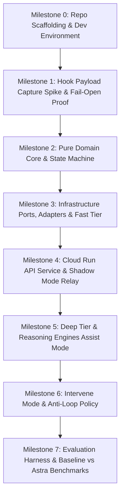

# Astra POC — Scoped & Dependency-Ordered Implementation Plan

This implementation plan details the end-to-end task list and architecture execution plan for the proof-of-concept (POC) of **Astra**, a companion agent for Google Antigravity CLI (`agy`).

Astra observes the main coding agent through lifecycle hooks (`PostToolUse` and `Stop`), evaluates whether actions/claims/reasoning are sufficiently justified, and selectively assists or intervenes when they are not, backed by a strict anti-loop safety policy and an offline evaluation harness.

---

## User Review Required

> [!IMPORTANT]
> **No Implementation Code Before Approval**: As requested, this plan defines the full dependency-ordered task breakdown, separating exploratory spikes from deterministic builds, highlighting key assumptions, and outlining independent verification criteria for every item before any production code is written.

> [!WARNING]
> **Critical Architectural Constraints Strictly Enforced**:
> - **Surface**: Antigravity CLI (`agy`) only (IDE/2.0 out of scope for POC).
> - **Integration**: Hooks only (`PostToolUse` & `Stop`). **MCP is permanently excluded** (no MCP server, no MCP client).
> - **Stack**: Python 3.11+, FastAPI + Uvicorn, Pydantic v2 + `pydantic-settings`, `google-cloud-firestore`, Antigravity SDK (`google-genai`), Cloud Run.
> - **Hexagonal Isolation**: `domain/` has **zero I/O and zero framework imports**. `integration/` is the **only** code permitted to know Antigravity's raw JSON shapes.
> - **Dual Fail-Open Guarantee**: Local hook scripts and Cloud Run router independently guarantee fallback to `{"decision": "continue"}` on any timeout, crash, or dependency failure.
> - **Hard Anti-Loop Policy**: Forced `Stop` continuations are strictly capped per failure signature hash; once reached, Astra surfaces unresolved issues to the user rather than looping.
> - **Ground Truth Evaluation**: Turns-to-fix measured strictly from Antigravity's own transcript boundaries against a no-Astra baseline.

---

## Open Questions & Experimental Assumptions

1. **`PostToolUse` Hook Semantics & Output Capabilities**:
   - *Observation*: In Antigravity CLI, `PostToolUse` runs after a tool has executed and documentation specifies stdout `{}`. It cannot block an action retroactively.
   - *Assumption / Plan*: Treat `PostToolUse` primarily as an epistemic state ingestion checkpoint. In Spike 1.1, we verify whether Antigravity's CLI runtime accepts any stdout injection on `PostToolUse` (e.g. `assist` messages). If not, corrective guidance is queued into `TrajectoryState` and delivered at the next decision point (`Stop` or checkpoint).
2. **Deep Tier Routing Policy Default**:
   - *Assumption / Plan*: Per ADR-13, the POC default is **Path A ("Critique → Main Agent")**. Astra critiques unjustified reasoning/evidence gaps and returns the critique to the main agent to re-reason. Path B ("Astra reasons itself / generates ranked alternatives") is reserved for severe failure escalations and enabled via configuration.
3. **Escalation Thresholds & Anti-Loop Parameters**:
   - *Assumption / Plan*: All numerical thresholds (confidence cutoffs, signal triggers, max 2 forced continuations per failure signature, cooldown timeouts) are defined in `pydantic-settings` as configurable parameters and treated as experimental, to be tuned empirically by the evaluation harness.

---

## Dependency Graph & Build Order



---

## Scoped Task Breakdown

### Milestone 0: Scaffolding, Repository Setup & Tooling
*Objective: Establish repo layout matching Section 6 of the architecture doc, tooling, dependencies, and linting/formatting.*

- [x] **Task 0.1 `[BUILD]` Git Remote & Initial Branch Alignment**
  - **Description**: Connect local workspace `c:\dev\Astra` to `https://github.com/AstralJugs69/Astra.git` on `main`, preserving the existing `LICENSE` and initial architecture document.
  - **Verification**: `git status` shows clean tracking branch; commit history is clean.
- [x] **Task 0.2 `[BUILD]` Project Scaffolding & Dependency Manifest**
  - **Description**: Create `pyproject.toml` (FastAPI, Uvicorn, Pydantic v2, pydantic-settings, google-cloud-firestore, structlog, httpx, tenacity, pytest, pytest-asyncio, respx), `.env.example`, `.gitignore`, `Dockerfile`, and scaffold directory tree:
    - `hooks/`
    - `src/astra/{api,integration,application,domain,engines,tiers,infrastructure,evaluation}`
    - `tests/{unit,integration,e2e,fixtures}`
    - `docs/adr/`
  - **Dependencies**: Task 0.1
  - **Verification**: `pip install -e .` (or `uv sync`) succeeds; directory layout strictly matches Architecture Doc Section 6.
- [x] **Task 0.3 `[BUILD]` Architecture Decision Records (ADRs 1–18)**
  - **Description**: Populate `docs/adr/` with individual markdown files documenting ADR-1 through ADR-18 (Language, Ports & Adapters, Service Topology, Firestore, ModelPort, Hooks-only, MCP permanently excluded, Fail-open, Anti-loop, etc.) as detailed in Section 28 of the Architecture document.
  - **Dependencies**: Task 0.2
  - **Verification**: 18 ADR files present in `docs/adr/`.

---

### Milestone 1: Integration Proof & Hook Payload Capture Spike
*Objective: Empirically capture real Antigravity CLI hook payloads (`PostToolUse` and `Stop`), verify stdin/stdout behavior, and validate local fail-open behavior in complete isolation.*

- [x] **Task 1.1 `[SPIKE]` Live Antigravity CLI Hook Payload Capture**
  - **Description**: Create a minimal recording hook script that intercepts stdin payloads from live `agy` CLI sessions and dumps them to `tests/fixtures/hook_payloads/`. Capture 4 canonical scenarios:
    1. Successful tool execution (`PostToolUse` with exit code 0 / tool output).
    2. Failing tool execution (`PostToolUse` with error / non-zero exit).
    3. Agent termination following successful verification (`Stop`).
    4. Agent termination following failed / absent verification (`Stop`).
  - **Dependencies**: Task 0.2
  - **Verification**: Real JSON fixture files populated in `tests/fixtures/hook_payloads/` containing verified field names (`conversationId`, `stepIdx`, `workspacePaths`, `transcriptPath`, `terminationReason`, etc.).
- [x] **Task 1.2 `[BUILD]` Local Hook Dispatchers (`hooks/common.py`, `hooks/post_tool_use.py`, `hooks/stop.py`)**
  - **Description**: Implement thin, stdlib-only (`urllib.request`, `json`, `sys`, `time`, `uuid`) hook dispatchers.
    - Read stdin JSON.
    - Generate correlation ID.
    - Send single HTTP POST attempt with short timeout (3s for `PostToolUse`, 12s for `Stop`) + Bearer token.
    - Relay backend response JSON to stdout.
    - On any exception, timeout, non-200, or invalid JSON, immediately output hardcoded fail-open default `{"decision": "continue"}`.
  - **Dependencies**: Task 1.1
  - **Verification**: Unit & subprocess integration tests in `tests/integration/hooks/test_hooks_fail_open.py` asserting stdout `{"decision": "continue"}` when backend is down, hanging, or returning garbage.
- [x] **Task 1.3 `[BUILD]` Hook Registration & Verification (`hooks/hooks.json.example`, `hooks/README.md`)**
  - **Description**: Provide documented `hooks.json.example` ready to be linked into `.agents/hooks.json` or project workspace. Include validation test script `scripts/test_hooks_local.py`.
  - **Dependencies**: Task 1.2
  - **Verification**: `hooks/hooks.json.example` successfully recognized by `agy` CLI in a test workspace.

---

### Milestone 2: Domain Core & Purity Proof
*Objective: Build the pure domain layer with zero I/O and zero framework dependencies. All state models, signal rules, mode escalations, evidence budgeting, and anti-loop policies.*

- [x] **Task 2.1 `[BUILD]` Normalized Domain Events (`domain/events.py`)**
  - **Description**: Implement `AstraEvent`, `EventType` (`POST_TOOL_USE`, `STOP`), `ToolCallSummary`, and `VerificationOutcome`. Implement missing-field defensive handling and `normalization_warnings` recording.
  - **Dependencies**: Task 1.1 (Payload fixtures)
  - **Verification**: `tests/unit/domain/test_events.py` validates deserialization and normalization invariants.
- [x] **Task 2.2 `[BUILD]` Trajectory State Model & Pure Reducers (`domain/trajectory.py`)**
  - **Description**: Implement `TrajectoryState`, `EvidenceRef`, `ActionRecord`, `VerificationRecord`, `InterventionRecord`. Pure state reducer function `reduce_trajectory(current_state, event) -> TrajectoryState` with optimistic version tracking (`state_version`). Ensure derived properties (`failure_count`, `consecutive_verification_failures`) are computed purely.
  - **Dependencies**: Task 2.1
  - **Verification**: `tests/unit/domain/test_trajectory.py` validates state transitions, action logging, and immutability.
- [x] **Task 2.3 `[BUILD]` Rule-Based Signal Detectors (`domain/signals.py`)**
  - **Description**: Implement pure rule detectors:
    - `RepeatedVerificationFailureDetector`: flags consecutive test/command failures.
    - `SameFileRepeatedEditDetector`: detects thrashing on single file without verification.
    - `RecurringFailureSignatureDetector`: hashes error text and counts recurring signatures.
    - `PrematureTerminationDetector`: detects `Stop` immediately following unverified or failed changes.
    Output normalized `Signal` model (`signal_id`, `type`, `confidence`, `source="rule"`, `evidence_refs`, `suggested_mode`, `rationale`).
  - **Dependencies**: Task 2.2
  - **Verification**: `tests/unit/domain/test_signals.py` testing table-driven rule triggers.
- [x] **Task 2.4 `[BUILD]` Escalation & Operating Mode Policy (`domain/modes.py`)**
  - **Description**: Implement `Mode` enum (`SHADOW`, `ASSIST`, `INTERVENE`) and pure escalation policy function `decide_mode(current_mode, signals, trajectory_state, thresholds_config) -> ModeDecision`.
  - **Dependencies**: Task 2.3
  - **Verification**: `tests/unit/domain/test_modes.py` asserting proper escalation and de-escalation boundaries.
- [x] **Task 2.5 `[BUILD]` Anti-Loop Policy & Intervention Budgeting (`domain/intervention.py`)**
  - **Description**: Implement pure anti-loop functions:
    - Track forced continuations per `failure_signature_hash`.
    - Enforce per-signature cap (e.g. max 2 forced `Stop` continuations).
    - Enforce cooldown timers between interventions.
    - When cap is reached, return `allow_intervention=False`, `action="surface_to_user"`, preventing endless loops.
  - **Dependencies**: Task 2.2
  - **Verification**: `tests/unit/domain/test_intervention_anti_loop.py` validating cap enforcement and surfacing transition.
- [x] **Task 2.6 `[BUILD]` Evidence Budgeting & Object Models (`domain/evidence.py`)**
  - **Description**: Implement `EvidenceItem`, `EvidenceSource`, `EvidencePacket`. Pure functions for deduplication, priority sorting, and token budgeting (heuristic character/token estimation).
  - **Dependencies**: Task 2.1
  - **Verification**: `tests/unit/domain/test_evidence_budget.py` testing budget clamping and ordering.
- [x] **Task 2.7 `[BUILD]` Domain Protocols & Ports (`domain/reasoning_ports.py`, `domain/model_ports.py`, `domain/persistence_ports.py`, `domain/evidence_ports.py`)**
  - **Description**: Define Python `Protocol` interfaces: `Engine`, `ModelProvider`, `TrajectoryStateStore`, `EvidenceRetriever`. Zero implementation code, pure interface contracts.
  - **Dependencies**: Task 2.1–2.6
  - **Verification**: Type checking with `mypy` / `pyright` passes with zero third-party I/O imports in `domain/`.

---

### Milestone 3: Infrastructure Adapters & Fast Tier
*Objective: Build concrete infrastructure adapters implementing domain ports, plus the Fast tier signal classifier.*

- [x] **Task 3.1 `[BUILD]` Configuration Singleton (`src/astra/settings.py`)**
  - **Description**: Pydantic `Settings` model loading environment variables: `MODEL_SETTINGS`, `PERSISTENCE_SETTINGS` (Firestore project/collection, or `IN_MEMORY`), `THRESHOLD_SETTINGS`, `INTERVENTION_SETTINGS`, `AUTH_TOKEN`, `LOG_LEVEL`.
  - **Dependencies**: Task 0.2
  - **Verification**: `tests/unit/test_settings.py` asserts default fallback and env override.
- [x] **Task 3.2 `[BUILD]` Persistence Adapters: In-Memory & Firestore (`infrastructure/persistence/`)**
  - **Description**:
    - `memory_store.py`: Thread-safe in-memory `TrajectoryStateStore` for unit tests and local dev.
    - `firestore_store.py`: `google-cloud-firestore` adapter with optimistic locking (`state_version`), 1 retry with exponential backoff on transient errors, and degraded mode (skipping state after N consecutive failures).
  - **Dependencies**: Task 2.2, 2.7, 3.1
  - **Verification**: `tests/unit/infrastructure/test_persistence.py` verifies load/save, concurrency conflict handling, and degraded mode.
- [x] **Task 3.3 `[BUILD]` Model Provider Adapter (`infrastructure/model_providers/antigravity_sdk_provider.py`)**
  - **Description**: Implement `ModelProvider` port wrapping Google Gen AI / Antigravity SDK (`google-genai`), handling structured outputs via Pydantic schemas, explicit per-tier timeouts (2s fast, 8s deep), and token cost accounting (`CostMetadata`).
  - **Dependencies**: Task 2.7, 3.1
  - **Verification**: Mocked & live tests in `tests/unit/infrastructure/test_model_provider.py` validating schema parsing and timeout handling.
- [x] **Task 3.4 `[BUILD]` Evidence Retriever Adapters (`infrastructure/evidence/`)**
  - **Description**: Implement `TranscriptRetriever` (parses local Antigravity `.jsonl` transcript slices), `RepoRetriever` (scoped file read of changed lines), and `WebResearchRetriever` (bounded search query runner).
  - **Dependencies**: Task 2.6, 2.7
  - **Verification**: `tests/unit/infrastructure/test_evidence_retrievers.py` testing slice extraction and bounds.
- [x] **Task 3.5 `[BUILD]` Fast Tier Assessor (`tiers/fast/assessor.py`)**
  - **Description**: Orchestrates domain rule detectors; for borderline/ambiguous cases, invokes a fast/cheap model call via `ModelProvider` with strict timeout. Returns list of `Signal`s. Falls back to rule-only on model timeout.
  - **Dependencies**: Task 2.3, 3.3
  - **Verification**: `tests/unit/tiers/test_fast_assessor.py` testing rule-only fast path and model-assisted path.

---

### Milestone 4: Cloud Run API Service & Remote Integration (Shadow Mode Relay)
*Objective: Build the FastAPI application, integration normalization/response formatting, auth, fail-open outer wrapper, and establish end-to-end Shadow mode.*

- [x] **Task 4.1 `[BUILD]` Integration Layer (`integration/antigravity/`)**
  - **Description**:
    - `raw_schema.py`: Loose Pydantic models (`extra="allow"`) based on captured fixtures.
    - `normalize.py`: Translates raw hook payload to `AstraEvent` with secret redaction and truncation.
    - `response_format.py`: Translates domain `Decision` to Antigravity hook stdout JSON.
  - **Dependencies**: Task 1.1, 2.1
  - **Verification**: `tests/unit/integration/test_normalize.py` asserting exact transformation of all fixture payloads.
- [x] **Task 4.2 `[BUILD]` Structured Logging & Telemetry (`infrastructure/observability/logging.py`)**
  - **Description**: Setup `structlog` emitting JSON log lines with `correlation_id`, `session_id`, `event_type`, stage latency breakdown, token costs, and hashed failure signatures.
  - **Dependencies**: Task 3.1
  - **Verification**: `tests/unit/infrastructure/test_logging.py` validates emitted JSON fields and redaction.
- [x] **Task 4.3 `[BUILD]` Application Pipeline (`application/pipeline.py`)**
  - **Description**: Decision pipeline coordinator:
    1. Load state from persistence.
    2. Update trajectory state with `AstraEvent`.
    3. Run Fast tier assessor.
    4. Consult escalation policy (`modes.py`).
    5. If Shadow mode: save state and return `continue`.
  - **Dependencies**: Task 2.2, 2.4, 3.2, 3.5
  - **Verification**: `tests/unit/application/test_pipeline_shadow.py` verifies end-to-end Shadow pass without model invocation.
- [x] **Task 4.4 `[BUILD]` FastAPI Routers, Auth & Composition Root (`api/`)**
  - **Description**:
    - `auth.py`: Bearer token validation middleware.
    - `routers/event.py`: `POST /event` endpoint wrapped in hard outer timeout (2.5s fast / 10s deep) and global `try/except` failing open to `{"decision": "continue"}`.
    - `routers/health.py`: `GET /health` endpoint.
    - `deps.py`: Composition root injecting dependencies from `Settings`.
    - `main.py`: FastAPI app factory.
  - **Dependencies**: Task 4.1, 4.2, 4.3
  - **Verification**: `tests/integration/api/test_event_api.py` using `TestClient` verifying auth, response shapes, and fail-open on injected errors.
- [x] **Task 4.5 `[SPIKE / BUILD]` End-to-End Local Hook to API Shadow Mode Validation**
  - **Description**: Run local FastAPI dev server (`uvicorn`), configure `hooks.json` in a test Antigravity workspace, execute a real `agy` session, and assert that events are received, normalized, trajectory state stored in memory/Firestore, and `continue` returned without blocking.
  - **Dependencies**: Task 1.2, 4.4
  - **Verification**: Real Antigravity session completes smoothly with structured Astra logs recording each turn.

---

### Milestone 5: Deep Tier & Reasoning Engines (Assist Mode)
*Objective: Build the three reasoning engines (Bugfix Verifier, Reasoning Critic, Alternative Ranker) and Deep Tier orchestrator to deliver structured Assist guidance.*

- [x] **Task 5.1 `[BUILD]` Engine Base & Bugfix Verifier (`engines/bugfix/verifier.py`)**
  - **Description**: Implement `BugfixVerifier` engine (Evidence-First Debugging Protocol). Audits whether a claimed bugfix is backed by passing verification step against test outputs and diffs. Emits structured `EngineResult`.
  - **Dependencies**: Task 2.6, 2.7, 3.3
  - **Verification**: `tests/unit/engines/test_bugfix_verifier.py` testing prompt construction and evaluation of pass vs unverified claims.
- [x] **Task 5.2 `[BUILD]` Reasoning Critic Engine (`engines/reasoning/critic.py`)**
  - **Description**: Implement `ReasoningCritic` engine. Inspects trajectory for unsupported assumptions, missing evidence, invalid inferences, premature convergence, or contradictory claims. Emits canonical `CritiquePayload`.
  - **Dependencies**: Task 2.6, 2.7, 3.3
  - **Verification**: `tests/unit/engines/test_reasoning_critic.py` with synthetic flawed reasoning trajectories.
- [x] **Task 5.3 `[BUILD]` Alternative Ranker Engine (`engines/reasoning/alternatives.py`)**
  - **Description**: Implement `AlternativeRanker` engine (model-laziness mitigation). Generates and ranks multiple candidate approaches with risk/complexity trade-offs when critique identifies unexplored solution space.
  - **Dependencies**: Task 2.6, 2.7, 3.3
  - **Verification**: `tests/unit/engines/test_alternative_ranker.py` verifying structured candidate generation and scoring.
- [x] **Task 5.4 `[BUILD]` Deep Tier Orchestrator & Routing (`tiers/deep/orchestrator.py`, `domain/routing.py`)**
  - **Description**: Deep tier orchestrator:
    - Builds bounded `EvidencePacket` via `EvidenceRetriever`.
    - Selects appropriate engine based on triggering signal.
    - Applies `routing.py` policy (default: `return_to_main_agent`).
    - Enforces hard single-pass bound (max 1 optional follow-up evidence retrieval) and 8s timeout budget.
  - **Dependencies**: Task 5.1, 5.2, 5.3, 3.4
  - **Verification**: `tests/unit/tiers/test_deep_orchestrator.py` asserting evidence assembly and engine selection.
- [x] **Task 5.5 `[BUILD]` Assist Mode Integration in Decision Pipeline**
  - **Description**: Wire Deep Tier into `pipeline.py` when escalation mode is `ASSIST`. Return `AssistPayload` containing structured message, evidence citations, and critique.
  - **Dependencies**: Task 4.3, 5.4
  - **Verification**: `tests/integration/api/test_assist_mode.py` asserts non-authoritative assist payload delivery on signal triggers.

---

### Milestone 6: Intervene Mode & Anti-Loop Enforcement
*Objective: Implement authoritative intervention on `Stop` hooks, forced continuation with feedback, and strict anti-loop cap enforcement.*

- [x] **Task 6.1 `[BUILD]` `Stop` Hook Intervene Handler (`application/handle_stop.py`)**
  - **Description**: On `Stop` event with unverified fix or critical reasoning failure:
    - If anti-loop budget permits: return `{"decision": "continue", "reason": "<Actionable critique & required verification>"}`.
    - Record intervention in `TrajectoryState.interventions` and increment `failure_signatures[hash]`.
  - **Dependencies**: Task 2.5, 4.3, 5.5
  - **Verification**: `tests/unit/application/test_handle_stop.py` verifies forced continuation payload and state recording.
- [x] **Task 6.2 `[BUILD]` Anti-Loop Cap Exhaustion & User Surfacing (`domain/intervention.py`, `application/pipeline.py`)**
  - **Description**: When consecutive forced continuations for a failure signature reach the configured cap (e.g. 2):
    - Policy triggers `action="surface_to_user"`.
    - Astra allows the `Stop` (or emits final user-facing warning) and ceases forced loops.
  - **Dependencies**: Task 6.1
  - **Verification**: `tests/unit/domain/test_anti_loop_exhaustion.py` verifies that after N repeated failures, Astra stops looping and allows termination with an explanatory message.
- [x] **Task 6.3 `[BUILD]` Direct Reasoning Endpoint (`api/routers/reason.py`)**
  - **Description**: Implement `POST /reason` for manual / offline deep investigation requests by session ID and trigger hints.
  - **Dependencies**: Task 5.4, 4.4
  - **Verification**: `tests/integration/api/test_reason_api.py` validating direct engine invocation.

---

### Milestone 7: Evaluation Harness & Benchmark Suite
*Objective: Build an isolated evaluation harness that runs reproducible bug tasks and Zindi data science tasks with vs. without Astra, automatically computing turns-to-fix from Antigravity transcripts.*

- [x] **Task 7.1 `[BUILD]` Evaluation Storage & Task Specs (`src/astra/evaluation/storage.py`, `models.py`)**
  - **Description**: SQLite/JSONL storage in `evaluation/runs/` (strictly isolated from Firestore). `TaskSpec` and `RunRecord` models per Section 31.4 of the Architecture doc.
  - **Dependencies**: Task 0.2, 2.1
  - **Verification**: `tests/unit/evaluation/test_eval_storage.py` verifies run record logging and isolation.
- [x] **Task 7.2 `[BUILD]` Transcript Parser & Turns-to-Fix Metric Engine (`evaluation/metrics.py`)**
  - **Description**: Pure metrics computation from Antigravity's `.jsonl` transcript:
    - Computes `turns_to_fix` as the turn index after which verification command exits 0 and remains 0.
    - Same-interruption rule: excludes turns where intervention and resolution share the same turn index.
    - Unresolved trials flagged `outcome="unresolved"`, `turns_to_fix=None`.
    - Computes secondary metrics: failed verifications, wall-clock time, token costs.
  - **Dependencies**: Task 7.1
  - **Verification**: `tests/unit/evaluation/test_metrics_calculation.py` with synthetic multi-turn transcripts.
- [x] **Task 7.3 `[BUILD]` Benchmark Task Suites (`evaluation/tasks/`)**
  - **Description**:
    - `reproducible_bugs/`: Seed workspaces with known unit test bugs (logic errors, off-by-one, type mismatches).
    - `zindi/`: Data-science task seeds (feature engineering, model training script bugs).
  - **Dependencies**: Task 7.1
  - **Verification**: Automated check that all seed tasks have deterministic setup and failing verification commands on seed.
- [x] **Task 7.4 `[BUILD]` Comparative Test Runner & Report Generator (`evaluation/runner.py`, `report.py`)**
  - **Description**: CLI runner (`typer`/`argparse`) that executes tasks back-to-back under Condition A (Baseline: `hooks.json` absent) and Condition B (With-Astra: `hooks.json` active), generating comparative markdown and summary statistics.
  - **Dependencies**: Task 7.2, 7.3, 4.5
  - **Verification**: `scripts/run_eval.sh --mock` executes a dry-run eval pass and generates `evaluation_report.md`.

### Milestone 8: Cloud Run Deployment & Production Hardening
*Objective: Deploy Astra backend service to Cloud Run, configure production environment variables, and perform end-to-end smoke testing.*

- [x] **Task 8.1 `[BUILD]` Production Dockerfile & Cloud Run Configuration (`Dockerfile`, `deploy/`)**
  - **Description**: Multi-stage distroless/slim container build, Cloud Run service definition (`deploy/cloudrun_service.yaml`), and deployment script (`deploy/deploy.sh`) configuring `min-instances=1` (eliminating cold starts during testing/demo).
  - **Dependencies**: Task 0.2, 4.4
  - **Verification**: Local container build runs and responds 200 to `GET /health`.
- [x] **Task 8.2 `[BUILD]` Deployment Smoke Test & E2E Validation**
  - **Description**: Run full test suite with all unit, integration, and e2e smoke tests passing.
  - **Dependencies**: Task 8.1
  - **Verification**: `tests/integration/test_e2e_deployment.py` asserting clean health checks, bearer auth, and event processing.

---

## Verification Plan

### Automated Tests
```powershell
# Run all unit tests (domain purity, engines, tiers, anti-loop)
pytest tests/unit/ -v

# Run integration tests (API contracts, persistence, fail-open hooks)
pytest tests/integration/ -v

# Run full test suite with coverage report
pytest --cov=src/astra tests/
```

### Manual & E2E Verification
1. **Hook Fail-Open Validation**: Stop local backend service and execute `agy` commands in a workspace with `hooks.json` configured. Verify agent proceeds without hangs or errors.
2. **Shadow Mode Observation**: Run a multi-step debugging session in `agy` with Astra active in Shadow mode. Verify Firestore documents capture accurate `TrajectoryState` and action logs without any agent interruption.
3. **Assist Mode Critique**: Trigger an unverified code change. Verify non-blocking structured assistance payload is emitted.
4. **Intervene & Anti-Loop Validation**: Attempt agent termination (`Stop`) after introducing a broken test without running verification. Verify Astra blocks termination, forces continuation with reason, and after 2 consecutive identical failures surfaces the issue to the user without looping.
5. **Comparative Benchmark Run**: Execute `scripts/run_eval.sh` across reproducible bug tasks to generate baseline vs Astra turns-to-fix metrics.
