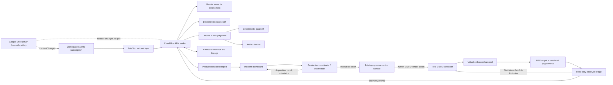
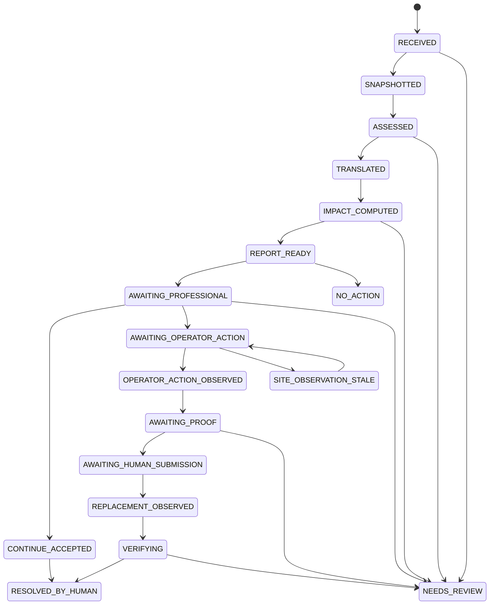

# Braille Errata Relay — Project Constitution and Build Instruction

> Status: repo-ready implementation brief  
> Research snapshot: 2026-08-28  
> Intended hackathon: [All Things Agentic Hackathon](https://allthingsagentichackathon.devpost.com/)  
> Category: **Taskmaster**  
> Team shape: solo build, deadline-first scope  
> Binding source of truth: the [official Devpost rules](https://allthingsagentichackathon.devpost.com/rules) and live submission form. If this file conflicts with either, Devpost prevails.

> **Implementation status — 2026-08-31:** This is the project's original
> research and target-design brief. The shipped automatic Drive trigger is a
> private Cloud Scheduler cycle that calls Cloud Run, drains `changes.list`,
> and authoritatively refetches the configured file before durable work begins.
> The Workspace Events/Pub/Sub source-ingress designs documented below are
> alternatives retained for research, not deployed release claims. See the
> README and `docs/fresh-project-deployment.md` for the implemented path.

## 0. How to use this file

This file is the project's constitution. Read it before changing architecture, adding integrations, or expanding scope. It records what is being built, what is deliberately simulated, where model judgment is allowed, where deterministic software must decide, how evidence is preserved, and what the demo must prove.

The non-negotiable build contract is:

> **Braille Errata Relay observes a changed source document, determines whether the correction materially affects an in-flight Braille production run, regenerates a candidate Braille artifact with Liblouis, computes the exact deterministic BRF impact, reports a decision-ready intervention to the responsible professional, and verifies the recovery that authorized humans perform through their existing production controls. The relay never holds, cancels, submits, releases, restarts, or physically stops a production job. Only the physical embossing mechanism is simulated; human-operated CUPS actions remain real.**

Do not turn this into a new Braille editor, publishing suite, digital asset manager, inventory system, recipient CRM, or system of record. It is a background agent overlay on an existing source-to-production workflow.

## 1. Executive brief

### 1.1 The problem

Braille production is a multi-stage workflow: an electronic source is transcribed and formatted, proofed, scheduled, embossed, assembled, and distributed. A small late correction in the source can have a much larger downstream effect in Braille because a changed word may alter contractions, cell count, line wrapping, page breaks, or volume boundaries. Once a stale production job has started, the response is not merely “regenerate the file.” Someone must identify which downstream artifact and job came from the superseded source, stop what can still be stopped, account for what has already been produced, generate the correct replacement, and verify the lineage.

The American Printing House for the Blind describes a real production process beginning with electronic source files, followed by Braille translation software, trained transcription, proof copies, correction, a work order, and production-floor embossing. It explicitly warns that conversion software alone does not produce perfect Braille. That is why this project automates incident detection and production coordination while preserving a human-quality boundary around final publication approval. See [APH's production overview](https://www.aph.org/blog/aph-behind-the-scenes-a-look-at-the-people-and-processes-that-bring-you-braille/).

### 1.2 The proposed agent

Braille Errata Relay watches a designated Google Drive source, reacts to a new revision, compares it with the last production baseline, asks Gemini for a bounded semantic assessment, runs deterministic Liblouis translation and pagination, compares the prior and new BRF page-by-page, and correlates affected output with read-only CUPS observations. It prepares a candidate corrected artifact and a role-specific incident report for a production coordinator or lead transcriber. The professional decides what should happen; a machine operator uses the facility's existing CUPS, vendor, or hardware controls; the relay observes and verifies the result.

The hero outcome is not a chat response and not autonomous machine control. It is an autonomous investigation followed by a visible, governed recovery:

```text
Drive source correction
  -> incident opened
  -> material factual change identified
  -> corrected UEB translated with Liblouis
  -> Braille page reflow measured
  -> decision-ready report routed to production coordinator
  -> coordinator records a disposition
  -> machine operator halts/cancels through existing controls
  -> relay observes the external queue transition
  -> qualified professional proofs the exact candidate artifact
  -> human submits/releases the approved replacement
  -> relay verifies output hash, job state, and lineage
```

### 1.3 Why this idea is compelling

1. **It is agent-native.** The workflow begins with an external event, spans interpretation and multiple tools, has irreversible state, and ends in verified action rather than generated prose.
2. **It exposes a non-obvious cascade.** One ordinary-language correction can invalidate multiple tactile pages. The before/after Braille reflow makes that consequence legible to people who do not read Braille.
3. **It fits an existing operational world.** Source repositories and transfer portals, electronic documents, translation tools, BRF artifacts, production jobs, and embosser queues already exist. Google Drive is the MVP's source adapter, not a claim about an industry-wide intake standard. The project inserts an agent between existing systems instead of inventing a replacement platform.
4. **It has a principled AI boundary.** Gemini decides semantic meaning and risk. Liblouis, hashes, page diffs, state transitions, and policy code decide production facts. This is stronger than asking a model to “generate Braille.”
5. **It demonstrates recovery, not only happy-path automation.** At-least-once events, duplicate delivery, stale jobs, partial physical progress, bridge outages, and uncertain model output are first-class states.
6. **It is honest and reproducible without specialized hardware.** The CUPS scheduler, job IDs, and human-operated queue transitions are real; the relay has read-only queue authority; the backend that would drive an embosser writes inspectable output files and simulated page-completion events instead.

### 1.4 Real production-floor reference model

There is no single universal Braille-production software stack or intake channel. The common workflow is organizational: a request and authoritative source are attached to a production identifier or work order; trained people transcribe and format; independent proofing produces corrections; an approved Braille master is released to a physical-production path; finished units are inspected, assembled, distributed, and retained for later reproduction or revision.

Two facilities provide the best concrete anchors for this project:

- [American Printing House for the Blind (APH)](https://www.aph.org/blog/aph-behind-the-scenes-a-look-at-the-people-and-processes-that-bring-you-braille/) describes a roughly 100-person operation spanning translation, proofreading, graphics, tests/textbooks, and production. A transcriber receives an electronic Word, Corel, BRF, PDF, or EPUB file; BrailleBlaster, Braille 2000, or Duxbury assists conversion; trained transcribers edit the result; a proof copy is corrected and proofread again; a finished report enables creation of a work order; and the floor uses embossers and presses. APH reports Braillo roll-paper machines for Braille-only pages and other units that can fold and staple.
- [National Braille Press (NBP)](https://www.nbp.org/ic/nbp/about/aboutus/tour.html) documents the clearest end-to-end factory tour. Most books arrive as hard copy and are scanned, though some arrive digitally. Transcribers format the content in Duxbury; a BRF first draft is compared with the print source by proofreaders; corrections return to transcription; an approved electronic Braille file drives a Plate Embossing Device that makes interpoint zinc masters; the plates are proofed again; presses reproduce pages; tactile graphics use a separate thermoform process; pages are collated, checked, bound, or stitched.

These references show that **Drive is plausible but not canonical**. Actual intake varies by market and contract:

| Context | Document/request entry | Source acquisition |
|---|---|---|
| Custom educational order | Web form, purchase order, email, and attached reference pages; APH's [textbook request](https://www.aph.org/educational-resources/accessible-textbooks/braille-textbook-request-form/) is one current example | Producer obtains the book or digital source after checking that an accessible edition is not already available |
| U.S. K-12 textbook production | Authorized-user assignment through the NIMAC repository | Publisher-supplied NIMAS XML/package/images are downloaded by an accessible media producer; the [U.S. Department of Education](https://sites.ed.gov/idea/idea-files/questions-and-answers-on-the-national-instructional-materials-accessibility-standard-nimas-aug-9-2021/) describes this repository-to-producer path |
| Library contractor | Contract, catalog/production record, and assigned production identifier | Publisher or customer digital files, print copies, or other contract-supplied source; completed packages are returned through a controlled portal |
| Periodical | Subscription or direct publisher relationship | Some producers receive early publisher files; otherwise work begins from the released issue, as described by [NLS](https://www.loc.gov/nls/news-and-updates/overseas-outlook-newsletter/overseas-outlook-july-december-2023/) |
| Commercial/personal transcription | Quote/order form, secure client transfer, email, or physical delivery | Word/PDF/EPUB and similar files, or hard copy that is scanned |
| Reproduction/on-demand | Catalog/Braille-master request | Existing BRF or plate/master is reused; no fresh print-to-Braille transcription should occur unless the source/master changed |

The transport is therefore replaceable. The durable integration contract is a **versioned source package associated with a stable production/work-order identifier**, plus its output profile, approved Braille master, job state, and revision history. Google Drive is selected for the hackathon because its change event makes the agent visible and reproducible, not because Braille houses universally run on Drive.

#### Reference workflow from request to reader

1. **Commission or select.** A school, library, publisher, government body, business, or individual requests a title/document. The producer records requester, title/edition/ISBN or other identifier, deadline, copies, language/code, contracted versus uncontracted Braille, paper/page profile, binding, graphics, and delivery requirements.
2. **Rights, eligibility, and duplicate check.** The producer verifies authority to make/distribute the accessible copy and checks whether a usable edition already exists. For U.S. instructional materials, NIMAC/Louis can avoid duplicate transcription.
3. **Acquire and register the source.** Input may be NIMAS/DTBook XML, Word, EPUB, PDF, another electronic file, a finished BRF, or print that must be scanned/OCRed. The exact edition and source revision are frozen under a production identifier.
4. **Preflight.** Staff check completeness, ordering, metadata, styles/structure, page references, OCR quality, languages, mathematics, tables, and images. They choose the Braille code, layout, volume plan, output device/profile, and which visual material needs description or a tactile graphic.
5. **Transcribe and format.** Duxbury, BrailleBlaster, Braille 2000, Liblouis-backed tools, or another authorized tool performs translation, but a trained transcriber resolves formatting, contractions, print-page mapping, transcriber's notes, special codes, and volume boundaries. BANA's [Braille Formats principles](https://www.brailleauthority.org/formats/formats2016.html) make clear that this work requires structured judgment and is not merely character conversion.
6. **Develop graphics in parallel.** Tactile diagrams are redesigned for tactile comprehension rather than copied visually. They follow a distinct production and quality path; see BANA's [tactile graphics guidelines](https://www.brailleauthority.org/guidelines-and-standards-tactile-graphics).
7. **Create the first proof.** The draft may be a BRF read on a refreshable display or an embossed paper proof. A proofreader compares it with the authoritative print/source, often while a second person reads the print aloud.
8. **Correct and re-proof.** Errors return to the transcriber; APH describes a second proof. Complex graphics may receive additional review. Computer-assisted translation is never treated as sufficient proof by itself; [NLS says materials must be checked by a qualified Braille proofreader](https://www.loc.gov/nls/services-and-resources/informational-publications/about-braille/).
9. **Release the master and production work order.** Only the reviewed artifact becomes the approved Braille master. The work order fixes artifact revision, device/layout profile, copy count, page/volume range, media, finishing, and destination. This is the principal safety gate Braille Errata Relay must preserve.
10. **Produce through one of two physical paths.** Direct/on-demand production sends an approved BRF or device-native stream to a cut-sheet, tractor-feed, or roll-fed embosser. Networked Index embossers, for example, expose file submission, status, and a queue through their [web interface](https://indexbraille.com/learn-more/index-web-interface/), while Duxbury exposes both direct embossing and BRF creation through its [command-line/API workflow](https://www.duxburysystems.com/documentation/dbt%2411.3/Command_Line_DBT.htm). High-volume plate production sends the approved Braille code to a plate embosser, proofs the zinc plate, and presses many paper copies. Roll systems may separate work into signatures for folding and binding.
11. **Monitor and inspect production.** Operators load/calibrate media, observe the machine, preserve dot quality and alignment, isolate jams or partial units, and inspect output. NLS contract requirements include producer inspection, proofreading, corrective action, and possible recall for production defects; see [Specification 801](https://www.loc.gov/nls/wp-content/uploads/2019/09/Spec801.final_.pdf).
12. **Finish.** Output is burst/cut where needed, folded into signatures, collated manually or automatically, checked for correct order, and bound, stitched, stapled, or placed in a binder. Covers, print/Braille labels, and volume numbering are added. Binding must protect dot height and allow pages to lie sufficiently flat.
13. **Package and distribute.** Physical copies go to a school, client, patron, or network library. Digital delivery may publish BRF through a library/repository. NLS's current [Braille deliverable-package specification](https://www.loc.gov/nls/who-we-are/guidelines-and-specifications/contract-specifications/braille-deliverable-package-2022/) uses one or more BRFs, a BOPF manifest, and a checksum in a controlled ZIP submitted through its Transfer Portal; this is a useful lineage model, not an MVP requirement.
14. **Retain and revise.** The producer retains the approved master and production evidence for reorders/on-demand runs. NLS BOPF metadata records producer, produced date, incrementing revision, revision date, and revision description in [Specification 806](https://www.loc.gov/nls/who-we-are/guidelines-and-specifications/contract-specifications/braille-oeb-package-file-bopf-requirements-2022/). A later correction must create a new revision; it must not silently overwrite the master or historical job.

#### Where Braille Errata Relay fits

The product belongs between steps 3/4 and steps 9-11 as a **correction-control overlay**:

```text
authoritative source provider (Drive in MVP; repository/portal/DAM in practice)
  -> immutable source revision + existing production/work-order ID
  -> existing transcription/format profile and approved baseline BRF
  -> proofreading/release gate
  -> ProductionObserver (read-only CUPS/IPP adapter in MVP)
  -> physical endpoint (simulated in MVP)
  -> existing finishing/distribution process (out of scope)
```

When a source revision arrives after the baseline has entered production, the relay automatically detects the incident, computes semantic and exact BRF impact, generates a **candidate corrected BRF**, and reports the affected job, page range, urgency, uncertainty, and recommended response. It does not hold or cancel stale work, submit a candidate, operate a machine, or claim that physical output was quarantined. A production coordinator decides the disposition; a machine operator performs any halt through existing controls; and a qualified transcriber/proofreader approves the exact corrected artifact before a human returns it to production.

The relay may observe scheduler state and simulator evidence after the human action. Physical facts that no device exposes—such as whether a buffered embosser actually stopped or which sheets were isolated—require an identified operator attestation and remain distinct from observed CUPS facts.

This placement yields two stable adapter interfaces without building a new publishing platform:

- `SourceProvider`: fetch authoritative metadata/bytes/version and observe or poll changes. Implement Google Drive first; NIMAC, SFTP, SharePoint, Dropbox, a publisher portal, or a DAM remain future adapters.
- `ProductionObserver`: inspect, correlate, and observe a production job without job-control credentials. Implement read-only CUPS/IPP first for the direct-digital line. Plate/PED and proprietary high-volume systems remain future observer adapters or human-attested integrations.

The human roles remain part of the existing facility: the production coordinator decides disposition, the machine operator controls the queue/device, and the qualified transcriber/proofreader approves the corrected artifact. The relay records their decisions and observations but does not acquire their production authority.

Firestore stores incident execution evidence and derived lineage only. It does not own orders, catalog records, proofreading decisions, inventories, recipient data, bindings, shipments, or the authoritative source/master.

## 2. Official hackathon ground truth

This section is a working summary, not legal advice and not a substitute for reading the official rules. The data below was fetched from Devpost's official event interface on 2026-08-27.

### 2.1 Brief and mandatory stack

The event asks participants to build and deploy a next-generation autonomous agent that operates beyond a standard chat loop. Braille Errata Relay should be submitted to **Taskmaster**, whose official framing is a complete workflow that takes action and handles a messy multi-step chore with little hand-holding.

Every project must use all three of the following:

1. **Gemini 3.5 or newer**, through the Gemini API or Vertex AI.
2. **At least one Google agent framework**: Google ADK, Google GenAI SDK, Antigravity SDK, or Genkit.
3. **At least one Google Cloud infrastructure service**, such as Cloud Run, Firestore, Pub/Sub, Cloud SQL, or GKE.

This build pins `gemini-3.5-flash` through Vertex AI, uses Google ADK, Cloud Run, Pub/Sub, Firestore, and an artifact bucket. Do not use a floating `latest` alias or silently fall back below the event minimum. Newer Gemini models may be enabled only after an explicit project-level smoke test and a recorded configuration change.

### 2.2 Delivery priorities

| Criterion | Weight | What this project must prove |
|---|---:|---|
| Innovation & Operational Utility | 40% | A real source correction triggers autonomous investigation, candidate regeneration, and a decision-ready professional report, followed by a governed human recovery that the relay verifies. |
| Architectural Discipline & Tech Stack | 30% | State is explicit; events are idempotent; credentials and tools are constrained; failures are recoverable; model judgment is separated from deterministic facts. |
| Demo & Production Readiness | 30% | The live flow works as shown, setup is reproducible, the architecture diagram is clear, and the video visibly proves the backend runs on Google Cloud. |

Do not spend scarce time on decorative features that do not improve one of those three rows.

### 2.3 Dates and deadline

The binding submission deadline is **2026-08-31 at 5:00 PM Pacific Time**, which is **2026-09-01 00:00 UTC** and **2026-09-01 03:00 EAT**.

Devpost's structured schedule and the prose terms disagree on several non-submission dates. Do not use this file to resolve that discrepancy. Re-check the live event page for any action that depends on those dates. The submission deadline is consistent in both sources.

### 2.4 Submission obligations

The current form requires or expects:

- one selected category: **Taskmaster**;
- a text description covering features, functionality, technologies, other data sources, findings, and learnings;
- a code repository URL; if private, access for `testing@devpost.com` and `cloudhackathons@google.com`;
- step-by-step spin-up and reproducible testing instructions in `README.md`;
- an uploaded architecture diagram (`pdf`, `ppt`, `pptx`, `png`, `jpg`, or `jpeg` in the current form);
- a public demo video of about four minutes or less, in English or with English translation/subtitles;
- the working agent in action, not only slides;
- visible proof in the video that the backend ran on Google Cloud, such as a Cloud Run URL/dashboard or Vertex AI/Cloud logs;
- disclosure of the Google framework, Cloud services, and Gemini model used;
- the project's actual start date and disclosure of pre-existing work.

A hosted URL is optional but strongly encouraged. The event record says the service need not remain continuously live if the repo and demo clearly prove that it was deployed on Google Cloud. The video, description, and images must therefore stand on their own.

Optional bonus paths include a public build article/video/podcast, a public social post using `#AllThingsAgenticHackathon`, or additional eligible Google AI models. These are lower priority than a reliable core demo.

### 2.5 Eligibility and conduct checkpoints

Before submitting, the entrant must personally read and accept the official terms. The current terms require legal age of majority, exclude specified jurisdictions and sanctioned persons/entities, and contain employer/conflict-of-interest conditions. Ethiopia appears as a selectable country in the current submission form, but only the official rules determine eligibility.

Other material requirements include:

- the project must be newly created during the submission period;
- standard libraries, frameworks, starter templates, and AI coding assistants may be used, while other pre-existing code or work must be disclosed;
- third-party SDKs, APIs, data, and other information must be used with authorization and under their licenses;
- the project must install and run consistently on its intended platform and match the submitted description/video;
- testing access, if provided, must remain free through the applicable review period;
- submission content must be owned or properly licensed and must not violate privacy, IP, law, or platform rules;
- submissions lock after the deadline; preserve the submitted repo/video state and continue later work in a separate branch or copy.

The rules allow the organizer to request access when an entry depends on proprietary hardware that is not widely available. **This project does not claim to run on a physical embosser and does not depend on one.** Its intended, reproducible platform is a software CUPS queue plus a documented virtual endpoint. A future real embosser integration is outside this MVP.

Relevant prize positioning: the event reports a $180,000 total pool, including the $20,000 Taskmaster award, two $10,000 Individual/Hobbyist awards, and two $5,000 Best Architectural Design awards. The rules state that a project can receive at most one prize. Prize strategy must not distort the build strategy.

## 3. Product definition

### 3.1 Product statement

**Braille Errata Relay is an autonomous investigation and professional-response layer for Braille production. It detects when a source revision supersedes an in-flight Braille artifact, measures semantic and tactile-layout impact, tells the responsible professional exactly what is at risk, prepares a traceable candidate correction, and verifies the human-controlled recovery.**

### 3.2 Primary user

For the MVP, the user is a Braille production coordinator or transcriber working with:

- an authoritative source exposed through a configured provider adapter (Google Drive in the MVP);
- an existing translation/formatting step;
- BRF production artifacts;
- a CUPS-managed embosser queue;
- an existing lightweight tracker, if desired.

The UI is an incident/evidence view, not the user's everyday publishing environment.

### 3.3 Job to be done

> When an authoritative source changes after Braille production has started, tell the responsible professional whether it matters, identify exactly which tactile output may be stale, give the operator a safe and specific response plan, prepare the candidate replacement, and verify that the human-approved recovery comes from the corrected source.

### 3.4 Success criteria

The MVP is successful when one Drive revision can trigger, without a user pressing a “run agent” button:

1. retrieval of the old production baseline and new source;
2. a structured semantic assessment with evidence from the changed source hunk;
3. full-volume regeneration through a pinned Liblouis table;
4. deterministic identification of changed BRF pages;
5. read-only correlation to at least one real CUPS job;
6. a timestamped, evidence-backed report routed to the configured production professional before any relay-initiated request for intervention;
7. an observed real hold/cancel performed manually by the human operator through the existing CUPS control surface;
8. a professional proof record tied to the exact candidate artifact, followed by an observed human submission/release;
9. a virtual endpoint artifact containing the exact manually submitted BRF bytes;
10. an evidence view that verifies hashes, human decision records, and final state;
11. identical reports and observations when the same source event is delivered twice;
12. a negative authorization test proving the relay cannot mutate the queue.


### 3.5 Operating stories and real-environment validation

These stories are the product contract. They convert “the agent helps when a late correction arrives” into observable behavior assigned to the real roles documented by APH and NBP. In this section, **professional** means the facility-designated production coordinator, lead transcriber, or qualified Braille proofreader for the decision at hand; **operator** means the person authorized to control the scheduler, embosser, PED, or press.

#### Story 1 — Register a traceable production baseline

> As a production coordinator, I want an approved source revision, Braille artifact, work-order identifier, and active job to be linked before production, so a later correction can be traced to the exact work at risk.

Acceptance criteria:

- registration records source hash, artifact hash, translation/layout profile, external work-order ID, queue/job ID, and responsible roles;
- the production job is submitted through the existing human-owned workflow, not by the relay;
- absent or ambiguous lineage is visible and prevents a precise halt recommendation;
- registration does not make Firestore the publishing or work-order system of record.

#### Story 2 — Detect and investigate without being asked

> As a production coordinator, I want the relay to notice a changed authoritative source and investigate it without a “run agent” click, so I learn about consequential errata while intervention may still be useful.

Acceptance criteria:

- one Drive revision opens one idempotent incident;
- the relay fetches and hashes the new source, compares it with the immutable baseline, obtains a bounded Gemini assessment, regenerates the whole constrained volume with Liblouis, and computes exact BRF page impact;
- the relay queries only read-only production state and labels its observation time and source;
- low confidence, unsupported content, missing lineage, or stale telemetry produces `NEEDS_PROFESSIONAL_REVIEW`, never guessed production facts.

#### Story 3 — Report to the professional before requesting intervention

> As the designated production professional, I want one decision-ready incident report before anyone acts on the relay's recommendation, so I can assess the source correction, production stage, and consequences in context.

Acceptance criteria:

- the report contains source/work-order identity, old/new source evidence, semantic severity and confidence, old/new artifact hashes, exact changed pages, observed job state and age, possible already-produced range, uncertainties, and recommended human response;
- the report names the roles that must act: coordinator, operator, transcriber, and proofreader as applicable;
- `report_ready_at` precedes any action the demo attributes to this incident, and acknowledgement is recorded separately from production action;
- the relay may create an urgent local/dashboard alert, but it cannot expose a disguised “stop” button or call the production control surface;
- existing emergency-stop and safety procedures remain available to operators independently; this workflow never requires a person to wait for the agent during a jam, hazard, or other emergency.

#### Story 4 — Let an authorized human decide and halt

> As a machine operator, I want the report to identify the exact job and recommended containment action while leaving the existing controls to me, so the relay cannot stop the wrong machine or override floor procedure.

Acceptance criteria:

- a coordinator records `CONTINUE_ACCEPTED`, `HALT_REQUESTED`, `REPORT_ERRATA`, or `REPLACE_VOLUME_REVIEW` with identity, time, and bounded note;
- the operator uses CUPS, the vendor queue, the device console, or the physical production procedure under existing credentials;
- the relay identity is technically unable to call Hold-Job, Cancel-Job, Pause-Printer, Release-Job, Print-Job, Create-Job, Send-Document, Restart-Job, or an equivalent vendor/device operation;
- the relay observes the later queue transition where possible, but never records “halted” merely because a human acknowledged the report;
- if a file may already be buffered in a device, CUPS cancellation is recorded as `QUEUE_CANCEL_OBSERVED`, not proof of `DEVICE_STOPPED`.

#### Story 5 — Account for physical work separately

> As a production coordinator, I want the relay to show which pages, plates, signatures, or copies may be stale while requiring the operator to record what was actually isolated, so simulated telemetry is never mistaken for physical containment.

Acceptance criteria:

- the relay produces `QUARANTINE_RECOMMENDED` ranges from lineage and observed/simulated progress;
- only an identified human may attest `PHYSICAL_OUTPUT_ISOLATED`, with actual range/count and disposition;
- simulator page files remain labeled `SIMULATED_ENDPOINT_TELEMETRY` and cannot create a real-world physical-attestation event;
- if physical progress is unknown, the report says unknown and recommends conservative inspection rather than inventing a count.

#### Story 6 — Prepare a candidate, preserve professional proofing

> As a Braille transcriber or proofreader, I want the relay to prepare a reproducible candidate and focused evidence package without calling it an approved master, so normal correction and proofing authority is preserved.

Acceptance criteria:

- every regenerated BRF is labeled `CANDIDATE` until an authorized professional approves its exact hash;
- the package includes source diff, Unicode Braille preview, old/new page diff, Liblouis/table/layout provenance, manifest, and affected source-block mapping;
- the professional may reject it, request retranscription, replace it with an externally corrected artifact, or approve it;
- demo fixture approval is explicitly labeled and is never presented as certified professional proof of arbitrary material.

#### Story 7 — Observe manual return to production and verify

> As a production coordinator, I want the operator to submit the approved replacement through the existing production process and the relay to verify what followed, so recovery is traceable without transferring release authority to the agent.

Acceptance criteria:

- the human submits/releases the approved artifact through CUPS, Duxbury, a vendor queue, PED workflow, or another existing surface;
- the relay observes the new job ID and artifact relationship where supported, or requires a human action receipt when the production system exposes no machine-readable identity;
- closure verifies the approved artifact hash, observed job/output identity, affected-range coverage, and absence of a contradictory active stale job, or records an explicit accepted-risk disposition;
- the terminal state is `RESOLVED_BY_HUMAN`, not `AGENT_EXECUTED`.

#### Story 8 — Fail honestly when nobody responds or telemetry is incomplete

> As a supervisor, I want an unanswered or unverifiable incident to remain visibly unresolved, so the system never turns a notification into a false claim that waste was prevented.

Acceptance criteria:

- lack of acknowledgement remains `AWAITING_PROFESSIONAL`; optional escalation targets a configured backup person without changing production;
- an offline observer becomes `SITE_OBSERVATION_STALE`; it does not queue a future cancel command;
- a completed job becomes a containment/errata case rather than an impossible cancellation;
- conflicting human records or hash mismatches stop closure and require review.

#### Incident-report contract

The autonomous deliverable is a versioned `ProductionIncidentReport`, not a queue command. At minimum it contains:

```json
{
  "incident_id": "sha256:...",
  "work_order_id": "external:...",
  "report_status": "HALT_RECOMMENDED",
  "severity": "HIGH",
  "source_change": {"old_sha256": "...", "new_sha256": "...", "evidence_blocks": ["chapter-6/p-014"]},
  "braille_impact": {"candidate_sha256": "...", "changed_pages": [12, 13], "resynchronized": true},
  "production_observation": {"system": "cups", "queue": "Braille-Embosser-Sim", "job_id": 183, "state": "processing", "observed_at": "..."},
  "uncertainties": ["device buffer state is not observable"],
  "recommended_human_steps": ["coordinator review", "operator stop through CUPS/device controls", "inspect and isolate pages 12-13", "proof candidate hash before resubmission"],
  "required_roles": ["production_coordinator", "machine_operator", "braille_proofreader"]
}
```

Gemini may draft the concise explanation and severity, but deterministic code fills identifiers, hashes, page ranges, observed states, timestamps, and allowed recommended-step templates. Source text cannot inject arbitrary instructions into the report.

#### Do the stories hold in real environments?

| Environment | Verdict | What changes while the authority boundary stays fixed |
|---|---|---|
| One-PC school or small transcription room | **Conditional fit.** One person may be coordinator and operator, while proofing should still be separately identified. | The read-only observer runs as a background service on the same PC; the person switches explicitly from report review to the existing CUPS/device control. A local alert must survive browser closure. Do not treat self-acknowledgement as independent proof. |
| Two/three-PC room | **Strongest direct fit.** It matches separate authoring/proofing and production-gateway roles. | Coordinator reviews on A/B; operator acts on C; observer on C publishes read-only state. No production credentials move to the cloud or dashboard. |
| High-volume direct-digital floor | **Organizational fit; adapter-dependent telemetry.** APH documents separate translation, proofreading, work-order, and production-floor roles. | Route by external work-order, queue, machine, and shift. The supervisor/operator decides. A high-speed or buffered device requires device confirmation or operator attestation beyond CUPS state. |
| Modern networked embosser with a native web queue | **Workflow fit; CUPS may not be authoritative.** Index documents device-native browser queue control. | Use a supported read-only IPP/vendor observer when available; otherwise use operator-attested status. The operator signs in to the native control surface. Never screen-scrape or borrow vendor control credentials for the MVP. |
| Plate/PED and press production | **Process fit; “cancel/requeue” language does not fit.** NBP documents electronic-file-to-zinc-plate, second proof, and press stages. | Report current stage and recommend human actions such as stop PED, stop press run, remake plate, or isolate signatures. These are recommendations only. Plate/copy counts and physical disposition are human records; generic CUPS is not claimed. |
| Job already transferred or completed | **Containment fit, halt may be impossible.** Braillo documents that a received text file can remain in the embosser buffer and run until empty. | Distinguish scheduler cancellation, device stop, and physical containment. Escalate to inspection/errata/recall procedure; never claim that disappearance from CUPS stopped the machine. |

## 4. Scope, non-goals, and the truth boundary

### 4.1 MVP scope

- One watched Google Drive file or one tightly scoped folder, behind a `SourceProvider` boundary.
- Plain text or constrained Markdown source. A Google Doc may be exported to plain text only if that path is stable early.
- English Unified English Braille (UEB), using one pinned Liblouis table.
- One explicit layout profile, for example 40 cells per line and 25 lines per page. Treat these as profile values, not universal Braille rules.
- One volume in the hero flow; support multiple volumes in data structures only.
- Whole-volume regeneration on every accepted source revision.
- Deterministic BRF page/line/cell diff.
- One local CUPS server and one allowlisted queue named `Braille-Embosser-Sim`.
- Three report outcomes: `NO_ACTION`, `REPORT_ERRATA`, and `HALT_RECOMMENDED`, plus candidate scopes `REPLACE_PAGES_RECOMMENDED` or `REPLACE_VOLUME_REVIEW`.
- All queue/device actions remain manual and external to the relay, including for the demo queue.
- Firestore as an execution/evidence ledger and derived lineage index, never as the authoritative publishing catalog.
- A minimal incident dashboard with report acknowledgement, professional disposition, operator-attestation, and proof-record controls. It contains no production-control button.

### 4.2 Explicit non-goals

- No physical embosser procurement, driver integration, calibration, or hardware claim.
- No Amharic/Ethiopic Braille in the MVP.
- No PDF, EPUB, DAISY book, NIMAS, complex DOCX, mathematics, tables, graphics, or tactile-diagram transcription.
- No attempt to replace professional Braille transcription, proofreading, or certification.
- No new Braille authoring or editing suite.
- No production planning, inventory, recipient CRM, shipping, binding, or warehouse system.
- No universal connector framework for every embosser vendor or publishing application.
- No relay-initiated hold, cancel, pause, resume, release, submit, restart, printer administration, vendor-queue control, PED/press actuation, or physical quarantine.
- No browser control disguised as “human in the loop”; operators act in the existing independent production surface.
- No autonomous destruction of master source files or completed physical output.
- No claim that semantic correctness guarantees standards-compliant Braille.
- No model-generated BRF and no model-estimated page impact.
- No distributed multi-agent fleet merely to match a theme; Taskmaster is the correct category.

### 4.3 What is real

| Layer | MVP status |
|---|---|
| Drive revision/change detection | Real |
| Retrieval and hashing of source revisions | Real |
| Gemini semantic assessment | Real |
| Google ADK orchestration/tool calls | Real |
| Liblouis UEB translation | Real |
| Deterministic pagination and BRF bytes | Real |
| Old/new BRF diff | Real |
| Firestore incident, idempotency, and lineage records | Real |
| Local observer bridge, queue snapshots, and telemetry receipts | Real and read-only |
| CUPS job inspection and correlation by the relay | Real and read-only |
| CUPS submission, hold/cancel, and replacement release | Real, but manually performed by the human operator outside the relay |
| Output file written by the CUPS backend | Real |
| Hash verification of submitted versus produced bytes | Real |

### 4.4 What is simulated

Only the endpoint mechanics after CUPS hands the job to the printer backend are simulated:

- raising dots on paper;
- paper feed, jams, trays, and device telemetry;
- the elapsed time per embossed sheet;
- the count and identity of “already embossed” sheets;
- quarantine/isolation of physical sheets; the demo records a clearly labeled fixture attestation only.

The simulator must announce this boundary in the UI and video:

> **Physical embosser simulated. Braille generation, BRF artifacts, CUPS states, human-operated cancellation/replacement submission, and relay verification are real. The relay has no queue-control authority.**

Do not present simulated page completion as CUPS telemetry. Generic CUPS knows job state, not which tactile page physically emerged from an arbitrary embosser. The simulator emits those page-level events, and the evidence view labels their source as `simulator`.

## 5. Domain model and terminology

- **Source of truth:** the configured upstream source/provider revision; for the MVP this is the watched Drive file, never Firestore or the dashboard.
- **Source revision:** an immutable snapshot identified by Drive metadata plus a locally computed SHA-256 of normalized source bytes.
- **Production baseline:** the source revision and translation manifest from which a queued/processing BRF artifact was created.
- **Braille artifact:** the exact BRF bytes plus a manifest containing translator/table/layout provenance and page hashes.
- **Lineage edge:** a typed link such as `SOURCE_REVISION -> TRANSLATION -> BRF_ARTIFACT -> CUPS_JOB -> ENDPOINT_OUTPUT`.
- **Incident:** one comparison between an old production baseline and a new authoritative source revision.
- **Material change:** a source change whose meaning or user task changes, as assessed by Gemini under a schema. Materiality is not the same as Braille layout impact.
- **Layout impact:** exact byte/page differences between old and new BRF, computed deterministically.
- **Stale job:** a queued or processing job whose page-range bytes no longer match the current authoritative Braille artifact.
- **Produced page:** in the MVP only, a page file that the simulator has atomically marked complete.
- **Quarantine recommendation:** a computed range that may require isolation; it is not evidence that physical material was touched.
- **Operator attestation:** a signed-in human record of a physical or device fact the observer cannot verify, kept distinct from machine observations.
- **Incident report:** the relay's decision-ready autonomous output containing verified impact, current observations, uncertainties, and recommended human steps.
- **Candidate artifact:** new BRF bytes and manifest prepared for professional review; never an approved master merely because the relay generated them.
- **Replacement:** new approved BRF page/suffix bytes manually submitted by an authorized human as a new production job. Never rewrite the historical job.
- **Observed action:** a queue/device state change the relay saw after human action; observation never implies the relay caused it.

## 6. Architecture at a glance



### 6.1 Deployment shape for the solo MVP

Logical boundaries matter more than microservices. Use:

- one Cloud Run application containing the authenticated event ingress, ADK semantic agent, deterministic report controller, telemetry-event handler, and dashboard API;
- one Firestore database;
- one source-event topic/push subscription plus one site-telemetry topic;
- one Cloud Storage bucket for immutable derived snapshots and evidence artifacts;
- Vertex AI for Gemini;
- one read-only local observer process;
- one pinned CUPS environment, preferably a Linux container or WSL distribution on the Windows development machine.

Split the Cloud Run application into multiple services only after the end-to-end path works. The code packages must keep boundaries clean even if deployed together. Keep the Pub/Sub-invoked service private and grant a dedicated push principal only `roles/run.invoker`. Start with Cloud Run concurrency `1`, 1–2 GiB memory, and an explicit request timeout below Pub/Sub push's 600-second ceiling. Cloud Run's writable filesystem is in-memory and disappears with the instance; upload every durable snapshot, BRF, and manifest to Cloud Storage.

### 6.2 Runtime placement: cloud control plane plus one site gateway

The correct product shape is **not** a Chrome extension and not a plugin that must run inside one transcription application. It is a hybrid system:

| Runtime | Where it lives | Responsibility | Must remain running? |
|---|---|---|---|
| Cloud control plane | Google Cloud Run | Drive events, ADK/Gemini assessment, deterministic artifact/impact work, lineage, incident-report creation, dashboard API | Managed by Cloud Run |
| Site observer (`relay-bridge`) | The production site's CUPS/print-server machine, or one always-on workstation on the same trusted network | Poll the allowlisted queue read-only, journal observations, inspect simulator evidence, publish telemetry | Yes |
| CUPS/IPP scheduler | Preferably the same machine as the bridge; otherwise a restricted network print server reachable by it | Own real queues and job state | Yes during production |
| Relay dashboard | Any authorized computer's normal browser | Review/acknowledge reports, record disposition/proof/attestation, inspect evidence; never control production | No |
| Existing operator control | CUPS/vendor UI, device console, PED/press procedure, or approved local command line | Human-owned hold/cancel/stop/submit/release actions | Only when an operator acts |
| Transcription software | Existing transcriber workstations | Continue authoring, formatting, and professional proofing | Only during normal staff work |

The agent's **reasoning and report preparation** live in Google Cloud. Its **eyes beside the production queue** are one read-only site observer. Its **human review surface** is a web dashboard. Its **production controls remain the facility's existing operator surfaces**. Closing a browser cannot stop observation, and the cloud service never receives CUPS owner/operator credentials or an inbound path to the private scheduler.

The observer initiates outbound TLS publishing of bounded telemetry; a site does not expose CUPS or a new webhook to the public internet. CUPS operation policies already separate read operations from authenticated owner/operator actions. Configure the observer without a CUPS user capable of job or printer mutation.


#### Observed computer roles on real Braille production floors

Public records do not expose a facility's complete network diagram, host inventory, or security segmentation. They do, however, document enough equipment, job descriptions, and handoffs to reconstruct the **logical workstation roles** below. Keep two labels distinct:

- **Documented** means a producer or equipment manufacturer explicitly describes the person, device, file, or connection.
- **Architecture inference** means the placement follows from those records but is not claimed to be one named facility's exact topology.

| Logical role | What real records document | Typical computer and peripherals | Implication for Braille Errata Relay |
|---|---|---|---|
| Intake/order/editorial | APH receives electronic Word, Corel, BRF, PDF, and EPUB files; NBP receives both hard copy and digital sources. APH creates a work order only after proofing is complete. | Office PC, browser/email or institutional transfer system, order metadata; sometimes source storage | Observe or adapt to the facility's existing intake. Drive is our MVP SourceProvider, not an industry claim or a replacement order system. |
| Scan/OCR | NBP says most hard-copy books are scanned into digital files. APH facility guidance lists a 300-dpi flatbed/autofeed scanner and OCR software. | PC plus scanner and OCR software | This is upstream of the agent. A scanned/OCR source must be professionally checked before it can be treated as authoritative. |
| Transcription | APH documents trained transcribers using BrailleBlaster, Braille 2000, or Duxbury. NBP documents Duxbury-based formatting and electronic-file transcription. APH facility guidance explicitly lists a personal computer for each workstation. | One PC per workstation in the guidance; Office, translation software, source and working files | Do not install the observer inside each authoring application. Accept exported artifacts and lineage metadata through an adapter. |
| Lead transcriber/prepress/coordinator | APH guidance assigns a lead transcriber responsibility for specifications, filenames, saved formats, interpoint/single-sided settings, proof corrections, graphics assembly, and delivery to production. | Coordinator PC or a transcriber's PC with access to job files/work orders | This is the natural human decision surface. The dashboard can record disposition and proof evidence, but it must not become the job, release, or publishing system of record. |
| Proofreading | NBP sends the BRF draft to a proofreader using a Braille notetaker/computer with refreshable pins while another person reads the print source. APH records a team proofing with a Focus 40 display and JAWS while text and graphics appear on screen. | Accessible PC/laptop, screen reader, refreshable Braille display or notetaker, sometimes digital recorder; a copyholder may use print or another screen | Proof approval belongs to this workstation/user role. The relay displays evidence and records approval of an exact artifact hash; Gemini never substitutes for tactile human proofing. |
| Tactile graphics | APH has a separate Graphics department; NBP and its current role descriptions document design software, scanners, embossers, laser cutters, and physical collage/thermoform work. | Graphics PC with Corel/Adobe or specialist tooling, scanner, graphics output device | Treat graphics as a separate production branch and dependency. MVP can flag graphic-impacting changes but must not regenerate or certify tactile graphics. |
| Production file/server | APH records approved production files being posted to a Production server. NBP says an electronic Braille file directs its Plate Embossing Device. | Shared server or production-control PC holding released files and job specifications | This is the best real-world home for `relay-bridge`, provided it can read the authoritative queue through a non-operator identity. |
| Embosser/PED control | Braillo production devices accept files from a computer over Ethernet, USB, and on current models Wi-Fi; an embosser buffers the transferred text file. Index V5 devices expose network print, preview, settings, and queue control through a web interface usable from computers, tablets, or phones. | Dedicated operator PC, shared print server, or browser talking to the machine's embedded controller | Hardware does not guarantee CUPS/IPP. Keep CUPS as the real MVP queue behind a `ProductionObserver`; add supported read-only vendor/native observers later. Never assume one USB-connected PC per machine. |
| Machine operator/QC | APH documents production-floor operators, daily machine checks, and dedicated accessible quality-check positions. NBP proofs plates again and monitors tactile graphics physically. | Machine console or nearby workstation; sometimes adaptive camera/phone setup; physical gauges and manual inspection | Queue telemetry can report progress, but paper loading, jams, dot quality, orientation, and tactile output remain human/physical checks. The virtual endpoint simulates only this last physical act. |
| Finishing/shipping | NBP documents manual/automated collation, binding, stitching, final page-order checking, and packaging. | Often little or no production-control computing; separate inventory/shipping PC may exist | Out of scope except for an auditable handoff receipt. Do not expand into inventory, fulfillment, or warehouse management. |

The most defensible reconstructed flow is:

```text
intake/order PC -> scan/OCR PC (when needed) -> transcription workstation(s)
                                               |-> tactile-graphics workstation
                                               `-> proofing PC + refreshable Braille
                                                        |
                                                        v
                                               coordinator/release gate
                                                        |
                                                        v
                                               production server/control PC
                                                        |
                                                        v
                                               embosser/PED controller
                                                        |
                                                        v
                                               physical QC and finishing
```

This is a **role map, not a claim that every site owns nine computers**. NBP's current transcriber description, for example, includes translation software, scanners, embossers, PEDs, and printers in one job, showing that a worker may cross multiple stages. Conversely, APH describes roughly 100 people in seven departments and ten embossers, so large plants clearly spread the same roles across many people and machines.

For this project, the resulting placement rule is exact:

> Install one read-only `relay-bridge` on the existing production server/print-server computer that can observe the authoritative queue, or on one always-on gateway on the same trusted LAN. Do not install one agent per transcriber, proofreader, browser, or embosser unless those devices truly expose independent queues.

If a small facility has only one all-purpose PC, the bridge may coexist with transcription and CUPS as an independently supervised background service with its own service identity and durable journal. It must not depend on Chrome, Duxbury, or a logged-in user's session staying open. With two computers, keep authoring/proofing on A and the bridge/queue on B. With three, separate transcription, proof/coordinator, and production gateway: this is both a credible production-room topology and our recommended target.

#### Supported physical topologies

**One-computer demo**

```text
Windows development laptop
  |- browser -> Cloud Run dashboard
  |- relay-bridge process
  `- WSL/Linux: CUPS + virtual embosser backend

Google Cloud
  `- Drive events + ADK/Gemini + Firestore + Pub/Sub + artifact bucket
```

This is the hackathon topology. The bridge may run interactively during development, but the architecture and restart behavior must match an unattended service. WSL is a demo packaging choice, not part of the product identity.

**Two-computer small production room**

```text
Computer A: transcriber/proofreader software + browser
Computer B: always-on relay-bridge + CUPS + network/USB embosser
Google Cloud: agent control plane
```

This is the recommended real-world minimum. Computer B is the production gateway. Computer A can restart, change users, or close its browser without interrupting monitoring.

**Three-computer production room**

```text
Computer A: transcription/source preparation
Computer B: proofreading/production-coordinator browser
Computer C: always-on relay-bridge + CUPS/IPP print server + embosser network
Google Cloud: agent control plane
```

No agent installation is required on A or B beyond a browser. If an existing transcription package exports BRF to a shared location or submits to CUPS, the relay correlates the approved artifact and job at the gateway boundary.

**Multiple sites or independently owned queues**

Each site/queue gets its own `bridge_id`, telemetry publisher identity, local observation journal, queue allowlist, and simulator output root where applicable. Cloud incidents address one installation explicitly. No bridge gets mutation credentials.

#### One canonical observer stream per queue

The MVP runs one `relay-bridge` for `Braille-Embosser-Sim` so observations have one monotonic local sequence and the dashboard is easy to explain. A second computer is an operator or reviewer client, not another controller.

- Observation events carry `bridge_id`, queue, job ID, observed time, sequence, and state hash.
- Duplicate observers would be safe only after cloud deduplication, but add no hackathon value.
- A cold standby may resume from the last observed cursor; it still receives no queue authority.

This is an evidence-consistency choice, not a leader election or production-ownership scheme.

#### Product-surface decision

| Candidate | Decision | Reason |
|---|---|---|
| Chrome extension | Reject for core runtime | Manifest V3 background logic uses an event-driven service worker that can be unloaded when dormant. Direct native access requires installing and registering a separate native-messaging host anyway. It also ties safety-critical monitoring to a user's browser/profile/session. |
| Full desktop application | Not required for MVP | A desktop shell adds packaging and UI work but does not remove the need for an unattended queue service. A tray/status application can be added later as a view onto `relay-bridge`. |
| Duxbury/BrailleBlaster plugin | Reject as the primary integration | It couples the product to one authoring tool, runs only while that tool is open, and risks crossing the professional editing/proofing boundary. Duxbury already exposes CLI/API output paths, and BrailleBlaster can save BRF/PEF, so file/job adapters are sufficient for the MVP. |
| Watched-folder utility | Optional compatibility adapter later | Useful for legacy workflows, but filesystem observation alone does not prove approval, source version, or which queue job consumed the file. It must feed the same lineage and proof-gate contract. |
| Local background service/daemon | Choose | It can start at boot, run without an interactive user, use a read-only service identity, keep a durable observation cursor, and stay next to CUPS. |
| Browser dashboard | Choose for humans | It supports report review and evidence records from one or many computers, but never proxies CUPS/vendor controls. |

A Chrome extension may eventually add convenience actions such as “open this Drive file in Braille Errata Relay,” but it must never control a queue or grant proof authority. A future software plugin may publish richer source/artifact metadata; production side effects remain human actions in the facility's existing control surface.

#### Site-service packaging

For the hackathon:

- run `relay-bridge` as a Python process on the development machine;
- run CUPS and the simulator in WSL/Linux;
- keep the bridge observation cursor/journal in SQLite on a persistent local path;
- start the bridge before the demo and expose its heartbeat in the dashboard.

For a real installation:

- prefer a small Linux print server with a `systemd` service when the facility already uses CUPS;
- if the production gateway is Windows, package the bridge as a Windows Service under a dedicated least-privilege account and point it at the approved CUPS/IPP server;
- do not run it as LocalSystem/root and do not grant it the job owner, CUPS operator, printer-administration, or document-submission identity;
- keep human production authority only in the existing operator account/surface.

The service has no general desktop automation, plugin injection, arbitrary shell command, unrestricted printer discovery, document submission, or queue-control operation. It performs allowlisted read queries, reads only its simulator evidence directory, journals observations, and publishes bounded telemetry.

#### Connectivity and outage behavior

- The bridge makes outbound TLS connections to the telemetry topic; no inbound site port is required.
- Observations carry installation/queue identity, local sequence, observation time, and state hash.
- If the bridge is offline, the incident shows `SITE_OBSERVATION_STALE`; no future production action is queued.
- When connectivity returns, the bridge snapshots current CUPS state and publishes the gap explicitly.
- If Cloud Run is unavailable, CUPS continues its existing queue behavior and operators retain their normal local emergency-stop procedure.
- Browser closure has no operational effect.
- A bridge heartbeat is observation freshness evidence, never proof that a device is running or stopped.

## 7. End-to-end data flow

### 7.1 Baseline registration

1. The operator chooses a Drive file and an existing production baseline.
2. Ingest downloads/exports the current source and normalizes it.
3. The system records an immutable snapshot in the artifact bucket, its SHA-256, Drive file/version metadata, and the Liblouis/layout configuration.
4. The deterministic pipeline produces the baseline BRF and page hashes.
5. A human operator submits the demo production job through the existing CUPS surface; the relay observes its job ID and registers lineage metadata in the local ledger. CUPS itself is not expected to preserve arbitrary application metadata.
6. The incident watcher stores the current Drive change token/cursor. No remediation occurs on first observation.

### 7.2 Change ingestion

1. Drive reports that something in the watched scope changed.
2. Prefer a Google Workspace Events subscription for `google.workspace.drive.file.v3.contentChanged`, delivered as a CloudEvent to Pub/Sub. The authenticated Pub/Sub push invokes the private Cloud Run handler.
3. The event is only a change signal. The worker calls the Drive files API to retrieve metadata and current bytes before it reasons or acts.
4. The worker ignores unrelated files, trashed items, repeated content hashes, and versions older than the current baseline.
5. The current file is downloaded/exported and normalized. The old input comes from the immutable baseline snapshot because an old Google-native revision may not be reliably downloadable later.
6. `incident_id = SHA256(file_id || old_source_sha256 || new_source_sha256)` is created transactionally.

### 7.3 Assessment and translation

1. A deterministic block-aware source diff identifies changed text and limited context.
2. Gemini receives only that diff, nearby source context, and production metadata. Source text is delimited and treated as untrusted data.
3. Gemini returns a validated `SemanticAssessment` JSON object.
4. Regardless of the semantic classification, the worker regenerates the complete volume with the pinned Liblouis/table/layout toolchain; Gemini never predicts authoritative pages.
5. The pipeline writes a content-addressed artifact and manifest.
6. Old and new BRF are compared byte-for-byte, then page-by-page and line-by-line for explanation.

### 7.4 Incident report and human-led response

1. Lineage lookup and a fresh read-only snapshot find jobs and simulated completed-page proxies derived from the old baseline.
2. Deterministic policy combines semantic materiality, exact BRF impact, observed job state, possible already-produced pages, confidence, and uncertainty.
3. The candidate artifact and `ProductionIncidentReport` are persisted before any notification; duplicate source events reuse the same logical report.
4. The configured production coordinator receives the report and records acknowledgement plus disposition. The dashboard contains no queue-control action.
5. If intervention is chosen, the machine operator uses the existing CUPS/vendor/device control. A queued job may be held/cancelled; a processing job may require cancel/stop; a buffered device may require its own console or physical procedure.
6. The observer bridge records later CUPS state as an observation, not as an action receipt caused by the relay.
7. A human records device-stop and physical-output isolation facts when they cannot be observed. Simulator data remains separate.
8. A qualified transcriber/proofreader reviews the candidate or replaces it with an externally corrected artifact and records approval for the exact hash.
9. A human operator submits/releases the approved replacement through the existing production surface.
10. The observer discovers the new job/output; deterministic verification checks lineage, hashes, and affected-range coverage.

### 7.5 Verification and closure

The incident closes only when all required invariants hold:

- the new source hash is still the latest observed source revision;
- the candidate/replacement manifest points to that source hash;
- the Liblouis table/version and layout profile are recorded;
- the replacement page bytes equal the selected page bytes from the new full-volume BRF;
- the coordinator's disposition and actor identity are recorded;
- any requested scheduler intervention is observed after the report, or the operator records why it cannot be observed;
- a queue cancellation is not treated as device stop when buffering may exist;
- any physical containment claim has a human attestation rather than simulator inference;
- if a replacement entered production, a professional proof record approves its exact artifact hash;
- the observer identifies the actual human-submitted CUPS job ID where CUPS is the production system;
- the endpoint output hash equals the submitted document hash;
- no active overlapping job remains whose bytes differ from the authoritative page hashes;
- every report, observation, decision, and attestation is idempotent and append-only;
- unresolved contradictions remain visible.

If one invariant cannot be proved, the state is `NEEDS_REVIEW`, not `RESOLVED_BY_HUMAN`.

## 8. Deeper component architecture

### 8.1 Google Drive MVP `SourceProvider` adapter

Preferred trigger: create a Google Workspace Events subscription for the known Drive target and the event type `google.workspace.drive.file.v3.contentChanged`. Workspace Events delivers a CloudEvent to a Pub/Sub topic in the same project. Give `drive-api-event-push@system.gserviceaccount.com` only `roles/pubsub.publisher` on that topic.

Important setup boundary:

- A human OAuth credential creates and renews the Drive Workspace Events subscription.
- The Cloud Run runtime uses its own service account to read the exact demo file/folder that was shared with it.
- Do not store a human refresh token in the runtime.
- Do not require domain-wide delegation for the demo.
- Omit event resource data: the signal is sufficient and the subscription can last up to seven days. Resource-data subscriptions have much shorter normal lifetimes.
- Google release notes say Drive subscriptions reached GA in May 2026, while some detailed pages still contain Developer Preview wording. Run this setup early and retain the fallback below.

Reliable fallback: use the Drive changes feed. Call `changes.getStartPageToken`, persist that cursor, then drain `changes.list` in order. Follow every `nextPageToken` and replace the stored cursor with `newStartPageToken` only after the final page has been durably processed. Trigger the poll with Cloud Scheduler so the reaction remains autonomous.

Legacy `files.watch` / `changes.watch` channels are a last resort, not the primary design. Their notification bodies are empty wake-up hints, the HTTPS endpoint is public rather than Cloud Run-OIDC-authenticated, channels expire without automatic renewal, and message numbers are increasing but not guaranteed contiguous. Validate the unguessable channel token, channel ID, and resource ID, then reconcile through `changes.list`.

Adapter responsibilities:

- resolve a signal into the exact changed file and provider version;
- fetch file metadata and current bytes;
- export a Google-native document only through an explicitly configured MIME path;
- compute a canonical content hash;
- persist the prior baseline snapshot needed for future comparison;
- emit a normalized `SourceChanged` event;
- ignore unrelated files, repeated content hashes, and superseded provider versions.

All event paths are at-least-once. An event is never proof of file contents; fetch, normalize, version, and hash the file before acting.

### 8.2 Normalizer and source diff

The constrained Markdown normalizer converts input into stable blocks:

```json
{
  "schema_version": 1,
  "document_id": "biology-vol2",
  "blocks": [
    {
      "block_id": "chapter-6/p-014",
      "kind": "paragraph",
      "text": "The nucleus produces energy for the cell."
    }
  ]
}
```

Normalization must make line endings, Unicode normalization, trailing whitespace, and generated IDs deterministic. Reject unsupported Markdown structures instead of silently flattening them incorrectly.

The source diff returns changed blocks, word-level changes, and one bounded neighboring block on each side. It never decides remediation.

### 8.3 ADK orchestration

Use one ADK `LlmAgent` for bounded semantic-impact analysis. Do not create a theatrical swarm. The model may call read-only evidence tools such as `load_source_diff`, `inspect_lineage`, and `inspect_active_job`, then returns a validated `SemanticAssessment`. It does **not** receive direct Firestore-write, CUPS-cancel, CUPS-submit, or arbitrary bridge tools.

The actual workflow is:

```text
deterministic evidence preparation
  -> ADK LlmAgent + read-only tools
  -> validated SemanticAssessment
  -> deterministic Liblouis / BRF / lineage pipeline
  -> deterministic recommendation policy
  -> ProductionIncidentReport + candidate artifact
  -> professional review and disposition
  -> external human production action
  -> read-only queue/output observation
  -> deterministic verification
```

This still makes the agent central: it autonomously investigates, explains consequence, selects the report branch, and prepares the candidate/evidence package. Deterministic code establishes page and production facts; humans retain consequential production authority. Structured output guarantees shape, not truth, so application code re-validates cited block IDs, enums, confidence, and review flags.

ADK session state is scratch/conversation context, not project truth. Cloud Run instance recycling can discard in-memory ADK sessions and artifacts; keep incident, artifact, report, human-decision, observation, and outcome state in Firestore/Cloud Storage. Update ADK state through events or `ToolContext`, prefer async network tools, and pin the tested `google-adk` version because its persistence schemas and documentation evolve.

The orchestration service, not the model, owns the state machine. A model/tool retry resumes from persisted state and cannot replay a production action because no production-action tool exists. A separate `LongRunningFunctionTool` is unnecessary; waiting for professionals and fresh observations is persisted workflow state, not a held model call.

### 8.4 Gemini semantic assessor

Gemini is responsible for questions that require meaning:

- Did the changed text alter a factual claim, instruction, answer, reference, navigation target, heading meaning, figure description, or other user-relevant meaning?
- What change class best describes it?
- How severe would stale output be for a reader?
- Is there enough context to decide, or is human review required?

Required structured output:

```json
{
  "schema_version": 1,
  "material": true,
  "change_class": "FACTUAL_CORRECTION",
  "severity": "HIGH",
  "confidence": 0.94,
  "changed_block_ids": ["chapter-6/p-014"],
  "old_claim": "The nucleus produces energy for the cell.",
  "new_claim": "The mitochondrion produces energy for the cell.",
  "reader_consequence": "The old Braille teaches an incorrect organelle function.",
  "requires_human_review": false,
  "reason": "The subject of a scientific factual statement changed."
}
```

The UI may show this short reason. Do not store or expose hidden chain-of-thought. Reject output that fails schema validation, cites blocks outside the diff, falls below the confidence threshold, or violates an authority rule.

Gemini must not:

- translate text into Braille;
- assert which BRF pages changed;
- invent CUPS job IDs or job states;
- decide that a human acted, a device stopped, physical output was isolated, or recovery succeeded;
- bypass professional review, proof, or evidence policy;
- consume instructions embedded inside the source document;
- mutate Drive, IAM, Firestore policy, or local files directly.

### 8.5 Liblouis translation adapter

The current official manual documents Liblouis 3.38.0 (2026-06-01). Pin the exact tested release rather than inheriting an unknown system package. The adapter accepts canonical blocks plus a versioned translation profile and returns dot-cell output and diagnostics. Pin:

- Liblouis package version;
- root table, initially `en-ueb-g2.ctb` for contracted UEB;
- a hash of the complete resolved include/table bundle, not only the root filename;
- an explicit display/output mode;
- normalization and adapter versions.

Translate a whole paragraph/block before wrapping so contraction context is not broken by artificial line boundaries. Use explicit Unicode dot-pattern output—such as `lou_translate -f -d unicode.dis en-ueb-g2.ctb`—or the equivalent library mode using `dotsIO | ucBrl`. Never rely on a translation table's implicit display mapping. Convert those verified six-dot patterns to BRF through one pinned mapping; reject undefined output and unexpected dot 7/8 patterns.

At startup and in CI:

- run `lou_checktable` (or the library equivalent) on the resolved table list;
- record `lou_version`;
- smoke-test known UEB input/output pairs;
- verify translation output buffer completion and reject partial/undefined translations;
- hash the actual table files used by the container.

Liblouis is a translation/back-translation library, not a complete general-purpose Braille publishing system. The MVP's constrained formatter/paginator is therefore part of the authoritative toolchain. The plain-prose pipeline is technically honest for its declared subset; it is not evidence that arbitrary textbooks, math, graphics, tables, or certified publications are production-ready. Back-translation is a useful diagnostic but is not proof of correctness because contracted Braille is context-sensitive and not necessarily a one-to-one round trip.

### 8.6 Deterministic paginator and BRF serializer

The formatter:

1. receives translated Unicode Braille cells associated with stable source block IDs;
2. wraps at word boundaries within `cells_per_line`;
3. applies explicit paragraph spacing/indent rules;
4. creates exactly `lines_per_page` rows, padding only where the profile requires it;
5. separates pages with form feed;
6. serializes through one explicit six-dot Braille-ASCII mapping;
7. writes a manifest and a Unicode Braille preview derived from the same cells.

BRF is a de facto, plain Braille-ASCII format rather than a rich, universally standardized container. Spaces and CR/LF/form-feed characters carry layout. Do not assume every embosser uses the same width, height, line endings, or mapping; bind every artifact to a layout profile. The Library of Congress format description is a useful grounding reference: [Braille Ready Format](https://www.loc.gov/preservation/digital/formats/fdd/fdd000551.shtml).

Serializer verification rejects bytes outside the declared Braille-ASCII/control-character allowlist, over-width lines, over-height pages, malformed form-feed placement, and a page count inconsistent with the manifest. Hash the exact serialized bytes; never hash a visually normalized preview.

[Portable Embosser Format (PEF)](https://braillespecs.github.io/pef/) is a structured alternative that explicitly represents volumes, sections, pages, rows, dimensions, and Unicode Braille. It may be added later as an evidence/export format, but it is not required for the hero path. Do not add it unless it simplifies validation without endangering BRF/CUPS completion.

### 8.7 BRF impact analyzer

Authoritative comparison rules:

- compare raw artifact hashes first;
- normalize nothing after serialization except the exact line-ending comparison rule recorded in the profile;
- split pages on form feed and compute per-page SHA-256;
- page byte equality is the production fact;
- line/cell diffs are explanatory UI data;
- if page count or a declared volume boundary changes, prohibit `REPLACE_PAGES_RECOMMENDED` and require `REPLACE_VOLUME_REVIEW`;
- if the first mismatch cannot be shown to resynchronize within a configured page window, escalate to `REPLACE_VOLUME` recommendation;
- regenerate the whole volume before extracting replacement pages; never translate only a changed sentence and assume surrounding contraction/layout context is unchanged.

An affected range should be represented as half-open or closed consistently. Use closed one-based page ranges in the domain/UI (`12-13`) and zero-based indexes only inside low-level code.

### 8.8 Lineage/evidence store

Firestore stores derived operational state, not the source document catalog. Suggested collections:

```text
watchers/{watcher_id}
source_revisions/{source_sha256}
artifacts/{artifact_sha256}
incidents/{incident_id}
incidents/{incident_id}/events/{event_id}
incidents/{incident_id}/reports/{report_id}
incidents/{incident_id}/decisions/{decision_id}
incidents/{incident_id}/operator_attestations/{attestation_id}
incidents/{incident_id}/proof_approvals/{approval_id}
production_jobs/{logical_job_id}
queue_observations/{observation_id}
bridges/{bridge_id}
```

Large source/BRF bytes belong in the artifact bucket. Firestore documents store hashes, object URIs, bounded excerpts, version/config metadata, and state.

Every evidence event contains:

```json
{
  "event_id": "01...",
  "incident_id": "sha256:...",
  "type": "CUPS_JOB_CANCEL_OBSERVED",
  "source": "bridge",
  "cause": "EXTERNAL_HUMAN_ACTION_OR_UNKNOWN",
  "observed_at": "server timestamp",
  "observer": "bridge:demo-workstation",
  "subject": "cups-job:183",
  "input_hash": "sha256:...",
  "details": {
    "queue": "Braille-Embosser-Sim",
    "observed_job_state": "canceled",
    "physical_device_state": "UNKNOWN"
  }
}
```

The log is append-only at the application layer. Corrections create new events; they do not rewrite old evidence.

A proof-approval record is append-only and applies to only one immutable candidate artifact. It records professional review; it does not authorize the relay to release anything:

```json
{
  "approval_id": "01...",
  "incident_id": "sha256:...",
  "kind": "PROOF_APPROVAL",
  "artifact_sha256": "sha256:...",
  "basis": "HUMAN_REVIEW | DEMO_FIXTURE_PREAPPROVAL",
  "actor": "braille_professional:...",
  "approved_at": "server timestamp",
  "notes": "bounded non-sensitive note"
}
```

The demo basis is evidence about the fixture workflow, not a claim that a certified proofreader reviewed arbitrary output.

An operator attestation is a different evidence type and never replaces queue telemetry or proof approval:

```json
{
  "attestation_id": "01...",
  "incident_id": "sha256:...",
  "kind": "DEVICE_STOPPED | PHYSICAL_OUTPUT_ISOLATED | REPLACEMENT_SUBMITTED",
  "actor": "machine_operator:...",
  "recorded_at": "server timestamp",
  "related_job_id": 183,
  "actual_page_range": "1-11",
  "notes": "bounded non-sensitive note"
}
```

An attestation states what an identified human asserts. The UI must never render it as sensor-observed fact.

### 8.9 Telemetry topic and read-only local observer

Cloud Run must not call a workstation CUPS socket behind NAT. The observer polls locally and publishes bounded observations outbound over TLS; neither port 631 nor a local HTTP control service is exposed.

Observation flow:

1. The observer polls one configured server/queue on a bounded interval and on local job-state changes where subscriptions are available.
2. It calls only read operations such as `Get-Jobs`, `Get-Job-Attributes`, and `Get-Printer-Attributes`.
3. It canonicalizes a snapshot containing `bridge_id`, queue, job ID, state/reasons, relevant timestamps, local sequence, and observation hash.
4. It journals the last published sequence in SQLite, then publishes the snapshot to the site-telemetry topic.
5. Cloud ingestion deduplicates by observation ID and links the snapshot to incidents through registered lineage.
6. Simulator manifests may be inspected separately and remain labeled simulator evidence.

The protocol supports only typed observation operations:

```text
POLL_QUEUE
SNAPSHOT_JOB
SNAPSHOT_PRINTER
INSPECT_SIMULATED_OUTPUT
PUBLISH_OBSERVATION
```

Forbidden operations include `HOLD`, `CANCEL`, `PAUSE_PRINTER`, `RELEASE`, `SUBMIT`, `RESTART`, vendor-control calls, raw IPP payloads, and `RUN_SHELL`. The observer API and code should not define these methods.

Use a dedicated local OS user that is neither the job owner nor a CUPS operator/administrator. Prefer user ADC/service-account impersonation or Workload Identity Federation for outbound telemetry; do not create a long-lived downloaded service-account key. Even if cloud credentials are compromised, the bridge principal must remain unable to alter production.

### 8.10 CUPS/IPP observer, human operator runbook, and endpoint simulator

CUPS is the real scheduler and the human operator's control surface. The relay uses IPP `Get-Jobs` / `Get-Job-Attributes` through libcups or `ipptool` for machine-readable observation, not parsed localized messages. Record at minimum:

- `job-id`;
- `job-state`: 3 pending, 4 pending-held, 5 processing, 6 processing-stopped, 7 canceled, 8 aborted, or 9 completed;
- `job-state-reasons`;
- `job-impressions-completed` / `job-media-sheets-completed` when supplied;
- creation, processing, and completion times.

The observer's CUPS policy must permit required Get operations while denying job-control, printer-control, document retrieval, and submission. Test the denial, not only the application UI.

**Human operator demo runbook — executed outside relay code:**

```bash
# Human submits corrected content held after checking the proof-approval record.
lp -d Braille-Embosser-Sim -H hold -o raw \
  -t "BER:manual:<incident-id>" corrected.brf

# Human holds/releases an existing pending job in the approved operator session.
lp -i Braille-Embosser-Sim-42 -H hold
lp -i Braille-Embosser-Sim-42 -H resume

# Human cancels a pending or processing stale job.
cancel Braille-Embosser-Sim-41
```

Standard IPP `Hold-Job` applies to pending/pending-held jobs, not an actively processing job. A human operator may use `Cancel-Job` for processing stale work; it can remain briefly `processing` with `processing-to-stop-point`, and one current sheet may finish. The runbook never uses `Restart-Job` for an erratum because it reprints the retained old document. “Requeue” means the human submits a new immutable artifact and job; the relay only observes and verifies it.

Before human release, the dashboard must show byte/lineage verification and a professional proof-approval record for the exact artifact hash. This evidence does not itself execute release.

For a reproducible demo, pin a patched CUPS 2.4.x build (current research found 2.4.19) in Ubuntu/WSL and install a small `relay-capture:/` backend with a raw queue. Raw queues/backends were deprecated for the CUPS 3 architecture, so this is a prototype observer/demo endpoint, not the long-term production design. A future implementation should use an IPP Printer Application/vendor-supported document format.

The simulator backend:

- is root-owned/read-only executable and runs unprivileged;
- writes only under a fixed root such as `/var/lib/braille-relay/embosser-output`;
- never derives a path from title, username, URI, or job options;
- captures and hashes the exact spooled BRF under the fixed job directory, then splits on form feed and writes page `.partial` files with `fsync` plus atomic rename;
- emits `PAGE: n 1` accounting messages so CUPS can update media-sheet counts;
- catches cancellation termination, finishes at most the current simulated sheet, and preserves the completed prefix;
- writes a manifest with input hash, completed page numbers/hashes, partial/final state, timestamps, and `simulated_endpoint: true`.

Do not use the CUPS `file:///` pseudo-device: it has unsafe/awkward global configuration, conflicts with this raw-capture shape, and can overwrite output. Official `ippeveprinter` is an alternative virtual IPP test endpoint, but adopt it only after verifying exact BRF byte passthrough; the local CUPS queue remains human-operated.

The dashboard always separates `CUPS job state — REAL` from `virtual embosser pages — SIMULATED ENDPOINT TELEMETRY`. Any CUPS sheet count is credible here only because the simulator backend emitted the accounting events; it is not hardware confirmation.

## 9. Agent/tool boundary and authority model

### 9.1 Decision table

| Question/action | Owner | Why |
|---|---|---|
| What text changed? | Deterministic diff | Reproducible fact |
| Does meaning change? | Gemini structured assessment | Semantic judgment |
| Is the assessment valid? | Schema + policy code | Models do not establish facts or authority |
| What Braille cells result? | Liblouis | Domain translation engine |
| What pages/bytes changed? | Deterministic paginator/diff | Production fact |
| Which job may contain those bytes? | Lineage store + read-only observer | Timestamped external state |
| What response should be recommended? | Deterministic policy + bounded Gemini explanation | Decision support, not execution |
| Who decides incident disposition? | Production coordinator/lead transcriber | Existing work-order and production authority |
| Who holds/cancels/stops/submits/releases? | Machine operator through existing controls | Human production authority and local context |
| Who approves corrected Braille? | Qualified transcriber/proofreader | Professional quality boundary |
| What physical output was isolated? | Machine operator attestation | Physical fact unavailable to a cloud agent |
| What happened to the queue? | Read-only observer | Observation is distinct from causation |
| Did output match? | Hash verifier | Evidence, not model opinion |
| How should the incident be explained? | Gemini using verified facts | Natural-language synthesis |

### 9.2 Tool preconditions

Agent tools are non-production-mutating and accept only validated logical identifiers:

- `load_source_diff(incident_id)`;
- `inspect_lineage(incident_id)`;
- `inspect_active_job(incident_id)` using a stored fresh observation;
- `generate_candidate_artifact(incident_id, translation_profile_id)`;
- `create_incident_report(incident_id, expected_state_version)`;
- `notify_professional(report_id, recipient_role)`;
- `verify_observed_recovery(incident_id)`.

The local observer exposes only:

- `Get-Jobs`;
- `Get-Job-Attributes`;
- `Get-Printer-Attributes`;
- simulator-manifest inspection;
- bounded telemetry publication.

Forbidden methods include hold, cancel, pause/resume, release, submit, restart, printer administration, vendor/device control, arbitrary filesystem paths, raw IPP, shell execution, and browser automation. Omit them from interfaces rather than relying on prompts to avoid them.

Human-record endpoints require an authenticated human session, role authorization, current incident version, and explicit form submission. The agent cannot call those endpoints on a person's behalf.

### 9.3 Approval policy

Default production posture:

- `NO_ACTION`: the relay may close automatically only when deterministic evidence supports no affected production and the report policy allows it.
- `REPORT_ERRATA` and `HALT_RECOMMENDED`: report creation/notification is automatic; disposition is human.
- queued or processing stale work: the relay recommends a role-specific action but never executes it.
- candidate replacement pages/volume: generation is automatic where translation scope is supported, always labeled `CANDIDATE`.
- corrected production artifact: requires professional approval for the exact hash.
- submission/release: always performed by a human through the existing production surface.
- physical isolation, disposal, and recall: always human-owned and outside the MVP except for evidence records.
- full-volume impact, uncertain state, missing lineage, unsupported content, or low confidence: `NEEDS_PROFESSIONAL_REVIEW`.

There is no `DEMO_AUTO_EXECUTE` mode and no demo-only mutation exception. The strongest safety test is that the same relay identity used in the demo receives an authorization failure if it attempts a mutating CUPS operation.

This report-first flow applies to errata response. It never delays or replaces an operator's independent emergency-stop, jam, maintenance, or workplace-safety procedure.

For demo honesty, fixture proof approval is visibly labeled; the presenter then changes role to human operator and uses the independent CUPS surface. That role switch is evidence of governance, not a weakness in autonomy.

## 10. Remediation logic

### 10.1 Inputs

The policy engine consumes verified fields only:

- semantic `material`, `severity`, `confidence`, and `requires_human_review`;
- old/new artifact and page hashes;
- first/last changed page and whether layout resynchronized;
- old/new page and volume counts;
- matching production jobs, external stage, read-only state, observation source, and freshness;
- whether scheduler, device-buffer, and physical progress are observable or require attestation;
- simulator-completed page range and hashes, labeled simulated;
- configured professional routing and maximum bounded page-replacement recommendation size;
- existing coordinator decisions, proof records, and human attestations.

### 10.2 Outcome matrix

| Conditions | Outcome | Action |
|---|---|---|
| Same normalized source hash, or no material/BRF effect and no affected production | `NO_ACTION` | Record evidence; no intervention recommendation. |
| Material change but impact/state is uncertain, output may be distributed, or content is unsupported | `REPORT_ERRATA` or `NEEDS_PROFESSIONAL_REVIEW` | Produce an explicit uncertainty/containment report; do not claim notification beyond configured demo routing. |
| BRF differences are bounded, page/volume counts stable, lineage complete, and affected work is pending/processing | `HALT_RECOMMENDED` + `REPLACE_PAGES_RECOMMENDED` | Tell coordinator/operator which external job and page range to inspect/stop; prepare candidate range/suffix; execute nothing. |
| Page/volume count changed, reflow does not resynchronize, production is plate/press, or impact exceeds threshold | `REPLACE_VOLUME_REVIEW` | Route to coordinator, transcriber, proofreader, and operator with full-volume/stage-specific recommendations; execute nothing. |

Semantic materiality and layout impact are orthogonal. A typo can alter Braille bytes; a material source change can theoretically serialize to the same Braille bytes. The policy must show both signals.

### 10.3 Job-state-specific behavior

- `pending` / `pending-held`: recommend that the operator hold or cancel the exact stale job; wait for a later observation or human record.
- `processing`: issue an urgent operator-stop/cancel recommendation; warn that CUPS may take time to reach `canceled` and a buffered device/current sheet may continue.
- `completed`: do not recommend impossible cancellation; recommend human inspection/isolation plus replacement/errata assessment.
- `canceled` / `aborted`: observe the terminal state and inspect whether a human-submitted replacement exists; do not attribute causation without a matching decision/attestation.
- plate/PED/press stage: use stage-specific human recommendations rather than CUPS verbs.
- missing/ambiguous/stale observation: remain `NEEDS_PROFESSIONAL_REVIEW` and state what cannot be known.

In this document, requeue describes a **human submitting a new approved job** linked with `replaces_job_id`; it never means restarting, resurrecting, or mutating the historical job. The relay verifies the observed job and artifact relationship after submission. It neither submits nor releases it.

### 10.4 Hero scenario

Use a correction whose longer UEB representation creates visible reflow, such as:

```text
Old: The nucleus produces energy for the cell.
New: The mitochondrion produces energy for the cell.
```

Build the fixture so the changed phrase sits near a line/page boundary and changes two Braille pages before layout resynchronizes. A human pre-seeds an old BRF job in CUPS and lets the simulator complete enough pages to make irreversibility visible.

The relay generates the report and candidate before the presenter changes role to production coordinator/operator. The human acknowledges, manually cancels through CUPS, records any device/physical fixture attestation, approves the labeled demo candidate, and manually submits/releases the replacement. The relay observes each later state and verifies lineage.

If affected pages may already have been produced, the report marks them `POTENTIALLY_STALE` and recommends isolation. If the human cancellation also prevents later unaffected pages from being produced, the candidate plan includes a corrected continuation/suffix. The final assembly recommendation accounts for every required page exactly once. Never demo replacement pages 12–13 while silently losing pages 19–72.

## 11. Source-to-Braille lineage

### 11.1 Content-addressed identifiers

Use deterministic identities:

```text
incident_id = SHA256(file_id || old_source_sha || new_source_sha)

translation_key = SHA256(
  normalized_source_sha ||
  liblouis_version ||
  resolved_table_bundle_sha ||
  layout_profile_sha ||
  normalizer_version ||
  formatter_version
)

report_id = SHA256(
  incident_id || candidate_artifact_sha || report_schema_version || observation_snapshot_id
)

observation_id = SHA256(
  bridge_id || queue || local_sequence || canonical_observed_state
)
```

### 11.2 Artifact manifest

Every full-volume and extracted-range BRF has a sidecar manifest:

```json
{
  "schema_version": 1,
  "artifact_sha256": "...",
  "artifact_kind": "BRF_VOLUME_CANDIDATE",
  "source": {
    "provider": "google-drive",
    "file_id": "...",
    "provider_version": "...",
    "normalized_sha256": "..."
  },
  "translation": {
    "engine": "liblouis",
    "version": "pinned-at-build",
    "root_table": "en-ueb-g2.ctb",
    "table_bundle_sha256": "..."
  },
  "layout": {
    "profile_id": "demo-40x25-v1",
    "cells_per_line": 40,
    "lines_per_page": 25,
    "page_separator": "FF",
    "line_ending": "CRLF"
  },
  "pages": [
    {"number": 1, "sha256": "...", "source_block_ids": ["..."]}
  ],
  "parent_artifact_sha256": null,
  "created_at": "..."
}
```

For an extracted replacement range, `parent_artifact_sha256` points to the regenerated full-volume BRF and the manifest records `page_range`. This proves that the replacement was sliced from the authoritative result rather than translated independently.

### 11.3 Lineage invariants

- No job is included in a precise recommendation without an artifact hash and fresh observation.
- No artifact is authoritative without a source hash and toolchain hash.
- No candidate is submitted, held, cancelled, or released by the relay.
- No human-submitted corrected replacement is considered valid without a professional proof record for its exact artifact hash.
- No incident is `RESOLVED_BY_HUMAN` while an overlapping stale job is observed active unless the coordinator records an explicit `CONTINUE_ACCEPTED`/accepted-risk disposition.
- `QUEUE_CANCEL_OBSERVED`, `DEVICE_STOP_ATTESTED`, and `PHYSICAL_OUTPUT_ISOLATED` remain separate evidence types.
- Any intervention attributed to the incident occurs after the incident report timestamp; independent emergency actions are recorded as pre-existing external events, not caused by the relay.
- Every physical fact is either observed by an appropriate supported device source or attributed to an identified human attestation.
- Historical jobs/artifacts remain queryable; supersession creates links, not overwrites.
- A page with the same bytes across two source revisions may be reused only when that equality is proven and recorded.

## 12. State, idempotency, retries, and concurrency

### 12.1 Incident state machine



Transitions use a Firestore transaction with `state_version`. A worker must supply the expected version. Terminal states are immutable except for a new explicit review event.

### 12.2 At-least-once delivery

Assume duplicate delivery from Drive, Pub/Sub, telemetry publication, HTTP retries, and process restarts. Exactly-once reports/records are achieved through idempotent domain identities, not assumed transport guarantees. External human actions are observed facts and are never retried by the relay.

For source-event push, return a success status only after the event has a durable Firestore claim/handoff; return a transient failure for safe redelivery. Push cannot extend an individual acknowledgement deadline and its maximum request/ack window is 600 seconds. If the cloud phase threatens that window, persist a durable work item and acknowledge early instead of stretching the request.

- Duplicate source notifications converge on the same `incident_id`.
- Keep Pub/Sub delivery ID separate from the logical revision/content identity.
- Translation output is content-addressed and can be reused.
- Each report has a deterministic `report_id`; duplicate notifications reuse one delivery key per recipient/report.
- Each queue snapshot has an observation ID derived from bridge/queue/sequence/state.
- Human submissions use a one-time form/idempotency token and append a new decision/attestation rather than overwriting evidence.
- Firestore transactions contain only Firestore reads/writes because the SDK may rerun a transaction after contention. Never invoke Drive, Gemini, Liblouis, CUPS, or object creation inside the transaction callback.
- The observer stores its last local sequence before publishing and cloud ingestion deduplicates observations.
- The relay never retries hold/cancel/release/submit because it cannot invoke them.
- If a human submits duplicate replacement jobs, the observer flags a production contradiction instead of cancelling either job.

### 12.3 Ordering and superseding changes

Serialize active incidents per watched file. If revision C arrives while A→B is running:

- record C immediately;
- mark the B report superseded and notify its reviewer if C changes the desired artifact;
- do not present B's candidate or recommendation as current after C is accepted;
- recompute directly from the current production baseline to C where safe;
- reject proof/closure against B if a newer source revision requires different output.

### 12.4 Retry classes

| Failure | Retry policy |
|---|---|
| Drive/Pub/Sub/Vertex transient error | Exponential backoff with jitter and bounded attempts; keep incident resumable. |
| Gemini schema failure | One constrained repair/retry; then `NEEDS_REVIEW`. |
| Liblouis/formatter deterministic failure | No blind retry; preserve logs and fail for review. |
| Observer offline | Surface `SITE_OBSERVATION_STALE`; retry telemetry connection, never queue a future production action. |
| CUPS temporarily unavailable | Bounded retry of read-only observation; preserve the last observation timestamp and mark it stale. |
| Professional/operator has not responded | Remain waiting and optionally notify the configured backup role; do not infer or execute action. |
| Verification hash mismatch | Immediate `NEEDS_REVIEW`; do not overwrite evidence or touch the queue. |

Use dead-letter handling for events that exceed retries. The dashboard must distinguish “waiting,” “retryable failure,” and “human review,” rather than one generic error.

## 13. Authorization, security, and privacy

### 13.1 Threat model

Protect against:

- source documents containing prompt-injection text;
- forged/replayed event envelopes or legacy Drive webhook notifications;
- duplicate/out-of-order source or telemetry events;
- an agent attempting a tool outside its authority;
- forged/replayed queue observations, professional decisions, proof records, or operator attestations;
- a compromised observer reading/reporting another queue or path;
- stale job IDs being reused for a different document;
- falsely attributing an external human action to the relay or treating acknowledgement as a stop;
- CSRF/session/role confusion on human-record forms;
- source/BRF data leaking into logs;
- secrets committed to the repo or embedded in the UI;
- introduction of arbitrary shell or printer-control capability into the observer.

### 13.2 Principal separation

Use distinct identities/configuration boundaries:

- **Drive reader:** read-only access to one watched scope.
- **Cloud Run runtime:** invoke Gemini, publish/consume the configured topic, read/write only project ledger documents and artifact prefix, access only named secrets.
- **Event ingress:** private and invokable only by the Pub/Sub push principal. If the legacy Drive-watch fallback is used, isolate its public webhook to validation/enqueueing and never run model or CUPS actions there.
- **Dashboard viewer:** read incident/evidence only.
- **Coordinator, proofreader, and operator-record roles:** separate authenticated permissions for disposition, proof approval, and attestation; none grants CUPS control to the application.
- **Observer bridge:** read only the configured CUPS queue/printer attributes and simulator output root; publish only to its telemetry topic.
- **Human CUPS/vendor operator:** an existing local identity outside the relay, used manually in the independent production surface.
- **CUPS backend:** unprivileged where possible, write only inside the simulator output directory.

### 13.3 Prompt/tool security

- Delimit source text as data and explicitly state that embedded instructions are untrusted.
- Give the model a bounded changed hunk, not secrets or an entire Drive.
- Validate structured outputs and tool arguments against enums, IDs, hashes, ranges, and current state.
- Tools derive sensitive targets from server-side lineage; the model may select a report class/recommendation template, not invent a path, printer URI, control command, or human fact.
- Use before-tool policy hooks/callbacks plus server-side checks; prompt rules alone are not authorization.
- Log concise reasons and verified tool I/O, not hidden reasoning traces.

### 13.4 Bridge security

The bridge authenticates outbound to Pub/Sub with user ADC/service-account impersonation or Workload Identity Federation. Its cloud principal receives only publisher access to the site-telemetry topic. It does not require artifact-bucket access or a command subscription. Avoid downloaded long-lived service-account keys.

The local OS/CUPS identity is not the submitting user, job owner, printer operator, or administrator. CUPS policy allows the required Get operations and denies Hold-Job, Cancel-Job, Release-Job, Restart-Job, Print-Job/Create-Job/Send-Document, printer control, administration, and document retrieval. Run explicit denial tests under the bridge identity.

Canonical telemetry includes schema version, installation ID, queue, local sequence, observed time, state payload, and hash. OAuth/TLS authenticates the publisher; cloud ingestion rejects an unexpected installation/queue, duplicate sequence, impossible timestamp, or invalid schema. A KMS command-signing system is unnecessary because there are no inbound action commands.

The bridge resolves and validates:

- exact CUPS server socket/host;
- exact queue name;
- numeric job IDs returned by the configured server;
- exact simulator output root after path resolution;
- the read-operation allowlist;
- monotonic observation sequence and bounded payload size.

### 13.5 Human-record security

Disposition, proof, and attestation forms require authenticated identity, explicit role, CSRF protection, current incident version, and one-time submission token. Records are append-only and render actor, basis, and timestamp. A coordinator cannot be silently represented as a proofreader; an operator attestation cannot be rendered as device telemetry; and fixture identities are labeled demo-only.

### 13.6 Data handling

- For the MVP, Drive remains authoritative; in another installation the configured upstream `SourceProvider` would.
- Store only needed derived snapshots and artifacts, with a documented retention policy.
- Avoid logging full source paragraphs; bounded demo fixtures are acceptable.
- Use synthetic/public-domain demo content.
- Do not include real student, recipient, disability, or production-facility data.
- Hashes are evidence, not anonymity; access-control the underlying objects.
- Configure object retention/versioning only as needed for the demo and keep costs bounded.

## 14. Repository structure

Use this structure unless implementation evidence justifies a smaller equivalent:

```text
.
├── instruction.md
├── README.md
├── LICENSE
├── pyproject.toml
├── uv.lock                         # or one chosen lockfile
├── .env.example
├── .gitignore
├── Dockerfile                      # Cloud Run image
├── compose.yaml                    # local Firestore/CUPS/bridge as needed
├── braille_relay/
│   ├── __init__.py
│   ├── api/
│   │   ├── app.py                  # event ingress, Pub/Sub, dashboard API
│   │   ├── auth.py
│   │   └── schemas.py
│   ├── agent/
│   │   ├── root_agent.py           # ADK definition
│   │   ├── prompts.py
│   │   ├── schemas.py              # semantic structured output
│   │   ├── policy.py               # report/recommendation policy; no production actions
│   │   └── tools/
│   │       ├── source.py
│   │       ├── braille.py
│   │       ├── observation.py       # read-only production evidence
│   │       └── verification.py
│   ├── ingestion/
│   │   ├── source_provider.py      # provider interface; Drive is the MVP adapter
│   │   ├── drive.py
│   │   ├── watcher.py
│   │   └── events.py
│   ├── domain/
│   │   ├── models.py
│   │   ├── state_machine.py
│   │   ├── lineage.py
│   │   ├── reports.py
│   │   ├── recommendations.py
│   │   ├── proofing.py             # professional proof records bound to candidate hashes
│   │   ├── human_actions.py        # dispositions and attestations, never CUPS calls
│   │   └── idempotency.py
│   ├── braille/
│   │   ├── normalize.py
│   │   ├── translate.py             # Liblouis adapter only
│   │   ├── paginate.py
│   │   ├── brf.py
│   │   ├── diff.py
│   │   └── manifests.py
│   ├── persistence/
│   │   ├── firestore.py
│   │   └── artifacts.py
│   ├── telemetry_protocol/
│   │   ├── observations.py
│   │   └── publisher.py
│   └── observability/
│       ├── logging.py
│       └── evidence.py
├── bridge/
│   ├── daemon.py                    # polling/publishing only
│   ├── cups_observer.py             # Get operations only
│   ├── observation_journal.py
│   ├── Dockerfile
│   └── cups/
│       ├── cupsd.conf
│       ├── mime.types
│       ├── mime.convs
│       └── backend/
│           └── braille_sim
├── web/
│   ├── templates/                  # minimal server-rendered UI preferred
│   └── static/
├── demo/
│   ├── fixtures/
│   │   ├── biology-vol2-v1.md
│   │   ├── biology-vol2-v2.md
│   │   └── layout-profile.json
│   ├── expected/
│   │   ├── v1.brf
│   │   ├── v2.brf
│   │   └── impact.json
│   ├── seed_demo.py
│   └── operator-runbook.md          # manual CUPS steps outside relay code
├── tests/
│   ├── unit/
│   ├── integration/
│   ├── e2e/
│   └── golden/
├── infra/
│   ├── cloudbuild.yaml
│   └── deploy.ps1                 # keep deployment simple; IaC optional
├── scripts/
│   ├── create_drive_subscription.py
│   ├── renew_drive_subscription.py
│   ├── register_baseline.py
│   └── verify_demo.py
└── docs/
    ├── architecture.png            # submission-ready export
    ├── architecture.mmd
    ├── threat-model.md
    └── demo-script.md
```

Avoid a JavaScript SPA unless it is already faster for the builder. A small FastAPI/Jinja/HTMX or equivalent dashboard is enough. The repo should optimize for understandable state and reproducibility.

## 15. Environment and configuration

`.env.example` contains names and safe defaults only. Real secrets belong in Secret Manager or local secret storage.

| Variable | Purpose / rule |
|---|---|
| `GOOGLE_CLOUD_PROJECT` | Deployment project ID. |
| `GOOGLE_CLOUD_LOCATION` | Vertex AI/Cloud Run location; pin one supported value and smoke-test it. |
| `GEMINI_MODEL` | Default `gemini-3.5-flash`; fail closed if unavailable. |
| `GOOGLE_GENAI_USE_VERTEXAI` | `true` for the pinned ADK/Vertex AI path; newer ADK docs may call the equivalent mode `GOOGLE_GENAI_USE_ENTERPRISE`. |
| `CLOUD_RUN_CONCURRENCY` | `1` for deterministic subprocess/temp-file behavior in the MVP. |
| `SOURCE_PROVIDER` | `drive` in the MVP; the domain model must not depend on Drive identifiers. |
| `DRIVE_WATCH_MODE` | `workspace_events`, fallback `changes_poll`, or last-resort `legacy_watch`. |
| `DRIVE_FILE_ID` / `DRIVE_FOLDER_ID` | One scoped target; do not configure both ambiguously. |
| `DRIVE_EXPORT_MIME_TYPE` | Explicit only for Google-native docs. |
| `DRIVE_SUBSCRIPTION_NAME` | Workspace Events subscription resource, created/renewed by the setup OAuth flow. |
| `PUBSUB_SOURCE_TOPIC` | Workspace event/change signal topic. |
| `PUBSUB_SITE_TELEMETRY_TOPIC` | Read-only bridge queue/simulator observations. |
| `FIRESTORE_DATABASE` | Ledger database. |
| `ARTIFACT_BUCKET` | Immutable derived snapshots/BRF/evidence prefix. |
| `LIBLOUIS_VERSION` | Exact tested release, initially `3.38.0`. |
| `LIBLOUIS_TABLE` | Pinned UEB root table, initially `en-ueb-g2.ctb`. |
| `LIBLOUIS_DISPLAY_TABLE` | Explicit `unicode.dis` for intermediate dot-pattern output. |
| `BRAILLE_CELLS_PER_LINE` | Layout profile value, e.g. `40`. |
| `BRAILLE_LINES_PER_PAGE` | Layout profile value, e.g. `25`. |
| `BRF_LINE_ENDING` | Explicit `CRLF` or `LF`; pin it. |
| `MAX_RECOMMENDED_REPLACE_PAGES` | Threshold for bounded replacement recommendation, e.g. `4`; never grants execution. |
| `MIN_SEMANTIC_CONFIDENCE` | Below this, require review. |
| `BRIDGE_ID` | Unique local bridge identifier. |
| `CUPS_SERVER` | Prefer the local Unix socket/loopback; observer identity is read-only. |
| `CUPS_ACCESS_MODE` | Required literal `observe_only`; startup fails for another value. |
| `OPERATOR_ACTION_MODE` | Required literal `manual_external`. |
| `PROFESSIONAL_REVIEW_REQUIRED` | Required `true` for any candidate returning to production. |
| `CUPS_VERSION` | Pinned patched 2.4.x release used by the WSL demo. |
| `CUPS_QUEUE` | Must equal `Braille-Embosser-Sim` in demo mode. |
| `SIM_OUTPUT_ROOT` | Resolved directory dedicated to endpoint output. |
| `SIM_PAGE_DELAY_MS` | Clearly simulated physical delay. |
| `REPORT_RECIPIENT_ROLES` | Configured coordinator plus optional backup role; no arbitrary source-derived recipients. |
| `PROOF_APPROVAL_MODE` | Default `require_record`; `demo_fixture` is allowed only for the documented synthetic fixture. |
| `LOG_LEVEL` | Do not enable source-body logging in deployed mode. |

Add a startup configuration report that redacts secrets and records model, toolchain, table hash, layout profile, queue, `observe_only`, `manual_external`, and proof requirements. This is useful Cloud and least-authority proof in the demo.

## 16. Suggested implementation plan

### Phase 0 — hard viability spikes (first, time-boxed)

1. Install/pin Liblouis and generate two deterministic BRFs from the hero fixtures.
2. Tune the fixture until one factual correction causes visible, bounded two-page reflow.
3. Stand up patched CUPS 2.4.x in Ubuntu/WSL plus `relay-capture:/`; as a human operator submit/cancel a processing job, and confirm the separately authenticated observer sees the real state and partial simulated output.
4. Manually exercise queued-job hold, held replacement submission, proof approval, and release; then prove under the bridge identity that all those mutating operations are denied.

**Gate:** if deterministic BRF reflow, human-operated CUPS control, read-only observation, or negative authorization is not working within the time box, stop UI/cloud expansion and fix or simplify that layer.

### Phase 1 — deterministic core

- canonical source normalizer and block diff;
- Liblouis adapter with pinned version/table hash;
- paginator/BRF serializer;
- artifact manifest/page hashes;
- impact analyzer, recommendation policy, and report schema;
- golden fixtures and unit tests.

**Checkpoint:** a local command must emit `v1.brf`, `v2.brf`, `impact.json`, and manifests with reproducible hashes.

### Phase 2 — real local observation and human production path

- pinned WSL/CUPS environment and virtual backend;
- bridge telemetry protocol and observation journal;
- read-only job/printer inspection;
- manual operator runbook for submit/hold/cancel/release;
- endpoint progress/cancellation manifest;
- end-to-end report → human action → relay observation test.

**Checkpoint:** the relay cannot mutate CUPS, observes one human cancellation/replacement, and deduplicates repeated snapshots without inventing another job or action.

### Phase 3 — cloud event and agent path

- Firestore incident/state/evidence repository;
- artifact bucket;
- Drive baseline and change adapter;
- Pub/Sub event handoff;
- ADK root agent and Gemini structured assessment;
- Cloud Run deployment;
- outbound observer telemetry authentication.

**Checkpoint:** edit/replace the Drive fixture and see a Cloud Run/Vertex-backed incident reach `REPORT_READY` with a fresh real CUPS observation, without pressing an in-app start button and without mutating CUPS.

### Phase 4 — evidence UI and demo polish

- incident timeline;
- source old/new diff;
- materiality card with bounded rationale;
- Braille before/after page view and annotated reflow;
- real CUPS job states and IDs;
- simulator badge/progress/potentially-stale range;
- coordinator disposition, operator attestation, and proof-approval records with no queue controls;
- source→BRF→job→output hash verification chain;
- architecture image and concise README.

### Phase 5 — submission protection

- run clean-room setup instructions;
- record an unedited approximately four-minute demo early;
- show Cloud Run URL/dashboard or logs and Vertex model invocation evidence;
- upload the video early enough for public processing;
- verify repo/video links in a logged-out browser;
- disclose all third-party packages, fixtures, and any pre-existing work;
- freeze the submitted state after the deadline.

## 17. Demo flow (target: 3:40–4:00)

### 0:00–0:25 — problem and truth boundary

Show Drive source, the old BRF artifact, and the real CUPS queue. State:

> “Braille can reflow when one source sentence changes. This agent catches the correction, investigates the active job, and reports to a professional. The physical embosser is simulated; Liblouis/BRF, read-only queue observation, human-operated CUPS actions, and verification are real. The agent cannot control the queue.”

### 0:25–0:55 — production underway

Show the old job ID in CUPS as processing or queued, plus simulator-completed pages. Show the artifact/source hash relationship briefly.

### 0:55–1:15 — change in a familiar system

Edit or replace the watched Drive source. Do not click “run” in the app.

### 1:15–2:00 — agent reasoning bounded by evidence

The incident appears. Show:

- old/new changed sentence;
- Gemini: factual, material, high confidence;
- Liblouis/version/table profile;
- deterministic page result, for example pages 12–13 changed because the longer cell sequence reflowed.

Keep model commentary short. The page diff is the visual centerpiece.

### 2:00–2:20 — professional-first report

Show `REPORT_READY` before any queue change:

- affected work-order/job and observed-at timestamp;
- `HALT_RECOMMENDED`, pages 12–13, possible partial output, and “device buffer unknown”;
- exact candidate hash and professional/operator checklist;
- no stop/cancel/release button in the relay dashboard.

Say explicitly: “I am now changing roles from the agent to the human production coordinator.” Record acknowledgement and `HALT_REQUESTED`. Acknowledgement must not change CUPS.

### 2:20–3:05 — human-controlled recovery

Switch to the independent CUPS/operator surface and manually cancel the processing stale job. Return to the relay and show `QUEUE_CANCEL_OBSERVED`; do not call it `DEVICE_STOPPED`. Record the clearly labeled demo operator attestation for the simulated endpoint/possible stale pages.

Show fixture proof approval tied to the exact candidate hash. Then, still as the human operator, manually submit the approved replacement held and release it through CUPS. The observer discovers the new job ID. Do not claim “printing → held” for an active job; standard processing work is cancelled by the human.

### 3:05–3:30 — verification

Show a four-link chain:

```text
corrected Drive source hash
  -> regenerated full-volume BRF hash
  -> submitted replacement-range hash / CUPS job ID
  -> virtual endpoint output hash
```

All must agree with recorded manifests. Show report timestamp before human action, distinct observed-versus-attested evidence, and no duplicate incident/report when the Drive signal is replayed. State that a duplicate human job would be flagged, not automatically cancelled.

### 3:30–3:55 — Cloud and architecture proof

Show the deployed Cloud Run URL/dashboard or logs, Vertex AI/Gemini invocation evidence, Pub/Sub/Firestore evidence, the architecture diagram, and the passing negative test showing the bridge identity cannot cancel or submit. Close with the existing-workflow framing, not a platform roadmap.

## 18. Delivery strategy

### 18.1 Innovation & Operational Utility (40%)

Lead with the correction cascade, autonomous investigation, and governed handoff. The project narrative should make this sentence clear:

> “A one-sentence correction invalidated two tactile pages; the agent found the active job, told the right professional exactly what was at risk, prepared the candidate, and verified the human-controlled recovery.”

Evidence to foreground:

- change originates in Drive;
- no “run agent” button;
- the agent autonomously coordinates semantic interpretation, translation, lineage, report routing, production observation, and verification;
- the professional/operator handoff is visible and the relay has no physical-production credentials;
- already-produced output creates a real irreversibility branch;
- professional proofreading is respected rather than falsely automated.

### 18.2 Architectural Discipline (30%)

Name these design decisions explicitly:

- at-least-once transport plus application idempotency;
- content-addressed source/artifact/report/observation identities;
- event/state machine with resumable steps;
- model judgment separated from deterministic production facts;
- read-only observer bridge with outbound-only connectivity and tested CUPS denials;
- page hashes and immutable evidence;
- explicit professional disposition, proof, operator attestation, and observed-versus-asserted evidence;
- transparent simulation boundary.

### 18.3 Demo & Production Readiness (30%)

Prove, do not merely say:

- live Drive event or documented changes poll;
- actual Gemini/ADK call;
- actual Liblouis-generated BRF;
- actual CUPS job IDs and human-operated state mutations observed by the relay;
- proof that the bridge identity cannot cancel, submit, or release;
- deployed Google Cloud backend;
- clean setup and golden tests;
- explicit simulator label;
- complete hash verification.

The architecture diagram and README are required submission assets, not afterthoughts.

## 19. Risks, mitigations, and kill criteria

| Risk | Mitigation | Kill/scope decision |
|---|---|---|
| Liblouis output is translated but pagination is not credible | Constrain source grammar and publish exact layout rules; golden-test output. | Drop complex Markdown/DOCX; never fake publication readiness. |
| Correction does not cause visible reflow | Engineer the fixture near a page boundary; verify before cloud work. | Change fixture, not algorithm claims. |
| CUPS raw/custom backend is version-sensitive and deprecated for CUPS 3 | Pin patched CUPS 2.4.x in WSL and document the migration boundary. | Do not chase cross-platform native printer support. |
| Active jobs cannot be held | Recommend the correct human operation: hold only pending work, cancel/stop processing work through the existing surface. | Change the demo narration, never fake a state or let the relay act. |
| CUPS cannot expose physical page progress | Emit only labeled simulator progress and use a separate human attestation for the demo fixture. | Do not claim generic embosser telemetry or real physical containment. |
| Embosser has already buffered the file | Treat CUPS cancellation as scheduler evidence only; require device observation or operator attestation. | Never equate job disappearance with physical stop. |
| Workspace Events setup is slow or documentation proves inconsistent | Use the same Drive semantics behind a scheduled `changes.list` poll. | Prefer working autonomous detection over a fragile subscription. |
| Old Drive revision cannot be fetched | Snapshot each accepted baseline in the artifact bucket. | No baseline means initialize-only, never invent an old source. |
| Gemini gives unstable or unsafe output | Structured schema, bounded context, one repair retry, confidence/review gate. | Deterministic fallback can say `NEEDS_REVIEW`; do not replace with rules pretending to be AI. |
| Local observer is offline | Show `SITE_OBSERVATION_STALE`; reconnect and take a fresh snapshot. | No pending cancel command and no cloud-to-LAN hack. |
| Duplicate event/report/job | Content-addressed incident/report IDs and observation sequence dedupe. | Flag duplicate human jobs as contradictions; do not cancel them. |
| Page count or volume boundary changes | Recommend full-volume professional review. | No bounded page replacement recommendation. |
| Building a new system of record | Store only execution evidence and derived lineage; Drive/CUPS remain authoritative. | Reject inventory/CRM/publishing features. |
| Hardware expectation | Reproducible software endpoint and clear disclosure. | Physical embosser remains out of scope. |
| Deadline pressure | Complete deterministic/CUPS hero path before UI polish. | Cut PEF, Sheets, Google Docs export, multi-volume UI, and bonus content first. |

Hard go/no-go gates:

1. Two fixtures produce reproducible, meaningfully different BRF with bounded page reflow.
2. A human can submit/hold/cancel/release in real CUPS; the relay observer sees those states but receives authorization failures for the same mutations.
3. Source revision → BRF artifact → CUPS job → endpoint output can be correlated by hashes and IDs.
4. Replaying the same incident produces no duplicate report/notification and cannot produce a CUPS side effect.
5. Scheduler observation, device/physical attestation, professional proof, and human submission are visibly distinct evidence types.

If any gate remains false, the project is not demo-ready regardless of UI quality.

## 20. Verification plan

### 20.1 Unit tests

- Unicode and line-ending normalization.
- Stable block IDs and source hashes.
- Source diff boundaries.
- Gemini output schema and cited-block validation.
- Liblouis adapter determinism for pinned fixture/table.
- Word wrapping, form-feed pagination, and BRF character allowlist.
- Page hash/diff and resynchronization logic.
- Recommendation/report decision matrix.
- `ProductionIncidentReport` schema and deterministic report ID.
- State transition legality and optimistic concurrency.
- Observation canonicalization, sequence, freshness, and deduplication.
- Role/form/idempotency validation for decisions, proof, and attestations.
- Page-range extraction from the full-volume artifact.
- Negative interface test confirming no production-mutation tool exists.

### 20.2 Golden tests

Commit small synthetic/public-domain fixtures and expected BRF/manifests. A version/table/layout change must produce an intentional golden update with an explanation.

### 20.3 Integration tests

- Firestore emulator transaction/idempotency behavior.
- Duplicate and out-of-order source/telemetry events.
- Drive adapter against a dedicated test file where feasible.
- ADK agent with a real eligible model in a bounded smoke test.
- CUPS container: an out-of-process human/operator fixture submits, holds/releases, and cancels; relay observer sees each state.
- Bridge identity receives authorization failure for hold, cancel, release, submit, document retrieval, and printer administration.
- Pub/Sub telemetry redelivery/ack-loss and observation-journal replay.
- Simulator cancellation after manual operator cancel preserves partial page files/manifests.
- Coordinator/proofreader/operator forms enforce separate roles and append-only records.
- Dashboard acknowledgement alone produces no CUPS change.

### 20.4 End-to-end acceptance test

Given baseline source V1 and a human-submitted old BRF job, when V2 arrives twice and authorized humans follow the report, then:

- exactly one incident and one logical report exist;
- semantic assessment identifies the factual change;
- exactly the expected BRF pages differ;
- `REPORT_READY` and professional acknowledgement precede incident-attributed production action;
- relay acknowledgement produces no CUPS change and the bridge mutation-denial tests pass;
- the affected old job reaches its terminal state only after a human operator action;
- simulated affected pages are `POTENTIALLY_STALE`, while any isolation claim is a distinct fixture attestation;
- professional proof approval binds the exact candidate hash;
- exactly one human-submitted replacement job is observed and linked;
- endpoint output bytes equal the approved selected BRF bytes;
- observed queue, operator attestation, and proof evidence remain distinct;
- the incident reaches `RESOLVED_BY_HUMAN` only after verification.

### 20.5 Fault injection

Test at least:

- duplicate Pub/Sub delivery;
- new revision while a professional/operator decision is pending;
- Gemini timeout/invalid JSON;
- Liblouis non-zero exit or missing table;
- observer offline and stale telemetry recovery;
- CUPS job already completed before the human attempts cancellation;
- scheduler says canceled while device stop remains unknown;
- job ID exists but lineage/artifact precondition mismatches;
- output hash mismatch;
- event-envelope or legacy-webhook spoof/replay;
- forged coordinator/proof/operator records and CSRF/replay;
- observer identity attempts hold, cancel, release, submit, document retrieval, and printer administration;

## 21. Deliverable definition of done

### Core build

- [ ] Drive change is real and autonomous.
- [ ] Gemini 3.5+ call is real and visible in evidence.
- [ ] Google ADK is structurally central, not imported for compliance theater.
- [ ] Cloud Run deployment succeeds.
- [ ] Pub/Sub and Firestore are used with documented semantics.
- [ ] Liblouis translation and deterministic BRF generation work from a clean setup.
- [ ] Real CUPS queue operations are performed manually by the human operator and observed by the relay.
- [ ] The bridge identity is technically denied cancel/hold/release/submit/admin operations.
- [ ] `ProductionIncidentReport` reaches the configured professional before incident-attributed action.
- [ ] Coordinator disposition, operator attestation, and professional proof remain separate records.
- [ ] Physical simulation boundary is labeled everywhere.
- [ ] Idempotency test passes.
- [ ] Full lineage verification passes.

### Repo/submission

- [ ] `README.md` has local and cloud spin-up instructions.
- [ ] Exact dependency versions/lockfile are committed.
- [ ] `.env.example` contains no secrets.
- [ ] Architecture diagram is exported in an accepted upload format.
- [ ] Threat/security and simulation disclosures are concise and visible.
- [ ] Public video is approximately four minutes or less and shows Cloud proof.
- [ ] Repository/video links work while logged out.
- [ ] Third-party licenses and pre-existing work are disclosed.
- [ ] Submitted state is frozen after the deadline.

## 22. Source notes

Use primary/official documentation for implementation decisions. URLs and behavior can change; pin dependency versions and record the date checked.

### Hackathon

- [All Things Agentic Hackathon — event page](https://allthingsagentichackathon.devpost.com/)
- [Official rules](https://allthingsagentichackathon.devpost.com/rules)
- [Submission requirements / details](https://allthingsagentichackathon.devpost.com/details/requirements)
- [Event resources](https://allthingsagentichackathon.devpost.com/resources)
- [FAQs](https://allthingsagentichackathon.devpost.com/details/faqs)

### Braille production and formats

- [National Braille Press - Virtual production-floor tour](https://www.nbp.org/ic/nbp/about/aboutus/tour.html)
- [National Braille Press - Current production job descriptions](https://www.nbp.org/ic/nbp/about/aboutus/employment.html)
- [APH - Guidelines for Starting and Operating Prison Braille Programs, including standard workstation equipment](https://sites.aph.org/files/pbf/guidelines.pdf)
- [APH - 2014 production records: accessible proofing workstations and Production server handoff](https://sites.aph.org/research-report-2014/ar2014.html)
- [APH - Braille textbook request and source intake](https://www.aph.org/educational-resources/accessible-textbooks/braille-textbook-request-form/)
- [U.S. Department of Education - NIMAS/NIMAC questions and answers](https://sites.ed.gov/idea/idea-files/questions-and-answers-on-the-national-instructional-materials-accessibility-standard-nimas-aug-9-2021/)
- [NLS - About Braille: production and qualified proofreading](https://www.loc.gov/nls/services-and-resources/informational-publications/about-braille/)
- [NLS Specification 801 - magazines/newspapers, finishing, QA, and recall](https://www.loc.gov/nls/wp-content/uploads/2019/09/Spec801.final_.pdf)
- [NLS Specification 806:2022 - BOPF lineage and revision metadata](https://www.loc.gov/nls/who-we-are/guidelines-and-specifications/contract-specifications/braille-oeb-package-file-bopf-requirements-2022/)
- [NLS Specification 1207:2022 - package and Transfer Portal delivery](https://www.loc.gov/nls/who-we-are/guidelines-and-specifications/contract-specifications/braille-deliverable-package-2022/)
- [BANA - Braille Formats: Principles of Print-to-Braille Transcription](https://www.brailleauthority.org/formats/formats2016.html)
- [BANA - Guidelines and Standards for Tactile Graphics](https://www.brailleauthority.org/guidelines-and-standards-tactile-graphics)
- [Duxbury - command-line/API BRF and direct-emboss workflow](https://www.duxburysystems.com/documentation/dbt%2411.3/Command_Line_DBT.htm)
- [Index Braille - network web interface and print queue](https://indexbraille.com/learn-more/index-web-interface/)
- [Braillo - production embosser connectivity across workstations and setups](https://braillo.com/production-braille-embossers/)
- [Braillo 600 manual - computer connection and device buffer behavior](https://braillo.com/wp-content/uploads/2017/09/B600-Braille-Printer-Manual-2015.pdf)
- [American Printing House — Behind the Scenes: Braille production](https://www.aph.org/blog/aph-behind-the-scenes-a-look-at-the-people-and-processes-that-bring-you-braille/)
- [Liblouis 3.38 User's and Programmer's Manual](https://liblouis.io/documentation/liblouis/index.html)
- [Liblouis `lou_translateString` API and mode flags](https://liblouis.io/documentation/liblouis/lou_005ftranslateString.html)
- [Liblouis `lou_translate` command and explicit display-table examples](https://liblouis.io/documentation/liblouis/lou_005ftranslate-_0028program_0029.html)
- [Liblouis UEB grade-2 table](https://github.com/liblouis/liblouis/blob/master/tables/en-ueb-g2.ctb)
- [Liblouis source and translation tables](https://github.com/liblouis/liblouis)
- [Library of Congress — Braille Ready Format description](https://www.loc.gov/preservation/digital/formats/fdd/fdd000551.shtml)
- [NLS — Delivery of Braille Book and Magazine Files via the Internet](https://www.loc.gov/nls/who-we-are/guidelines-and-specifications/contract-specifications/delivery-of-braille-book-and-magazine-files-via-the-internet/)
- [NLS Specification 1207: Braille deliverable packages](https://www.loc.gov/nls/wp-content/uploads/2022/06/Spec-1207-Braille-Delivery-June-2022-Final.pdf)
- [DAISY Consortium — Portable Embosser Format](https://braillespecs.github.io/pef/)

### Google Drive events and identity

- [Subscribe to Google Drive events](https://developers.google.com/workspace/events/guides/events-drive)
- [Create a Google Workspace subscription](https://developers.google.com/workspace/events/guides/create-subscription)
- [Choose Google Workspace Events API scopes](https://developers.google.com/workspace/events/guides/auth)
- [Google Workspace Events subscriptions REST resource](https://developers.google.com/workspace/events/reference/rest/v1/subscriptions)
- [Google Workspace developer release notes](https://developers.google.com/workspace/release-notes)
- [Retrieve changes with the Drive API](https://developers.google.com/workspace/drive/api/guides/manage-changes)
- [Drive push notifications for resource changes](https://developers.google.com/workspace/drive/api/guides/push)
- [Drive events overview](https://developers.google.com/workspace/drive/api/guides/events-overview)
- [Choose Drive API scopes](https://developers.google.com/workspace/drive/api/guides/api-specific-auth)
- [Service-account OAuth guidance](https://developers.google.com/identity/protocols/oauth2/service-account)

### Gemini, ADK, and Cloud Run

- [What's new in Gemini 3.5 Flash](https://ai.google.dev/gemini-api/docs/whats-new-gemini-3.5)
- [Gemini models](https://ai.google.dev/gemini-api/docs/models)
- [Gemini structured outputs](https://ai.google.dev/gemini-api/docs/structured-output)
- [Gemini function calling](https://ai.google.dev/gemini-api/docs/function-calling)
- [Vertex AI Gemini quickstart](https://docs.cloud.google.com/vertex-ai/generative-ai/docs/start/quickstart)
- [ADK `LlmAgent`](https://adk.dev/agents/llm-agents/)
- [ADK function tools](https://adk.dev/tools-custom/function-tools/)
- [ADK sessions](https://adk.dev/sessions/session/)
- [ADK state](https://adk.dev/sessions/state/)
- [Deploy ADK to Cloud Run](https://adk.dev/deploy/cloud-run/)
- [Cloud Run container runtime contract](https://docs.cloud.google.com/run/docs/container-contract)
- [Cloud Run request timeouts](https://docs.cloud.google.com/run/docs/configuring/request-timeout)
- [Cloud Run service-to-service authentication](https://docs.cloud.google.com/run/docs/authenticating/service-to-service)

### Pub/Sub, Firestore, and bridge identity

- [Pub/Sub push subscriptions](https://docs.cloud.google.com/pubsub/docs/push)
- [Pub/Sub pull subscriptions](https://cloud.google.com/pubsub/docs/pull)
- [Pub/Sub exactly-once delivery limitations](https://docs.cloud.google.com/pubsub/docs/exactly-once-delivery)
- [Authenticate Pub/Sub push subscriptions](https://docs.cloud.google.com/pubsub/docs/authenticate-push-subscriptions)
- [Firestore transactions and batched writes](https://docs.cloud.google.com/firestore/native/docs/manage-data/transactions)
- [Firestore server-client IAM](https://docs.cloud.google.com/firestore/native/docs/security/iam)
- [Workload Identity Federation](https://cloud.google.com/iam/docs/workload-identity-federation)
- [Cloud KMS digital signatures](https://cloud.google.com/kms/docs/create-validate-signatures)

### Runtime placement and integration surfaces

- [Chrome Extensions - extension service workers](https://developer.chrome.com/docs/extensions/develop/concepts/service-workers)
- [Chrome Extensions - native messaging](https://developer.chrome.com/docs/extensions/develop/concepts/native-messaging)
- [Google Cloud Pub/Sub pull and StreamingPull](https://docs.cloud.google.com/pubsub/docs/pull)
- [OpenPrinting - CUPS printer sharing and server/client roles](https://openprinting.github.io/cups/doc/sharing.html)
- [OpenPrinting - network printer protocols](https://openprinting.github.io/cups/doc/network.html)
- [Microsoft - Windows Service applications](https://learn.microsoft.com/en-us/dotnet/framework/windows-services/introduction-to-windows-service-applications)
- [Microsoft - least-privilege service logon guidance](https://learn.microsoft.com/en-us/windows/win32/ad/guidelines-for-selecting-a-service-logon-account)
- [BrailleBlaster - saving production BRF/PEF files](https://dev.brailleblaster.org/docs/manual/manual.php)


### CUPS, IPP, and the local simulator

- [RFC 8011 — Internet Printing Protocol/1.1 model and semantics](https://www.rfc-editor.org/rfc/rfc8011)
- [PWG — How to Use the Internet Printing Protocol](https://www.pwg.org/ipp/ippguide.html)
- [CUPS `lp(1)`](https://openprinting.github.io/cups/doc/man-lp.html)
- [CUPS `lpstat(1)`](https://openprinting.github.io/cups/doc/man-lpstat.html)
- [CUPS `cancel(1)`](https://openprinting.github.io/cups/doc/man-cancel.html)
- [CUPS implementation of IPP](https://openprinting.github.io/cups/doc/spec-ipp.html)
- [OpenPrinting - Managing Operation Policies](https://openprinting.github.io/cups/doc/policies.html)
- [OpenPrinting `cupsd.conf(5)` authorization configuration](https://openprinting.github.io/cups/doc/man-cupsd.conf.html)
- [CUPS filter and backend programming](https://openprinting.github.io/cups/doc/api-filter.html)
- [CUPS printer accounting](https://openprinting.github.io/cups/doc/accounting.html)
- [CUPS `ippeveprinter(1)`](https://openprinting.github.io/cups/doc/man-ippeveprinter.html)
- [OpenPrinting — Printer Applications and drivers](https://openprinting.github.io/cups/drivers.html)
- [OpenPrinting CUPS releases](https://github.com/OpenPrinting/cups/releases)
- [OpenPrinting Braille Printer Application](https://github.com/OpenPrinting/braille-printer-app)
- [Microsoft — Install WSL](https://learn.microsoft.com/en-us/windows/wsl/install)
- [Microsoft — systemd in WSL](https://learn.microsoft.com/en-us/windows/wsl/systemd)

### Known moving targets

As of this research snapshot, current Google documentation does not use one perfectly consistent naming/version story: different pages identify newer Gemini releases differently, newer ADK pages may prefer `GOOGLE_GENAI_USE_ENTERPRISE` while older Vertex examples use `GOOGLE_GENAI_USE_VERTEXAI`, and some Drive Workspace Events pages retain preview wording even though consolidated release notes say Drive events are GA. Therefore pin `gemini-3.5-flash`, pin `google-adk`, smoke-test the chosen environment variable, and keep `changes.list` polling as a working fallback. Do not use floating model aliases in the submitted demo.

## 23. Final product guardrails

When uncertain, choose the option that preserves these truths:

1. The project is an overlay on existing production, not a replacement platform.
2. Gemini handles meaning; deterministic tools handle Braille and production facts.
3. The relay autonomously investigates and reports; it never takes production-control authority from trained people.
4. The relay's CUPS identity is read-only. Real hold/cancel/submit/release actions are performed manually through an independent human operator surface; only the physical embossing endpoint is simulated.
5. A professional decides disposition, a qualified transcriber/proofreader approves the exact candidate hash, and an operator controls the queue or device.
6. Queue cancellation, device stop, physical isolation, proof approval, and replacement submission remain distinct facts with distinct evidence.
7. Human decisions and actions are attributable, append-only, and observed without being invented or silently executed by the relay.
8. Partial output, device buffering, stale telemetry, and uncertainty are never erased by a cheerful “success” message.
9. A small, fully reproducible text/UEB demo is more credible than broad unsupported format claims.
10. The live demo must prove autonomous detection through verified human recovery, not merely show a polished dashboard.
